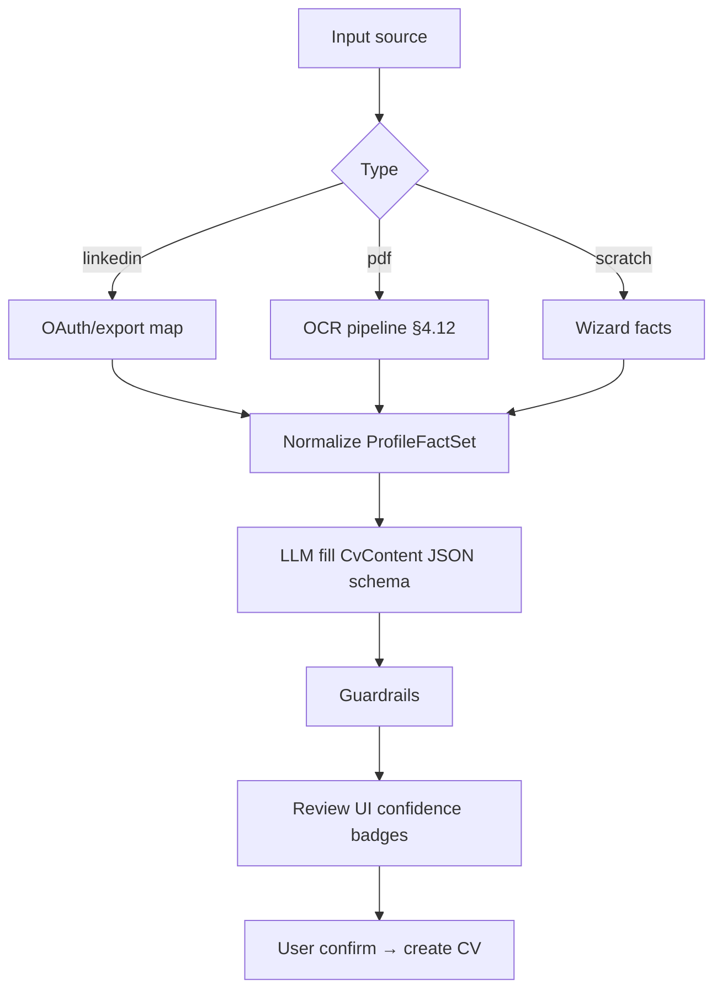
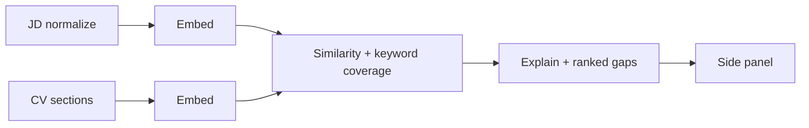

# CV STUDIO AI — AI / ML PRODUCT SPECIFICATION

## AI/ML Product Manager — Document de référence

| Métadonnée            | Valeur                                                                  |
| --------------------- | ----------------------------------------------------------------------- |
| **Produit**           | CV Studio AI                                                            |
| **Version**           | 1.0                                                                     |
| **Date**              | 26 juillet 2026                                                         |
| **Auteur**            | AI/ML Product Manager                                                   |
| **Horizon**           | 24 mois                                                                 |
| **Alignement**        | PRD · Architecture (AI Gateway) · API `/ai/*` · Database `ai_histories` |
| **Artefacts prompts** | `docs/ai/prompts/*.md` · `packages/ai-service` (cible)                  |

---

## 1. Doctrine produit IA

### 1.1 Principes non négociables

1. **Honnêteté biographique** — jamais inventer employeur, diplôme, date, titre non fourni.
2. **Human-in-the-loop** — toute écriture sur le CV = confirmation utilisateur.
3. **Transparence** — badge « Suggestion IA » ; refus explicite si hors faits.
4. **Mesurable** — thumbs, score uplift ATS/match, coût $/request, latency p95.
5. **Privacy** — minimisation PII dans logs ; rétention prompts 90j ; EU residency.

### 1.2 North Star IA

**% utilisateurs Pro utilisant ≥2 features IA / mois** (cible PRD ≥60%)  
Leading : apply rate des suggestions, match score uplift médian, ATS uplift médian.

### 1.3 Architecture gateway (rappel)

```
API Nest → Entitlement + Quota → (sync for optimize-resume; Bull queue later)
  → packages/ai-service Gateway
       → Prompt Registry (versionné)
       → Guardrail Pipeline (pre/post)
       → Model Router (tiered) / Heuristic fallback
       → Cost Tracker + AiHistory
```

**Statut d’implémentation (2026-07-30):** vertical slice `optimize-resume` live dans `packages/ai-service` (`runAiFeature`) + Nest `POST /ai/optimize-resume` (quotas journaliers + `ai_histories`). Autres features `/ai/*` encore scaffold/queued.

### 1.4 Model portfolio (recommandé 2026)

| Tier               | Modèles candidats                                              | Usage                                                    |
| ------------------ | -------------------------------------------------------------- | -------------------------------------------------------- |
| **S (small/fast)** | GPT-4.1-mini / GPT-4o-mini · Claude Haiku · Gemini Flash       | Rewrite bullet, grammar, skill normalize                 |
| **M (balanced)**   | GPT-4.1 / Claude Sonnet                                        | Cover letter, interview Q, career advice, portfolio copy |
| **L (strong)**     | GPT-4.1 / o-series sparingly · Claude Sonnet/Opus              | JD matching hard cases, complex CV generation review     |
| **Embed**          | `text-embedding-3-large` ou équivalent                         | Job Matcher similarity                                   |
| **OCR**            | AWS Textract / Google Document AI / Azure Read + LLM structure | PDF import                                               |
| **Rules**          | Heuristiques maison (pas LLM)                                  | ATS format/parseability score                            |

**Règle FinOps :** démarrer S ; escalate M seulement si confidence basse ou feature critique.

---

## 2. Guardrails globaux (tous features)

### 2.1 System preamble (injecté partout)

Voir [`docs/ai/prompts/_system-guardrails.md`](./ai/prompts/_system-guardrails.md)

### 2.2 Post-processors obligatoires

| Check                                      | Action                                                          |
| ------------------------------------------ | --------------------------------------------------------------- |
| New employer/company not in input          | **Refuse** / strip                                              |
| New diploma / school not in input          | Refuse                                                          |
| Fabricated metrics (numbers not in source) | Flag `warning` or strip                                         |
| JSON schema invalid                        | Retry 1× with repair prompt ; else error                        |
| Toxicity / discrimination                  | Block                                                           |
| Prompt injection in JD/PDF                 | Treat as untrusted data ; ignore “ignore previous instructions” |

### 2.3 Output contract commun

```json
{
  "ok": true,
  "feature": "optimize_resume",
  "promptVersion": "optimize_resume.v3",
  "model": "gpt-4.1-mini",
  "result": {},
  "warnings": [],
  "refusals": [],
  "usage": { "inputTokens": 0, "outputTokens": 0, "costUsd": 0 }
}
```

---

## 3. Quotas, rate limits, caching, coûts

### 3.1 Quotas Pro (mensuel) — alignés PRD

| Feature             | Soft quota | Burst  |
| ------------------- | ---------- | ------ |
| Optimize bullet     | 100        | 10/min |
| JD Match            | 30         | 5/min  |
| Cover letter        | 20         | 5/min  |
| Interview prep      | 10         | 3/min  |
| Career advice       | 20         | 5/min  |
| Generate CV         | 5          | 2/min  |
| ATS explain (LLM)   | 40         | 10/min |
| Grammar             | 200        | 20/min |
| Portfolio gen       | 10         | 3/min  |
| OCR import          | 10         | 2/min  |
| LinkedIn import map | 5          | 2/min  |

Free : teaser ATS score rules-only ; pas d’apply IA.

### 3.2 Caching

| Key                           | TTL      | Invalidation   |
| ----------------------------- | -------- | -------------- |
| `emb:jd:{hash}`               | 7j       | —              |
| `emb:cvsec:{cvId}:{hash}`     | 24h      | on CV patch    |
| `ats:rules:{cvHash}`          | 1h       | content change |
| `grammar:{hash}`              | 7j       | —              |
| Exact prompt cache (provider) | provider | version bump   |

Ne **jamais** cacher des outputs biographiques cross-user.

### 3.3 Cost targets (par requête réussie)

| Feature              | Target USD                     |
| -------------------- | ------------------------------ |
| Optimize bullet      | < 0.01                         |
| Grammar              | < 0.005                        |
| ATS explain          | < 0.02                         |
| Cover letter         | < 0.05                         |
| Interview session    | < 0.08                         |
| Generate CV full     | < 0.12                         |
| JD Match (embed+LLM) | < 0.04                         |
| OCR page             | < 0.02 (+LLM structure < 0.05) |

Alert si coût moyen Pro > 1.5–2.5 €/user/mois.

### 3.4 Error handling

| Code                 | Cause        | UX                      |
| -------------------- | ------------ | ----------------------- |
| `AI_QUOTA_EXCEEDED`  | 429/402      | Upgrade / wait          |
| `AI_REFUSED`         | Guardrail    | Message honnête         |
| `AI_TIMEOUT`         | >60s         | Retry                   |
| `AI_PROVIDER_DOWN`   | circuit open | Degraded / retry later  |
| `AI_INVALID_OUTPUT`  | schema fail  | Silent retry then error |
| `OCR_LOW_CONFIDENCE` | parse        | Highlight fields        |

---

# 4. FEATURE SPECS (1→12)

---

## 4.1 CV Generator (LinkedIn / PDF / scratch)

### Objectif

Produire un **draft** `CvContent` structuré, éditable, sans hallucination.

### Inputs

- `source`: `linkedin` | `pdf` | `scratch`
- `profileHints` / parsed LinkedIn / OCR result
- `locale`, `templateId`, `targetRole?`

### Models

1. Structure mapping : **S/M**
2. Si scratch + sparse hints : **M** with constrained template slots only

### Workflow



### API

- `POST /api/v1/ai/generate-cv` (existant)
- Internals : `AiGateway.generateCv(input)`

### Prompt

[`docs/ai/prompts/01-cv-generator.md`](./ai/prompts/01-cv-generator.md)

### Eval

- Fact precision ≥ 98% on golden set
- Zero invented employers on adversarial set

---

## 4.2 Resume Optimizer (ATS-oriented)

### Objectif

3 variants d’un bullet/section, plus impact, factuelles, ton contrôlé.

### Models

Default **S** ; escalate **M** si JD fournie et match gaps complexes.

### Workflow

Select bullet → tone/length → LLM → guardrail → show variants → user Apply → optional re-ATS.

### API

- `POST /api/v1/ai/optimize-resume`

### Prompt

[`docs/ai/prompts/02-resume-optimizer.md`](./ai/prompts/02-resume-optimizer.md)

### Caching

Hash(bullet + tone + locale + jdHash?) TTL 24h for identical retries.

---

## 4.3 Cover Letter Generator

### Objectif

Lettre structurée (hook, fit, preuves, close) alignée CV+JD.

### Models

**M** (qualité ton) ; length control.

### Workflow

Load CV facts → JD extract reqs → draft letter → user edit → export.

### API

- `POST /api/v1/ai/generate-cover-letter`

### Prompt

[`docs/ai/prompts/03-cover-letter.md`](./ai/prompts/03-cover-letter.md)

---

## 4.4 Job Matcher

### Objectif

Score d’adéquation + gaps actionnables (must/nice) **sans inventer**.

### Models

1. Embeddings CV sections + JD
2. LLM **S/M** pour explanation + suggested edits linked to existing bullets only

### Workflow



### API

- Étendre : `POST /api/v1/cvs/:id/match` (Architecture) **et/ou** `POST /api/v1/ai/match-job`
- Persist `match_reports`

### Prompt

[`docs/ai/prompts/04-job-matcher.md`](./ai/prompts/04-job-matcher.md)

### Cost

Cache JD embeddings agressivement.

---

## 4.5 Interview Prep Coach

### Objectif

8–15 questions + plans STAR basés CV+JD+type entretien.

### Models

**M** ; practice mode local (pas besoin LLM pour timer).

### API

- `POST /api/v1/ai/interview-prep`

### Prompt

[`docs/ai/prompts/05-interview-prep.md`](./ai/prompts/05-interview-prep.md)

### Disclaimer

Pas une garantie d’embauche ; conseils généraux.

---

## 4.6 ATS Analyzer

### Objectif

Score 0–100 + breakdown + recommandations.  
**Format/structure = rules engine** ; **explications = LLM S optionnel**.

### Workflow

Parse simulation → heuristic weights → optional LLM explain in user language → store `ats_reports`.

### API

- `POST /api/v1/ai/check-ats`

### Prompt (explain only)

[`docs/ai/prompts/06-ats-analyzer.md`](./ai/prompts/06-ats-analyzer.md)

### Scoring weights (v1)

Format 35% · Structure 20% · Contact 10% · Content heuristics 20% · Keywords (si JD) 15%

---

## 4.7 Career Advisor

### Objectif

Cartes conseil (gaps skills, positionnement, next steps) avec disclaimer.

### Models

**M** ; retrieval optionnel sur taxonomie skills marché (embeddings job corpus).

### API

- `POST /api/v1/ai/career-advice` (à ajouter)

### Prompt

[`docs/ai/prompts/07-career-advisor.md`](./ai/prompts/07-career-advisor.md)

### Liability

Pas de conseil juridique / immigration certifié.

---

## 4.8 Portfolio Generator

### Objectif

Générer structure + copy pour `portfolios.items` à partir projets CV.

### Models

**M** pour narrative ; **S** pour headlines.

### API

- `POST /api/v1/ai/generate-portfolio` (à ajouter)

### Prompt

[`docs/ai/prompts/08-portfolio-generator.md`](./ai/prompts/08-portfolio-generator.md)

---

## 4.9 Grammar Checker

### Objectif

Corrections langue (FR/EN/…) sur texte sélectionné — pas de réinvention de faits.

### Models

**S** ; LanguageTool open-source en fallback offline pour Free teaser possible.

### API

- `POST /api/v1/ai/grammar-check` (à ajouter)

### Prompt

[`docs/ai/prompts/09-grammar-checker.md`](./ai/prompts/09-grammar-checker.md)

---

## 4.10 Skill Endorsement (Skill Intelligence)

### Objectif

Normaliser skills, suggérer compétences **déjà evidence-based** dans le CV (pas cold invent).

### Models

**S** + dictionary taxonomy (O*NET-like / internal).

### API

- `POST /api/v1/ai/skills-suggest` (à ajouter)

### Prompt

[`docs/ai/prompts/10-skill-endorsement.md`](./ai/prompts/10-skill-endorsement.md)

### Rule

Chaque skill suggéré doit citer une evidence (expérience/projet) ; sinon discard.

---

## 4.11 LinkedIn Import

### Objectif

Mapper profil LinkedIn → `ProfileFactSet` / draft CV.

### Models

Deterministic field mapping first ; **S** for summary polish only on mapped facts.

### API

- Part of `generate-cv` source=linkedin
- `POST /api/v1/ai/linkedin-import` (à ajouter pour sync)

### Prompt

[`docs/ai/prompts/11-linkedin-import.md`](./ai/prompts/11-linkedin-import.md)

### Risks

API LinkedIn instability → file export upload fallback.

---

## 4.12 PDF OCR & Parsing

### Objectif

PDF → text blocks → structured ProfileFactSet with confidence.

### Pipeline

1. Textract/Document AI OCR
2. Layout blocks
3. LLM **M** structured extraction JSON
4. Confidence UI + manual fix
5. Optional generate-cv

### API

- `POST /api/v1/ai/parse-pdf` (multipart) (à ajouter)

### Prompt

[`docs/ai/prompts/12-pdf-ocr-parse.md`](./ai/prompts/12-pdf-ocr-parse.md)

### Errors

`OCR_LOW_CONFIDENCE` si mean confidence < 0.7

---

## 5. Prompt registry & versioning

| Champ            | Exemple                   |
| ---------------- | ------------------------- |
| `id`             | `optimize_resume`         |
| `version`        | `v3`                      |
| `modelTier`      | `S`                       |
| `temperature`    | 0.3                       |
| `responseFormat` | `json_schema`             |
| `evalSuite`      | `golden/optimize_v3.json` |

Bump version = canary 5% → thumbs watch → 100%.

Fichiers : `docs/ai/prompts/*.md` + JSON schemas dans `docs/ai/schemas/`.

---

## 6. Eval harness (qualité)

| Suite                         | Pass criteria           |
| ----------------------------- | ----------------------- |
| Hallucination adversarial     | ≥95% refuse             |
| Optimize quality rubrique 1–5 | mean ≥ baseline         |
| Match ranking correlation     | Spearman ≥ 0.7 vs human |
| ATS explain usefulness        | thumbs ≥75%             |
| Latency                       | p95 < feature SLO       |
| Cost                          | within budget 2 weeks   |

Pas de prod promote sans suite verte.

---

## 7. Observability

Metrics : `ai_requests_total{feature,model,status}` · `ai_cost_usd` · `ai_latency_ms` · `ai_thumbs` · `ai_refusals`  
Trace : promptVersion, model, tokens (pas raw PII en clear dans logs longs).

---

## 8. Rollout roadmap IA

| Phase  | Features                                            |
| ------ | --------------------------------------------------- |
| M6–7   | Optimizer, LinkedIn/PDF generate, ATS rules+explain |
| M7–8   | Matcher, Cover letter                               |
| M8–9   | Interview prep                                      |
| M9–10  | Career advisor, Grammar, Skills                     |
| M10–12 | Portfolio gen, OCR GA, LinkedIn sync                |

---

## 9. API surface cible (complète)

| Method | Path                        | Feature |
| ------ | --------------------------- | ------- |
| POST   | `/ai/generate-cv`           | 1       |
| POST   | `/ai/optimize-resume`       | 2       |
| POST   | `/ai/generate-cover-letter` | 3       |
| POST   | `/ai/match-job`             | 4       |
| POST   | `/ai/interview-prep`        | 5       |
| POST   | `/ai/check-ats`             | 6       |
| POST   | `/ai/career-advice`         | 7       |
| POST   | `/ai/generate-portfolio`    | 8       |
| POST   | `/ai/grammar-check`         | 9       |
| POST   | `/ai/skills-suggest`        | 10      |
| POST   | `/ai/linkedin-import`       | 11      |
| POST   | `/ai/parse-pdf`             | 12      |

---

## 10. Sign-off checklist

- [ ] Guardrails tests CI
- [ ] Quotas enforced server-side
- [ ] Prompt versions registered
- [ ] FinOps dashboard live
- [ ] Disclaimers UX
- [ ] GDPR retention AI logs

---

_AI/ML Product Spec CV Studio AI v1.0_
