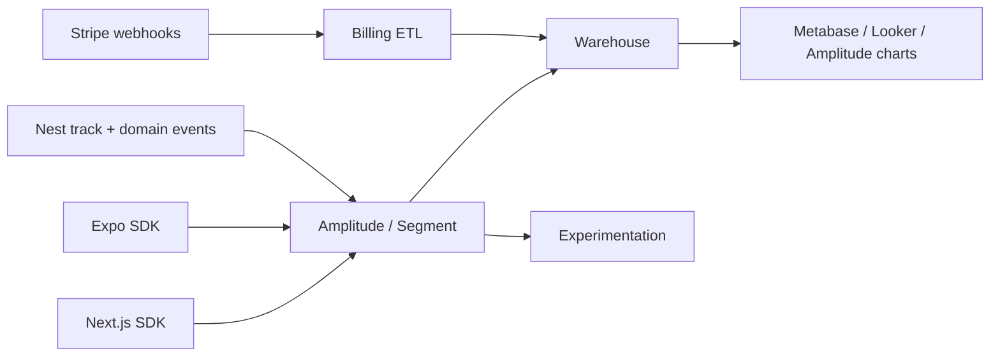
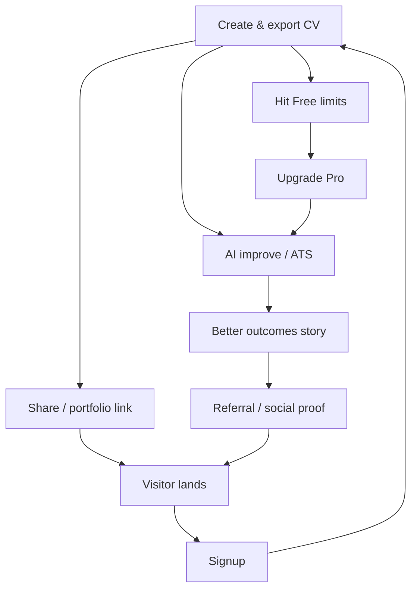

# CV STUDIO AI — PRODUCT ANALYTICS

## Data Product Manager — Document de référence

| Métadonnée           | Valeur                                                            |
| -------------------- | ----------------------------------------------------------------- |
| **Stack analytics**  | Amplitude (product) + warehouse (BigQuery/Snowflake) + Stripe     |
| **Secondary**        | Mixpanel-compatible taxonomy (portable) · PostHog optional EU     |
| **Ingest**           | Client SDK (web/mobile) + server `track` (Nest) + Stripe webhooks |
| **Identity**         | `user_id` (UUID) · `anonymous_id` pre-auth · `device_id` mobile   |
| **Privacy**          | Consent Mode · no CV body in props · GDPR aligned                 |
| **Version taxonomy** | **v1.0** · 26 juillet 2026                                        |
| **Alignement**       | PRD KPIs · Billing · AI quotas · Security · Mobile                |

---

## 0. North Star & KPI tree

### North Star Metric

**Weekly Activated Editors (WAE)** — users with ≥1 meaningful edit **and** ≥1 preview interaction in the last 7 days.

### Input metrics → NSM

```
Acquisition → Activation → Engagement → Monetization → Retention → Referral
```

| Layer        | Primary KPIs                               |
| ------------ | ------------------------------------------ |
| Acquisition  | Visits, signup rate, CAC by channel        |
| Activation   | Time-to-first-CV, first export, aha moment |
| Engagement   | WAE, edits/week, AI feature adoption       |
| Monetization | Free→Pro CVR, MRR, ARPU, LTV               |
| Retention    | D1/D7/D30, logo churn, revenue churn       |
| Referral     | Share/portfolio invites, K-factor          |

### Aha moment (hypothèse)

**Export PDF réussi dans les 24h** après signup **ou** score ATS ≥70 avec ≥1 apply suggestion — à valider via correlation → retention D30.

---

## 1. Architecture data



| Couche                | Rôle                                                |
| --------------------- | --------------------------------------------------- |
| **Stream**            | Amplitude Events API / Segment                      |
| **Server SoT events** | `analytics_events` PG (partition) + forward to CDP  |
| **Warehouse**         | Daily sync identities, events, Stripe, entitlements |
| **Reverse ETL**       | Cohorts → Customer.io / push / paywall targeting    |

**ADR :** Amplitude primary for product + Experiment ; warehouse for LTV/CAC finance-grade.

---

## 2. Identity & properties

### 2.1 Identity graph

1. Anonymous browse → `anonymous_id` (cookie / mobile install)
2. Signup/login → `identify(user_id)` + alias merge
3. Group (Business) → `group_id = org_id` when Business seats

### 2.2 User properties (set / set_once)

| Property                | Type                                 | Notes                              |
| ----------------------- | ------------------------------------ | ---------------------------------- |
| `email_domain`          | string                               | not full email in CDP if avoidable |
| `plan`                  | free\|pro\|business                  | from entitlements                  |
| `plan_status`           | active\|trialing\|canceled\|past_due |                                    |
| `signup_at`             | datetime                             | set_once                           |
| `signup_method`         | email\|google\|apple                 |                                    |
| `country`               | string                               | geo coarse                         |
| `locale`                | string                               |                                    |
| `platform`              | web\|ios\|android                    | last                               |
| `cv_count`              | number                               |                                    |
| `export_count_lifetime` | number                               |                                    |
| `ai_actions_30d`        | number                               |                                    |
| `mfa_enabled`           | bool                                 |                                    |
| `nps_last_score`        | number                               |                                    |
| `nps_last_at`           | datetime                             |                                    |
| `acquisition_channel`   | string                               | UTM first-touch set_once           |
| `acquisition_campaign`  | string                               | set_once                           |
| `predicted_churn_risk`  | low\|med\|high                       | ML later                           |

### 2.3 Super properties (every event)

`app_version`, `platform`, `env`, `session_id`, `experiment_variants[]`, `plan`

### 2.4 Privacy rules

- **Never** send: password, CV full text, phone raw if unused, auth tokens, card data
- PII minimized ; email only if CDP DPA + purpose
- Honor `analytics_opt_out` user flag

---

## 3. Event taxonomy (complete)

Convention : `object_action` snake_case · past tense where natural · props camelCase in JSON optional — **we use snake_case props** for warehouse friendliness.

### 3.1 Marketing & acquisition

| Event                     | Props clés                    | When                 |
| ------------------------- | ----------------------------- | -------------------- |
| `page_viewed`             | `path`, `referrer`, `utm_*`   | Every marketing page |
| `cta_clicked`             | `cta_id`, `placement`, `path` | Hero, pricing, etc.  |
| `pricing_viewed`          | `plan_highlighted`            | `/pricing`           |
| `template_gallery_viewed` | `filter_category`             | Marketing templates  |

### 3.2 Auth & onboarding

| Event                      | Props                            |
| -------------------------- | -------------------------------- |
| `signup_started`           | `method`                         |
| `signup_succeeded`         | `method`                         |
| `signup_failed`            | `method`, `error_code`           |
| `login_succeeded`          | `method`                         |
| `login_failed`             | `error_code`                     |
| `logout`                   | —                                |
| `onboarding_step_viewed`   | `step`                           |
| `onboarding_completed`     | `steps_completed`, `duration_ms` |
| `mfa_enabled`              | `method`                         |
| `password_reset_requested` | —                                |

### 3.3 CV core loop

| Event                 | Props                                                 |
| --------------------- | ----------------------------------------------------- |
| `cv_created`          | `cv_id`, `source` (blank\|template\|import\|ai)       |
| `cv_opened`           | `cv_id`                                               |
| `cv_section_edited`   | `cv_id`, `section`, `edit_length_bucket`              |
| `cv_autosaved`        | `cv_id`, `latency_ms`                                 |
| `cv_preview_viewed`   | `cv_id`, `surface` (web_pane\|mobile_tab)             |
| `cv_template_applied` | `cv_id`, `template_id`, `is_premium`                  |
| `cv_reordered`        | `cv_id`, `section`                                    |
| `cv_deleted`          | `cv_id`                                               |
| `cv_duplicated`       | `cv_id`, `new_cv_id`                                  |
| `cv_version_restored` | `cv_id`, `version_id`                                 |
| `cv_imported`         | `source_format` (pdf\|docx)                           |
| `cv_exported`         | `cv_id`, `format`, `job_id`, `duration_ms`, `success` |
| `cv_shared`           | `cv_id`, `channel` (link\|email)                      |
| `cv_share_revoked`    | `cv_id`                                               |
| `portfolio_published` | `portfolio_id`                                        |

### 3.4 AI features (12)

| Event                     | Props                                                          |
| ------------------------- | -------------------------------------------------------------- |
| `ai_feature_opened`       | `feature`                                                      |
| `ai_feature_run`          | `feature`, `cv_id`, `quota_remaining`, `latency_ms`, `success` |
| `ai_suggestion_shown`     | `feature`, `suggestion_count`                                  |
| `ai_suggestion_applied`   | `feature`, `cv_id`                                             |
| `ai_suggestion_dismissed` | `feature`                                                      |
| `ai_quota_hit`            | `feature`, `plan`                                              |
| `ats_score_viewed`        | `cv_id`, `score_bucket`                                        |

`feature` enum : `optimize`, `ats`, `bullet`, `summary`, `keywords`, `cover_letter`, `job_match`, `translate`, `tone`, `gap_fill`, `interview`, `ocr` (align AI doc).

### 3.5 Templates & marketplace

| Event                            | Props                       |
| -------------------------------- | --------------------------- |
| `template_viewed`                | `template_id`, `is_premium` |
| `template_previewed`             | `template_id`               |
| `marketplace_item_viewed`        | `item_id`                   |
| `marketplace_purchase_started`   | `item_id`, `price_cents`    |
| `marketplace_purchase_succeeded` | `item_id`, `price_cents`    |

### 3.6 Monetization

| Event                      | Props                                                      |
| -------------------------- | ---------------------------------------------------------- |
| `paywall_viewed`           | `trigger`, `surface`                                       |
| `paywall_cta_clicked`      | `plan`, `trigger`                                          |
| `checkout_started`         | `plan`, `interval`, `platform`                             |
| `checkout_succeeded`       | `plan`, `interval`, `amount_cents`, `currency`, `provider` |
| `checkout_failed`          | `plan`, `error_code`                                       |
| `checkout_cancelled`       | `plan`                                                     |
| `subscription_renewed`     | `plan`, `amount_cents`                                     |
| `subscription_canceled`    | `plan`, `reason`, `mrr_delta_cents`                        |
| `subscription_reactivated` | `plan`                                                     |
| `entitlement_changed`      | `from_plan`, `to_plan`                                     |
| `trial_started`            | `plan` (si trial)                                          |
| `trial_converted`          | `plan`                                                     |
| `invoice_paid`             | `amount_cents`                                             |

Server-authoritative for payment events (Stripe webhook → track).

### 3.7 Engagement & growth

| Event                              | Props                          |
| ---------------------------------- | ------------------------------ |
| `notification_permission_prompted` | `platform`                     |
| `notification_permission_result`   | `status`                       |
| `push_notification_opened`         | `campaign_id`, `type`          |
| `email_clicked`                    | `campaign_id` (from ESP)       |
| `referral_link_copied`             | —                              |
| `referral_signup_attributed`       | `referrer_user_id`             |
| `offline_mode_entered`             | `platform`                     |
| `sync_completed`                   | `pending_count`, `duration_ms` |

### 3.8 Satisfaction

| Event                | Props                                    |
| -------------------- | ---------------------------------------- |
| `nps_prompt_shown`   | `surface`, `eligible_reason`             |
| `nps_submitted`      | `score`, `comment_length_bucket`         |
| `nps_dismissed`      | —                                        |
| `csat_submitted`     | `score`, `context` (export\|ai\|support) |
| `feedback_submitted` | `category`                               |

### 3.9 Experimentation

| Event                 | Props                                    |
| --------------------- | ---------------------------------------- |
| `experiment_enrolled` | `experiment_key`, `variant`              |
| `experiment_exposure` | `experiment_key`, `variant` (impression) |

---

## 4. Funnels

### 4.1 Sign-up funnel

`page_viewed (landing)` → `cta_clicked (signup)` → `signup_started` → `signup_succeeded` → `onboarding_completed` → `cv_created`

**Targets (M6) :** visit→signup 8–12% · signup→cv_created 70%+ · signup→onboarding_complete 50%+

### 4.2 Create CV → value funnel

`cv_created` → `cv_section_edited` (≥3) → `cv_preview_viewed` → `cv_exported` (success)

**Activation definition :** complete this funnel within **24h** of signup.

### 4.3 Payment funnel

`paywall_viewed` → `paywall_cta_clicked` → `checkout_started` → `checkout_succeeded`

Break by `trigger` : `ai_quota` · `premium_template` · `export_docx` · `cv_limit` · `pricing_page` · `settings`

**Targets :** paywall→checkout 25% · checkout→paid 60%+ (Stripe)

### 4.4 AI adoption funnel

`ai_feature_opened` → `ai_feature_run` → `ai_suggestion_applied`

### 4.5 Template apply funnel

`template_gallery_viewed` → `template_viewed` → `cv_template_applied`

Implement in Amplitude as saved funnels + # dashboard “Growth”.

---

## 5. Retention & cohorts

### 5.1 Retention charts

| Chart                 | Definition                                       |
| --------------------- | ------------------------------------------------ |
| **Classic N-day**     | Return any event D1/D7/D30 from signup           |
| **Usage retention**   | Return with `cv_section_edited` or `cv_exported` |
| **Revenue retention** | Still `plan in (pro,business)` + active          |

### 5.2 Cohort cuts

- Signup week
- Acquisition channel (first UTM)
- Platform (web/ios/android)
- Activated vs not in 24h
- Used AI in week 1 Y/N
- Plan at D0
- Country

### 5.3 Leading indicators of retention

- Exports ≥1 in week 1
- AI apply ≥1
- Template applied
- Second session &lt; 48h

---

## 6. User segmentation

### 6.1 Lifecycle segments

| Segment         | Rule                                   |
| --------------- | -------------------------------------- |
| `prospect`      | anon, pricing viewed                   |
| `new`           | signup &lt; 7d                         |
| `activated`     | activation funnel done                 |
| `engaged`       | WAE true                               |
| `power`         | ≥3 exports / 30d OR ≥10 AI applies     |
| `dormant`       | no usage 14–30d                        |
| `churn_risk`    | dormant + was engaged OR cancel intent |
| `churned_user`  | canceled paid OR deleted               |
| `paid_active`   | pro/business active                    |
| `paid_past_due` | past_due                               |

### 6.2 Persona segments (PRD)

Map survey/onboarding role → `persona` property : student · career_switcher · professional · recruiter_adjacent

### 6.3 Behavioral

- `ai_heavy` vs `diy_editor`
- `mobile_primary` (≥70% sessions mobile)
- `marketplace_buyer`

Use for messaging, paywall copy, experiments.

---

## 7. A/B testing framework

### 7.1 Tooling

**Amplitude Experiment** (or GrowthBook / PostHog) + feature flags server-side for entitlements-safe tests.

### 7.2 Principles

1. One primary metric per experiment
2. Guardrails : crash-free, checkout error rate, auth fail
3. Exposure event required (`experiment_exposure`)
4. Sample ratio mismatch checks
5. Min runtime : 7 days or MDE powered
6. No PII in assignment logs beyond `user_id`

### 7.3 Assignment

- Client for UX copy/layout
- **Server** for pricing, quotas, AI model routing

### 7.4 First experiment backlog

| Key                         | Hypothesis                   | Primary metric                      |
| --------------------------- | ---------------------------- | ----------------------------------- |
| `paywall_trigger_copy_v1`   | Urgency copy ↑ CVR           | checkout_succeeded / paywall_viewed |
| `onboarding_template_first` | Template-first ↑ activation  | activated_24h                       |
| `aha_export_nudge`          | Nudge export ↑ D7            | D7 usage retention                  |
| `pricing_annual_default`    | Annual default ↑ LTV         | LTV90 / checkout ARPU               |
| `ai_cta_in_editor`          | Persistent AI CTA ↑ ai_apply | ai_suggestion_applied / WAE         |

### 7.5 Analysis

Bayesian or frequentist (team standard) · segments: new vs returning · plan · platform.

---

## 8. Growth loops



| Loop                  | Metric                         |
| --------------------- | ------------------------------ |
| Viral share           | invites / user · K-factor      |
| Content SEO templates | organic signup                 |
| AI quota → paid       | paywall trigger `ai_quota` CVR |
| Career reminder push  | reactivation rate dormant      |

Instrument each loop edge with events above.

---

## 9. Revenue dashboard

### 9.1 Executive (daily)

| Metric                                          | Source             |
| ----------------------------------------------- | ------------------ |
| MRR / ARR                                       | Stripe + warehouse |
| New MRR / Expansion / Contraction / Churned MRR | Stripe             |
| Net revenue retention (NRR)                     | warehouse          |
| ARPU                                            | MRR / active paid  |
| Free→Paid CVR (28d)                             | events + Stripe    |
| Trial conversion (if any)                       | events             |

### 9.2 Product revenue

- Paywall CVR by `trigger`
- Revenue by template/AI feature (assisted path)
- Platform mix (web vs mobile checkout)

### 9.3 Board cadence

Mon : growth review · Wed : monetization · Month : cohort LTV

---

## 10. CAC & LTV tracking

### 10.1 CAC

```
CAC = (Ad spend + sales + attributable marketing tools) / New customers (paid)
```

- Channel grain : Google, Meta, LinkedIn, SEO, Referral, Direct
- First-touch + last-touch reports
- Blended CAC vs paid CAC

UTM capture on `page_viewed` / `signup_succeeded` → `acquisition_*` set_once.

### 10.2 LTV

| Model          | Formula (v1)                                            |
| -------------- | ------------------------------------------------------- |
| **LTV quick**  | ARPU × Gross margin × (1/churn_monthly)                 |
| **LTV cohort** | Sum discounted net revenue months 0–24 by signup cohort |
| **LTV90**      | Net revenue first 90 days (leading)                     |

Gross margin assume 70–85% SaaS (ex-AI COGS) — Finance owns margin input ; Data owns joins.

### 10.3 LTV:CAC

Target **≥ 3:1** ; payback **≤ 12 months**.

Warehouse model : `fct_subscription_metrics_daily`, `dim_user_acquisition`.

---

## 11. Churn analysis

### 11.1 Definitions

| Type              | Definition                                     |
| ----------------- | ---------------------------------------------- |
| **Logo churn**    | Paid accounts canceled / active paid start     |
| **Revenue churn** | Lost MRR / MRR start                           |
| **Voluntary**     | User cancels                                   |
| **Involuntary**   | payment_failed → canceled                      |
| **Product churn** | Activated users with no activity 30d (leading) |

### 11.2 Cancel survey

On `subscription_canceled` collect `reason` enum :  
`too_expensive` · `missing_feature` · `found_alternative` · `job_found` · `temporary` · `other`

### 11.3 Playbooks

| Signal                               | Action                           |
| ------------------------------------ | -------------------------------- |
| `ai_quota_hit` ×3 / week without pay | Soft paywall + success story     |
| Dormant 14d was power                | Winback email + template new     |
| `past_due`                           | Dunning (Stripe) + in-app banner |
| Cancel `too_expensive`               | Annual offer experiment          |

### 11.4 Churn dashboard

Reasons mix · tenure before cancel · feature usage 14d before cancel · save offers CVR.

---

## 12. NPS tracking

### 12.1 Cadence

- Eligible : activated + ≥2 sessions + account age ≥7d
- Frequency : max **1 / 90 days**
- Surfaces : post-export success (10% sample) · account settings · email quarterly

### 12.2 Metrics

- NPS = %Promoters (9–10) − %Detractors (0–6)
- Target M12 : NPS ≥ **40**
- Break by plan, persona, platform, activation

### 12.3 Closed loop

- Detractors → support ticket optional + tag `nps_detractor`
- Passives → feature education
- Promoters → referral CTA (`referral_link_copied`)

Events : `nps_prompt_shown`, `nps_submitted`, `nps_dismissed`.

---

## 13. Implementation guide

### 13.1 Web

`apps/web/src/lib/analytics/` — `track()`, `identify()`, `page()`  
Consent gate before load Amplitude.

### 13.2 Mobile

`apps/mobile/src/services/analytics.ts` — same taxonomy.

### 13.3 Server

`POST /api/v1/analytics/track` (auth) for critical + Stripe worker emitter.  
Dual-write : PG `analytics_events` + Amplitude HTTP API.

### 13.4 QA

- Staging project Amplitude
- Event validation schema (JSON Schema in `docs/analytics/events.schema.json`)
- CI check: forbid unknown event names in PRs (optional lint)

---

## 14. Governance

| Role     | Responsibility                             |
| -------- | ------------------------------------------ |
| Data PM  | Taxonomy, dashboards, experiments priority |
| Eng      | Instrumentation quality                    |
| Growth   | Funnels, loops, paid CAC                   |
| Finance  | LTV margin, revenue recognition join       |
| DPO/CISO | Consent, retention of analytics PII        |

**Change control :** taxonomy PR + version bump · no silent rename (deprecate → alias 30d).

---

## 15. Roadmap analytics

| Phase   | Deliverable                                      |
| ------- | ------------------------------------------------ |
| M0–M1   | Taxonomy v1 · SDK web · signup/CV/paywall events |
| M2–M3   | Funnels dashboards · Stripe → revenue · NPS v1   |
| M4–M6   | Experiments framework · cohorts · CAC pipeline   |
| M7–M9   | Mobile parity · churn playbooks · LTV cohorts    |
| M10–M12 | Growth loops instrumentation · predictive churn  |

---

## 16. Related files

| File                                                     | Purpose          |
| -------------------------------------------------------- | ---------------- |
| [EVENT-TAXONOMY.md](analytics/EVENT-TAXONOMY.md)         | Quick ref table  |
| [events.schema.json](analytics/events.schema.json)       | Validation       |
| [FUNNELS-AND-BOARDS.md](analytics/FUNNELS-AND-BOARDS.md) | Saved views      |
| [METRICS-DICTIONARY.md](analytics/METRICS-DICTIONARY.md) | Definitions      |
| [ADR-018](adr/018-amplitude-analytics.md)                | Tooling decision |

---

_Product Analytics CV Studio AI v1.0 — Data PM_
