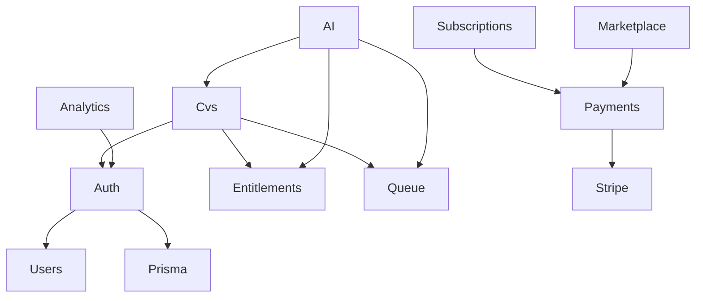

# CV STUDIO AI — API REST SPECIFICATION (NestJS)

## Tech Lead Backend — Document de référence

| Métadonnée     | Valeur                                                   |
| -------------- | -------------------------------------------------------- |
| **Base URL**   | `https://api.cvstudio.ai/api/v1`                         |
| **Version**    | 1.0.0                                                    |
| **Auth**       | Bearer JWT (access) + Refresh cookie/body                |
| **Format**     | `application/json`                                       |
| **Docs**       | Swagger UI `/docs` (staging) · OpenAPI JSON `/docs-json` |
| **Code**       | `apps/api`                                               |
| **Alignement** | Architecture · Database · PRD                            |

---

## 1. Principes API

| Principe    | Détail                                                           |
| ----------- | ---------------------------------------------------------------- |
| Envelope    | `{ success, data, meta }` / `{ success:false, error, meta }`     |
| Idempotency | Header `Idempotency-Key` sur POST export, checkout, AI, purchase |
| Pagination  | Cursor `?cursor=&limit=` (max 100)                               |
| Versioning  | URL `/api/v1`                                                    |
| Errors      | Codes métier stables (`ENTITLEMENT_REQUIRED`, …)                 |
| Tracing     | `X-Request-Id` echo + OpenTelemetry                              |
| Rate limits | Headers `X-RateLimit-*`                                          |

### Envelope succès

```json
{
  "success": true,
  "data": {},
  "meta": {
    "timestamp": "2026-07-26T08:00:00.000Z",
    "version": "1.0",
    "requestId": "req_01H…"
  }
}
```

### Envelope erreur

```json
{
  "success": false,
  "error": {
    "code": "VALIDATION_ERROR",
    "message": "Validation failed",
    "details": [{ "path": "email", "message": "Invalid email" }]
  },
  "meta": { "timestamp": "…", "version": "1.0", "requestId": "…" }
}
```

### Codes HTTP courants

| HTTP | Usage                          |
| ---- | ------------------------------ |
| 200  | OK                             |
| 201  | Created                        |
| 202  | Accepted (async job)           |
| 204  | No content (logout)            |
| 400  | Validation                     |
| 401  | Unauthenticated                |
| 402  | Entitlement / payment required |
| 403  | Forbidden                      |
| 404  | Not found                      |
| 409  | Conflict                       |
| 429  | Rate limited                   |
| 500  | Internal                       |

---

## 2. Architecture modules NestJS

```
apps/api/src/
├── main.ts
├── app.module.ts
├── config/
├── common/
│   ├── decorators/     @CurrentUser @RequireEntitlement @Public @Idempotent
│   ├── filters/        HttpExceptionFilter (envelope)
│   ├── guards/         JwtAuthGuard RolesGuard EntitlementsGuard Throttle
│   ├── interceptors/   TransformInterceptor LoggingInterceptor Timeout
│   ├── middleware/     RequestIdMiddleware RawBodyMiddleware (Stripe)
│   ├── pipes/          ValidationPipe config
│   └── dto/            PaginationQueryDto ApiResponse
├── database/           PrismaModule PrismaService
├── cache/              RedisModule
├── queue/              Bull queues producers
└── modules/
    ├── auth/
    ├── users/
    ├── cvs/
    ├── templates/
    ├── subscriptions/
    ├── payments/
    ├── invoices/
    ├── ai/
    ├── analytics/
    ├── marketplace/
    └── health/
```

### Module dependency graph



---

## 3. Cross-cutting concerns

### Guards (ordre)

1. `ThrottlerGuard`
2. `JwtAuthGuard` (skip si `@Public()`)
3. `RolesGuard` (si `@Roles()`)
4. `EntitlementsGuard` (si `@RequireEntitlement()`)

### Interceptors

- `RequestIdInterceptor` / middleware
- `LoggingInterceptor` (method, path, userId, latency)
- `TransformInterceptor` (wrap `data` → envelope)
- `TimeoutInterceptor` (10s default ; 60s AI/export)

### Filters

- `GlobalExceptionFilter` → envelope + map Prisma `P2025` → 404

### Middlewares

- `RequestIdMiddleware`
- Stripe webhook : raw body parser sur `POST /payments/webhook`

### Security headers

Helmet via Nest ; CORS allowlist web/admin/mobile.

---

## 4. Catalogue endpoints

### 4.1 Auth — `/api/v1/auth`

| Method | Path                    | Auth    | Description                      |
| ------ | ----------------------- | ------- | -------------------------------- |
| POST   | `/auth/register`        | Public  | Email + password                 |
| POST   | `/auth/login`           | Public  | Returns accessToken (+ refresh)  |
| POST   | `/auth/logout`          | JWT     | Revoke refresh family            |
| POST   | `/auth/refresh`         | Refresh | Rotate tokens                    |
| POST   | `/auth/oauth/google`    | Public  | `{ idToken \| code }`            |
| POST   | `/auth/oauth/linkedin`  | Public  | `{ code, redirectUri }`          |
| POST   | `/auth/oauth/apple`     | Public  | `{ idToken, code? }`             |
| POST   | `/auth/2fa/enable`      | JWT     | Returns otpauth URI / QR payload |
| POST   | `/auth/2fa/verify`      | JWT     | Confirm TOTP → enable            |
| POST   | `/auth/forgot-password` | Public  | Send reset email                 |
| POST   | `/auth/reset-password`  | Public  | `{ token, newPassword }`         |

**Register body**

```json
{ "email": "a@b.co", "password": "Str0ng!pass", "firstName": "Léa", "lastName": "Martin" }
```

**Login response data**

```json
{
  "accessToken": "eyJ…",
  "expiresIn": 900,
  "tokenType": "Bearer",
  "user": { "id": "…", "email": "…", "subscriptionTier": "free" },
  "refreshToken": "…"
}
```

_(Refresh préféré httpOnly cookie `refresh_token` en web ; body pour mobile.)_

### 4.2 Users — `/api/v1/users`

| Method | Path        | Auth | Description                 |
| ------ | ----------- | ---- | --------------------------- |
| GET    | `/users/me` | JWT  | Profil courant              |
| PATCH  | `/users/me` | JWT  | Update profil               |
| DELETE | `/users/me` | JWT  | Soft delete + GDPR schedule |

### 4.3 CVs — `/api/v1/cvs`

| Method | Path                                   | Auth | Entitlement                    |
| ------ | -------------------------------------- | ---- | ------------------------------ |
| GET    | `/cvs`                                 | JWT  | —                              |
| POST   | `/cvs`                                 | JWT  | `cv:create` (Free max 1)       |
| GET    | `/cvs/:id`                             | JWT  | owner / collab                 |
| PATCH  | `/cvs/:id`                             | JWT  | owner / editor                 |
| DELETE | `/cvs/:id`                             | JWT  | owner                          |
| POST   | `/cvs/:id/publish`                     | JWT  | Pro for portfolio-grade public |
| GET    | `/cvs/:id/export/pdf`                  | JWT  | Free ok for owned              |
| GET    | `/cvs/:id/export/docx`                 | JWT  | Pro+                           |
| GET    | `/cvs/:id/versions`                    | JWT  | —                              |
| GET    | `/cvs/:id/versions/:versionId`         | JWT  | —                              |
| POST   | `/cvs/:id/versions/:versionId/restore` | JWT  | —                              |

**Export PDF** : retourne `202` + `{ jobId }` puis poll `GET /cvs/exports/:jobId` **ou** `200` + `{ url, expiresAt }` si synchrone court. Spec prod : **async 202**.

### 4.4 Templates — `/api/v1/templates`

| Method | Path                            | Auth                       |
| ------ | ------------------------------- | -------------------------- |
| GET    | `/templates`                    | Public/JWT (premium flags) |
| GET    | `/templates/:id`                | Public/JWT                 |
| GET    | `/templates/category/:category` | Public/JWT                 |

Query : `?premium=&published=true&cursor=`

### 4.5 Subscriptions — `/api/v1/subscriptions`

| Method | Path                       | Description                            |
| ------ | -------------------------- | -------------------------------------- |
| POST   | `/subscriptions`           | Create/attach (rare ; prefer checkout) |
| GET    | `/subscriptions/me`        | Current sub + entitlements             |
| PATCH  | `/subscriptions/me`        | Change plan interval                   |
| DELETE | `/subscriptions/me/cancel` | cancel_at_period_end                   |
| POST   | `/subscriptions/checkout`  | Stripe Checkout Session URL            |

### 4.6 Payments — `/api/v1/payments`

| Method | Path                | Auth             |
| ------ | ------------------- | ---------------- |
| GET    | `/payments/history` | JWT              |
| POST   | `/payments/webhook` | Stripe signature |

### 4.7 Invoices — `/api/v1/invoices`

| Method | Path                     |
| ------ | ------------------------ |
| GET    | `/invoices`              |
| GET    | `/invoices/:id`          |
| GET    | `/invoices/:id/download` |

### 4.8 AI — `/api/v1/ai`

Tous JWT + entitlement Pro (sauf teaser ATS score si produit le permet).

| Method | Path                        | Entitlement                     |
| ------ | --------------------------- | ------------------------------- |
| POST   | `/ai/generate-cv`           | `ai:generate`                   |
| POST   | `/ai/optimize-resume`       | `ai:optimize`                   |
| POST   | `/ai/generate-cover-letter` | `ai:cover_letter`               |
| POST   | `/ai/check-ats`             | `ai:ats` (Free teaser optional) |
| POST   | `/ai/interview-prep`        | `ai:interview`                  |

Réponses souvent `202` + job ; ou sync si < timeout.

### 4.9 Analytics — `/api/v1/analytics`

| Method | Path                   | Notes                                       |
| ------ | ---------------------- | ------------------------------------------- |
| GET    | `/analytics/dashboard` | Aggregates user                             |
| GET    | `/analytics/events`    | Cursor page ; POST ingest interne optionnel |

### 4.10 Marketplace — `/api/v1/marketplace`

Commission **30%** platform / **70%** seller (net after Stripe fees). See `docs/MARKETPLACE-CV-STUDIO-AI.md`.

| Method | Path                                  | Notes                                 |
| ------ | ------------------------------------- | ------------------------------------- |
| GET    | `/marketplace/templates`              | Public browse                         |
| GET    | `/marketplace/templates/:id`          | PDP                                   |
| POST   | `/marketplace/templates/:id/purchase` | Buyer · entitlement `marketplace:buy` |
| POST   | `/marketplace/templates/:id/reviews`  | Verified purchase                     |
| POST   | `/marketplace/seller/apply`           | Seller onboarding                     |
| GET    | `/marketplace/seller/me`              | Seller profile                        |
| POST   | `/marketplace/seller/listings`        | Submit listing → moderation           |
| GET    | `/marketplace/sales`                  | Seller sales                          |
| GET    | `/marketplace/seller/analytics`       | Impressions / CVR / earnings          |
| POST   | `/marketplace/purchases/:id/disputes` | Buyer dispute ≤14d                    |

---

## 5. Entitlements matrix

| Feature key       | Free  | Pro       | Business  |
| ----------------- | ----- | --------- | --------- |
| `cv:create`       | 1 max | unlimited | unlimited |
| `cv:export:pdf`   | yes   | yes       | yes       |
| `cv:export:docx`  | no    | yes       | yes       |
| `ai:*`            | no*   | yes       | yes       |
| `marketplace:buy` | no    | yes       | yes       |
| `api:access`      | no    | no        | yes       |

\* ATS teaser score possible sans apply auto-fix.

---

## 6. Controllers → Services map

| Controller              | Service(s)                                                | Infra                      |
| ----------------------- | --------------------------------------------------------- | -------------------------- |
| AuthController          | AuthService, TokenService, OAuthService, TwoFactorService | Prisma, Redis, Mail queue  |
| UsersController         | UsersService                                              | Prisma, GDPR job           |
| CvsController           | CvsService, CvExportService, CvVersionService             | Prisma, Bull pdf           |
| TemplatesController     | TemplatesService                                          | Prisma, Redis cache        |
| SubscriptionsController | SubscriptionsService, CheckoutService                     | Stripe, Redis entitlements |
| PaymentsController      | PaymentsService, StripeWebhookService                     | Stripe raw body            |
| InvoicesController      | InvoicesService                                           | Stripe/S3                  |
| AiController            | AiOrchestratorService                                     | Bull ai, ai-service pkg    |
| AnalyticsController     | AnalyticsService                                          | Prisma partitions          |
| MarketplaceController   | MarketplaceService                                        | Stripe Connect later       |

---

## 7. DTOs (inventory)

Voir code `apps/api/src/modules/**/dto/*.ts` :

- Auth : RegisterDto, LoginDto, RefreshDto, OAuth*Dto, TwoFactor*Dto, ForgotPasswordDto, ResetPasswordDto
- Users : UpdateUserDto
- Cvs : CreateCvDto, UpdateCvDto, PublishCvDto, ListCvsQueryDto
- Templates : ListTemplatesQueryDto
- Subscriptions : CreateSubscriptionDto, UpdateSubscriptionDto, CheckoutDto
- AI : GenerateCvDto, OptimizeResumeDto, CoverLetterDto, CheckAtsDto, InterviewPrepDto
- Marketplace : PurchaseTemplateDto
- Common : PaginationQueryDto

Validation : `class-validator` + `ValidationPipe` whitelist.

---

## 8. Swagger

- `@ApiTags`, `@ApiBearerAuth`, `@ApiOperation`, `@ApiResponse`
- Bearer scheme `JWT`
- Grouped by tags : Auth, Users, CVs, Templates, Subscriptions, Payments, Invoices, AI, Analytics, Marketplace
- Examples on critical DTOs

---

## 9. Rate limits (défaut)

| Scope          | Limit                        |
| -------------- | ---------------------------- |
| Public auth    | 10/min/IP                    |
| Authenticated  | Free 120/min · Pro 600/min   |
| AI             | Quota mensuel + burst 10/min |
| Webhook Stripe | exempt + signature           |

---

## 10. Sequence — Checkout

Voir Architecture §20.4 ; endpoint `POST /subscriptions/checkout` → `{ url }` → Stripe → webhook → entitlements.

---

## 11. Testing API

- e2e : `apps/api/test/*.e2e-spec.ts`
- Contract : OpenAPI snapshot
- Auth matrix IDOR sur `/cvs/:id`

---

## 12. Run local

```bash
pnpm --filter @cvstudio/api dev
# Swagger http://localhost:3001/docs
```

---

_API Spec v1.0 — Companion code in apps/api_
