# CV STUDIO AI — ARCHITECTURE TECHNIQUE

## Document de référence Engineering (Principal Architect)

| Métadonnée         | Valeur                                            |
| ------------------ | ------------------------------------------------- |
| **Produit**        | CV Studio AI                                      |
| **Version**        | 1.0                                               |
| **Date**           | 26 juillet 2026                                   |
| **Auteur**         | Principal Software Architect                      |
| **Audience**       | Engineering (≤20 devs), DevOps, Security, Product |
| **Horizon**        | 24 mois · Scale 1M+ users                         |
| **Alignement**     | PRD v1.0 · Design System v1.0                     |
| **Classification** | Interne — Production-ready blueprint              |

---

## Table des matières

1. [Overview](#1-overview)
2. [Objectifs & Non-objectifs](#2-objectifs--non-objectifs)
3. [Architecture layered](#3-layered-architecture)
4. [Patterns architecturaux](#4-architectural-patterns)
5. [Monorepo structure](#5-monorepo-structure)
6. [Frontend (Next.js)](#6-frontend-architecture-nextjs)
7. [Backend (NestJS)](#7-backend-architecture-nestjs)
8. [Domain model & DDD](#8-domain-model--ddd)
9. [Database design](#9-database-design-postgresql)
10. [Caching Redis](#10-caching-strategy-redis)
11. [Message queues](#11-message-queue-bullredis)
12. [API design](#12-api-design)
13. [AuthN / AuthZ](#13-authentication--authorization)
14. [Security](#14-security-considerations)
15. [Performance](#15-performance-optimizations)
16. [Observability](#16-logging--monitoring)
17. [Testing](#17-testing-strategy)
18. [CI/CD](#18-cicd-pipeline)
19. [Deployment](#19-deployment-architecture)
20. [UML & Sequence diagrams](#20-uml--diagrammes)
21. [ADRs](#21-architecture-decision-records)
22. [Roadmap technique 24 mois](#22-roadmap-technique-24-mois)
23. [Runbooks & SLOs](#23-slos--error-budgets)
24. [Handoff équipe](#24-handoff-équipe)

**Artefacts liés :** `docs/prisma/schema.prisma` · `docs/architecture/*` (si scindé)

---

# 1. OVERVIEW

## 1.1 Vision technique

CV Studio AI est une plateforme SaaS **API-first**, organisée en **monorepo Turborepo**, déployée sur **AWS (EKS)**, conçue pour :

- **1M+ utilisateurs** inscrits / **250k MAU**
- **10k sessions editor concurrentes**
- **PDF p95 < 5s**, **ATS p95 < 8s**, **API TTFB p95 < 300ms** (cached)
- **Lighthouse ≥ 90** (landing + shell editor)
- **Uptime 99.9%**
- Évolution **24 mois** (IA, marketplace, mobile, collab) sans réécriture majeure

## 1.2 Diagramme système (C4 — Context)

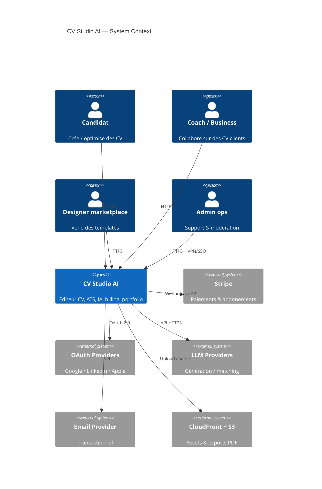
```mermaid
C4Context
title CV Studio AI — System Context

Person(candidate, "Candidat", "Crée / optimise des CV")
Person(coach, "Coach / Business", "Collabore sur des CV clients")
Person(designer, "Designer marketplace", "Vend des templates")
Person(admin, "Admin ops", "Support & moderation")

System(cvstudio, "CV Studio AI", "Éditeur CV, ATS, IA, billing, portfolio")

System_Ext(stripe, "Stripe", "Paiements & abonnements")
System_Ext(oauth, "OAuth Providers", "Google / LinkedIn / Apple")
System_Ext(llm, "LLM Providers", "Génération / matching")
System_Ext(email, "Email Provider", "Transactionnel")
System_Ext(cdn, "CloudFront + S3", "Assets & exports PDF")

Rel(candidate, cvstudio, "HTTPS")
Rel(coach, cvstudio, "HTTPS")
Rel(designer, cvstudio, "HTTPS")
Rel(admin, cvstudio, "HTTPS + VPN/SSO")
Rel(cvstudio, stripe, "Webhooks / API")
Rel(cvstudio, oauth, "OAuth 2.0")
Rel(cvstudio, llm, "API HTTPS")
Rel(cvstudio, email, "API")
Rel(cvstudio, cdn, "Upload / serve")
```

## 1.3 Diagramme conteneurs (C4 — Containers)

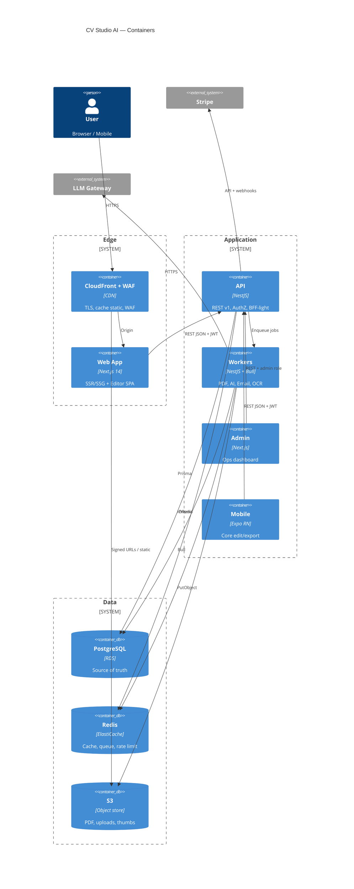
```mermaid
C4Container
title CV Studio AI — Containers

Person(user, "User", "Browser / Mobile")

System_Boundary(edge, "Edge") {
  Container(cf, "CloudFront + WAF", "CDN", "TLS, cache static, WAF")
  Container(web, "Web App", "Next.js 14", "SSR/SSG + Editor SPA")
}

System_Boundary(app, "Application") {
  Container(api, "API", "NestJS", "REST v1, AuthZ, BFF-light")
  Container(workers, "Workers", "NestJS + Bull", "PDF, AI, Email, OCR")
  Container(admin, "Admin", "Next.js", "Ops dashboard")
  Container(mobile, "Mobile", "Expo RN", "Core edit/export")
}

System_Boundary(data, "Data") {
  ContainerDb(pg, "PostgreSQL", "RDS", "Source of truth")
  ContainerDb(redis, "Redis", "ElastiCache", "Cache, queue, rate limit")
  ContainerDb(s3, "S3", "Object store", "PDF, uploads, thumbs")
}

System_Ext(stripe, "Stripe")
System_Ext(llm, "LLM Gateway")

Rel(user, cf, "HTTPS")
Rel(cf, web, "Origin")
Rel(web, api, "REST JSON + JWT")
Rel(mobile, api, "REST JSON + JWT")
Rel(admin, api, "REST + admin role")
Rel(api, pg, "Prisma")
Rel(api, redis, "IORedis")
Rel(api, workers, "Enqueue jobs")
Rel(workers, pg, "Prisma")
Rel(workers, redis, "Bull")
Rel(workers, s3, "PutObject")
Rel(workers, llm, "HTTPS")
Rel(api, stripe, "API + webhooks")
Rel(cf, s3, "Signed URLs / static")
```

## 1.4 Stack imposée (résumé)

| Couche        | Techno                                                               |
| ------------- | -------------------------------------------------------------------- |
| Monorepo      | Turborepo + pnpm                                                     |
| Web           | Next.js 14 App Router, TS, Tailwind, shadcn, TanStack Query, Zustand |
| API           | NestJS, Prisma, Passport, JWT, Swagger                               |
| Mobile        | React Native / Expo                                                  |
| Data          | PostgreSQL, Redis                                                    |
| Jobs          | BullMQ                                                               |
| Infra         | Docker, Kubernetes (EKS), Terraform, GitHub Actions                  |
| Observability | OpenTelemetry, Prometheus, Grafana, Winston → ELK/OpenSearch         |

---

# 2. OBJECTIFS & NON-OBJECTIFS

## 2.1 Objectifs

1. Scalabilité horizontale stateless (API/Web/Workers)
2. Maintenabilité pour ~20 développeurs (modules clairs, contrats partagés)
3. Performance perçue editor + Lighthouse ≥ 90 marketing
4. Sécurité OWASP Top 10 + RGPD EU residency
5. Évolutivité roadmap (IA, marketplace, collab CRDT, mobile)
6. Production-ready : CI, envs, migrations, rollback, SLOs

## 2.2 Non-objectifs (24 mois)

- Microservices fins dès J0 (modular monolith Nest d’abord)
- Job board / auto-apply
- Multi-cloud actif (AWS primary)
- Event sourcing complet partout (audit events ciblés)
- GraphQL public v1 (REST first ; GraphQL option BFF plus tard)

## 2.3 Principes d’architecture

| Principe                   | Application                               |
| -------------------------- | ----------------------------------------- |
| API-first                  | Mobile & Web partagent les mêmes contrats |
| Entitlements server-side   | Jamais trust UI seule                     |
| Expand/contract migrations | Zéro downtime schema                      |
| Feature flags              | Rollout progressif IA / billing           |
| Observability by default   | Traces + metrics + structured logs        |
| Cost-aware AI              | Gateway unique, quotas, cache embeddings  |

---

# 3. LAYERED ARCHITECTURE

```
┌─────────────────────────────────────────────────────────────┐
│  Presentation — Next.js / Expo / Admin                       │
│  Pages · Components · Hooks · Zustand · TanStack Query       │
├─────────────────────────────────────────────────────────────┤
│  API Client Layer — REST (/api/v1) · typed SDK shared-types  │
├─────────────────────────────────────────────────────────────┤
│  Interface Adapters — Nest Controllers · DTOs · Guards       │
├─────────────────────────────────────────────────────────────┤
│  Application Layer — Use cases / Commands & Queries (CQRS)   │
├─────────────────────────────────────────────────────────────┤
│  Domain Layer (DDD) — Entities · Aggregates · VOs · Policies │
├─────────────────────────────────────────────────────────────┤
│  Infrastructure — Prisma repos · Stripe · LLM · S3 · Mail    │
├─────────────────────────────────────────────────────────────┤
│  Data — PostgreSQL · Redis · Object Storage                  │
└─────────────────────────────────────────────────────────────┘
```

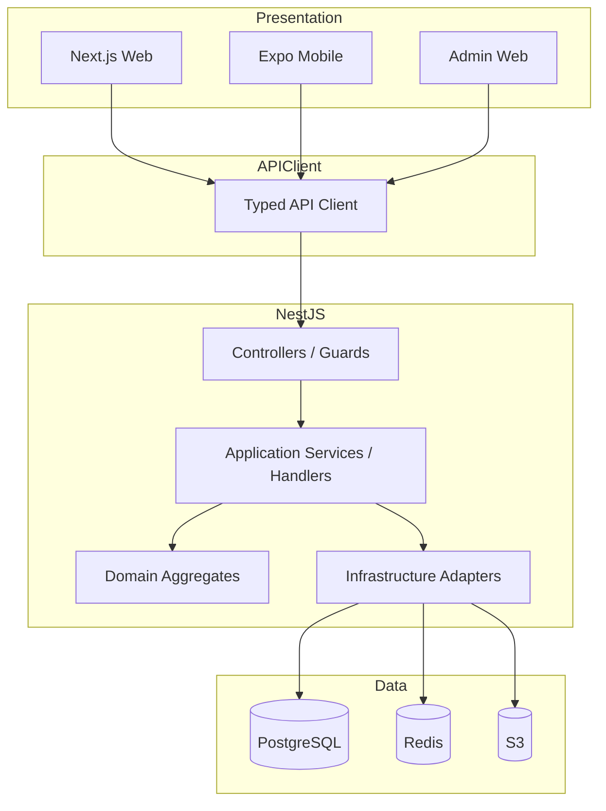
```mermaid
flowchart TB
  subgraph Presentation
    Web[Next.js Web]
    Mobile[Expo Mobile]
    Admin[Admin Web]
  end

  subgraph APIClient
    SDK[Typed API Client]
  end

  subgraph NestJS
    Ctrl[Controllers / Guards]
    App[Application Services / Handlers]
    Dom[Domain Aggregates]
    Infra[Infrastructure Adapters]
  end

  subgraph Data
    PG[(PostgreSQL)]
    Redis[(Redis)]
    S3[(S3)]
  end

  Web --> SDK
  Mobile --> SDK
  Admin --> SDK
  SDK --> Ctrl
  Ctrl --> App
  App --> Dom
  App --> Infra
  Infra --> PG
  Infra --> Redis
  Infra --> S3
```

### Règles de dépendance (Clean Architecture)

- Domain **ne dépend pas** de Nest/Prisma/Stripe
- Application orchestre Domain + ports (interfaces)
- Infrastructure **implémente** les ports
- Controllers traduisent HTTP ↔ Application (DTOs validés)

---

# 4. ARCHITECTURAL PATTERNS

## 4.1 Domain-Driven Design — Bounded Contexts

| Context               | Responsabilité                      | Aggregate roots            |
| --------------------- | ----------------------------------- | -------------------------- |
| **Identity & Access** | Auth, sessions, RBAC                | `User`, `Session`          |
| **Resume**            | Documents CV, versions, share       | `ResumeDocument`           |
| **Template**          | Catalogue, marketplace listings     | `Template`, `Listing`      |
| **Billing**           | Plans, subscriptions, invoices      | `Subscription`, `Customer` |
| **AI Generation**     | Optimize, match, letters, interview | `AiRequest`, `AtsReport`   |
| **Portfolio**         | Pages publiques                     | `PortfolioPage`            |
| **Collaboration**     | Teams, comments, presence (M12+)    | `Workspace`, `Comment`     |
| **Analytics**         | Product events ingestion            | `AnalyticsEvent`           |

Anti-corruption layers : Stripe webhooks → Billing ; LLM responses → AI value objects (guardrails).

## 4.2 Clean Architecture

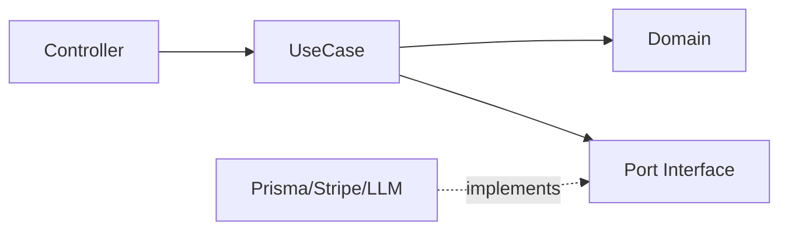
```mermaid
flowchart LR
  Ctrl[Controller] --> UC[UseCase]
  UC --> Dom[Domain]
  UC --> Port[Port Interface]
  Adapter[Prisma/Stripe/LLM] -.implements.-> Port
```

## 4.3 CQRS

**Writes (Commands)** — validés, transactionnels, émettent domain events  
Exemples : `CreateResume`, `UpdateResumeContent`, `ExportPdf`, `StartAtsAnalysis`, `CreateCheckoutSession`

**Reads (Queries)** — optimisées, éventuellement cached, projections dénormalisées légères  
Exemples : `GetResumeById`, `ListResumesForUser`, `GetEntitlements`, `ListTemplates`

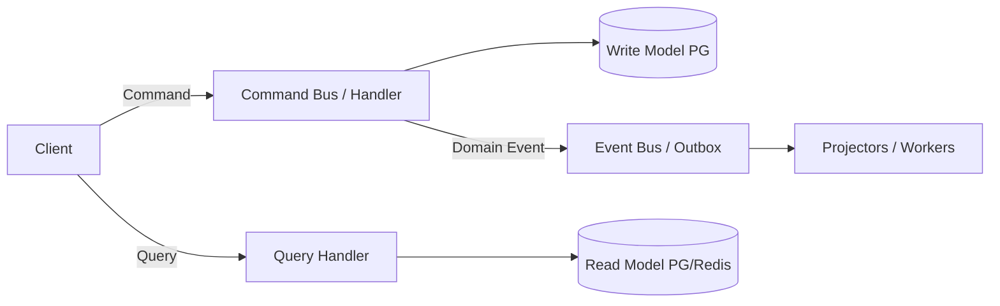
```mermaid
flowchart LR
  Client -->|Command| CH[Command Bus / Handler]
  CH --> WR[(Write Model PG)]
  CH -->|Domain Event| Bus[Event Bus / Outbox]
  Bus --> Proj[Projectors / Workers]
  Client -->|Query| QH[Query Handler]
  QH --> RD[(Read Model PG/Redis)]
```

**Event sourcing** : pas full ES. **Audit trail** via :

- `resume_versions` snapshots
- `audit_logs` (admin / billing / security)
- outbox events pour jobs async

## 4.4 Repository Pattern

```typescript
// Port (domain/application)
interface ResumeRepository {
  findById(id: ResumeId): Promise<ResumeDocument | null>;
  save(resume: ResumeDocument): Promise<void>;
  listByUser(userId: UserId, page: Page): Promise<Paged<ResumeSummary>>;
}
```

Impl Prisma dans `infrastructure/persistence`. Tests unitaires mockent le port.

## 4.5 Autres patterns

| Pattern                | Usage                                          |
| ---------------------- | ---------------------------------------------- |
| Outbox                 | Fiabilité events → queue                       |
| Saga / Process Manager | Checkout → entitlements → email                |
| Gateway                | LLM, OAuth, Stripe wrappers                    |
| Strategy               | PDF renderers, ATS rule sets, AI model routing |
| Circuit Breaker        | LLM provider failover                          |
| Idempotency Key        | Exports, checkout, webhooks                    |

---

# 5. MONOREPO STRUCTURE

```
cv-studio-ai/
├── apps/
│   ├── web/                 # Next.js 14 frontend
│   ├── api/                 # NestJS API
│   ├── workers/             # NestJS worker process (Bull consumers)
│   ├── mobile/              # React Native / Expo
│   └── admin/               # Admin dashboard Next.js
├── packages/
│   ├── shared-types/        # DTOs, API contracts, zod/schemas
│   ├── shared-ui/           # shadcn wrappers + design tokens CSS
│   ├── shared-utils/        # date, i18n helpers, result types
│   ├── shared-config/       # eslint, tsconfig bases
│   ├── ai-service/          # prompts, guardrails, provider clients
│   ├── analytics/           # event taxonomy + emitters
│   └── sdk-api-client/      # typed fetch client for web/mobile
├── infrastructure/
│   ├── docker/
│   ├── kubernetes/             # Helm charts / manifests
│   ├── terraform/           # AWS VPC, EKS, RDS, Redis, S3, CF
│   └── github-actions/      # reusable workflows
├── docs/                    # PRD, Design, Architecture
├── turbo.json
├── pnpm-workspace.yaml
├── package.json
└── tsconfig.base.json
```

### Turborepo pipeline (cible)

```json
{
  "pipeline": {
    "build": { "dependsOn": ["^build"], "outputs": ["dist/**", ".next/**"] },
    "lint": {},
    "test": { "dependsOn": ["^build"] },
    "typecheck": { "dependsOn": ["^build"] }
  }
}
```

### Package manager

**pnpm** workspaces — perf disk + strict deps pour 20 devs.

---

# 6. FRONTEND ARCHITECTURE (Next.js)

## 6.1 Arborescence

```
apps/web/src/
├── app/
│   ├── (marketing)/          # landing, pricing, templates gallery
│   ├── (auth)/               # signup, login, reset
│   ├── (app)/                # authenticated shell
│   │   ├── dashboard/
│   │   ├── editor/[resumeId]/
│   │   ├── templates/
│   │   ├── marketplace/
│   │   └── account/
│   ├── p/[slug]/            # public portfolio
│   ├── s/[token]/           # shared resume
│   └── api/                  # BFF route handlers (rare)
├── components/
│   ├── ui/                   # from shared-ui
│   ├── layout/
│   ├── editor/               # dual-pane, preview, rails
│   └── forms/
├── hooks/
├── lib/
├── store/                    # Zustand (editor local)
├── services/                 # thin wrappers SDK
├── styles/
│   └── tokens.css            # from design-tokens.css
└── middleware.ts             # auth gate + locale
```

## 6.2 Tech stack frontend

| Lib                   | Rôle                                               |
| --------------------- | -------------------------------------------------- |
| Next.js 14 App Router | SSR/SSG marketing, RSC où pertinent                |
| TypeScript            | strict                                             |
| Tailwind + tokens     | Design system                                      |
| shadcn/ui             | primitives accessibles                             |
| React Hook Form + Zod | forms editor sections                              |
| TanStack Query        | server state, cache, mutations                     |
| Zustand               | editor ephemeral state (cursor, dirty, UI drawers) |
| Framer Motion         | micro-interactions (reduced-motion aware)          |
| next/image + Sharp    | images                                             |

## 6.3 Data flow editor

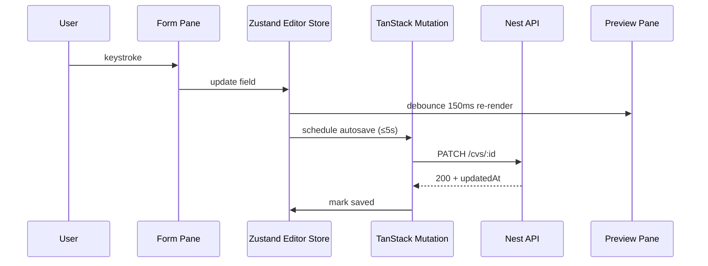
```mermaid
sequenceDiagram
  participant U as User
  participant Form as Form Pane
  participant Z as Zustand Editor Store
  participant Q as TanStack Mutation
  participant API as Nest API
  participant P as Preview Pane

  U->>Form: keystroke
  Form->>Z: update field
  Z->>P: debounce 150ms re-render
  Z->>Q: schedule autosave (≤5s)
  Q->>API: PATCH /cvs/:id
  API-->>Q: 200 + updatedAt
  Q->>Z: mark saved
```

## 6.4 Performance frontend

- Route-based code splitting
- Dynamic import drawer AI/ATS
- Preview virtualization si multi-pages
- Fonts `next/font` Inter + JetBrains subset
- Lighthouse CI sur `/` et `/editor` shell
- Bundle budget editor initial < ~250KB gzip aim

## 6.5 Auth middleware

- Cookie httpOnly refresh + memory/access token pattern
- Redirect unauthenticated hors `(app)`
- Public routes : marketing, `/p/*`, `/s/*`

---

# 7. BACKEND ARCHITECTURE (NestJS)

## 7.1 Arborescence

```
apps/api/src/
├── main.ts
├── app.module.ts
├── config/
├── common/
│   ├── decorators/          # @CurrentUser, @RequireEntitlement
│   ├── filters/             # Problem+JSON / envelope errors
│   ├── guards/              # JwtAuth, Roles, Entitlements
│   ├── interceptors/        # logging, timeout
│   ├── pipes/               # validation
│   └── middleware/
├── modules/
│   ├── auth/
│   ├── users/
│   ├── cv/
│   ├── templates/
│   ├── subscription/
│   ├── payment/
│   ├── ai/
│   ├── ats/
│   ├── portfolio/
│   ├── marketplace/
│   ├── analytics/
│   └── health/
├── database/                # PrismaModule
├── cache/
├── queue/                   # producers
├── logger/
└── exceptions/
```

`apps/workers` partage modules domain/infra, expose consumers Bull uniquement.

## 7.2 Module map

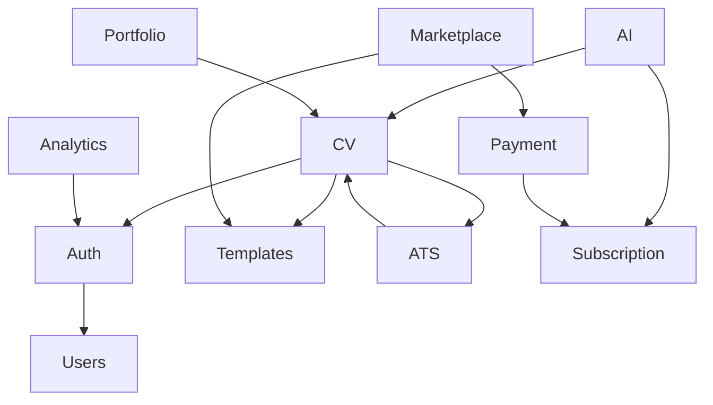
```mermaid
flowchart TB
  Auth --> Users
  CV --> Auth
  CV --> Templates
  CV --> ATS
  AI --> CV
  AI --> Subscription
  ATS --> CV
  Payment --> Subscription
  Portfolio --> CV
  Marketplace --> Templates
  Marketplace --> Payment
  Analytics --> Auth
```

## 7.3 Tech stack backend

NestJS · Prisma · PostgreSQL · Redis · JWT · Passport · class-validator · Winston · BullMQ · Swagger · argon2id

## 7.4 Bootstrap concerns

- Global ValidationPipe (`whitelist`, `forbidNonWhitelisted`)
- Helmet / security headers behind ingress also
- CORS allowlist web + admin + mobile schemes
- Graceful shutdown (drain HTTP + Prisma)
- OpenAPI `/docs` staging only (prod VPN / basic auth)

---

# 8. DOMAIN MODEL & DDD

## 8.1 Aggregate ResumeDocument (cœur)

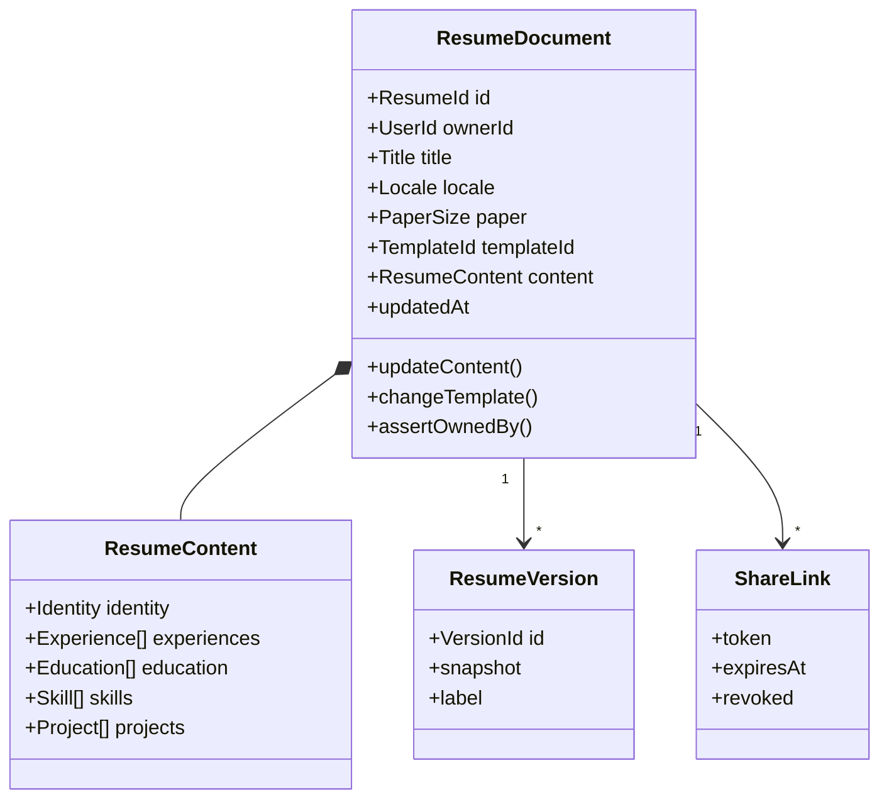
```mermaid
classDiagram
  class ResumeDocument {
    +ResumeId id
    +UserId ownerId
    +Title title
    +Locale locale
    +PaperSize paper
    +TemplateId templateId
    +ResumeContent content
    +updatedAt
    +updateContent()
    +changeTemplate()
    +assertOwnedBy()
  }
  class ResumeContent {
    +Identity identity
    +Experience[] experiences
    +Education[] education
    +Skill[] skills
    +Project[] projects
  }
  class ResumeVersion {
    +VersionId id
    +snapshot
    +label
  }
  class ShareLink {
    +token
    +expiresAt
    +revoked
  }
  ResumeDocument *-- ResumeContent
  ResumeDocument "1" --> "*" ResumeVersion
  ResumeDocument "1" --> "*" ShareLink
```

## 8.2 Aggregate Subscription / Entitlements

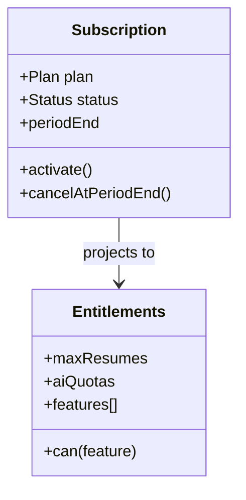
```mermaid
classDiagram
  class Subscription {
    +Plan plan
    +Status status
    +periodEnd
    +activate()
    +cancelAtPeriodEnd()
  }
  class Entitlements {
    +maxResumes
    +aiQuotas
    +features[]
    +can(feature)
  }
  Subscription --> Entitlements : projects to
```

Plans : `FREE` | `PRO` | `BUSINESS` (+ roles workspace).

## 8.3 AI Guardrail Policy (domain service)

- Refuse invention employer/diploma/dates
- Preserve numeric metrics user-provided
- Require human confirm before apply

---

# 9. DATABASE DESIGN (PostgreSQL)

## 9.1 Principes

- UUID v7 (time-sortable) ou UUID v4 PK
- Soft delete (`deleted_at`) users/resumes
- `created_at` / `updated_at` partout
- 3NF pour transactional core ; JSONB pour `resume.content`
- Indexes sur FK + colonnes de liste (`user_id, updated_at DESC`)
- FK ON DELETE restrict/cascade selon aggregate
- EU region RDS Multi-AZ + PITR

## 9.2 ER Diagram (logique)

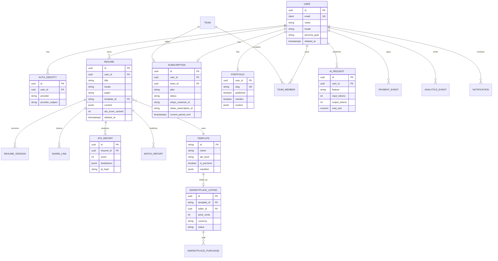
```mermaid
erDiagram
  USER ||--o{ AUTH_IDENTITY : has
  USER ||--o{ RESUME : owns
  USER ||--o| SUBSCRIPTION : has
  USER ||--o| PORTFOLIO : has
  USER ||--o{ TEAM_MEMBER : joins
  TEAM ||--o{ TEAM_MEMBER : contains
  TEAM ||--o| SUBSCRIPTION : billed
  RESUME ||--o{ RESUME_VERSION : versions
  RESUME ||--o{ SHARE_LINK : shares
  RESUME ||--o{ ATS_REPORT : analyzes
  RESUME ||--o{ MATCH_REPORT : matches
  RESUME }o--|| TEMPLATE : uses
  TEMPLATE ||--o| MARKETPLACE_LISTING : listed_as
  MARKETPLACE_LISTING ||--o{ MARKETPLACE_PURCHASE : sold
  USER ||--o{ AI_REQUEST : performs
  USER ||--o{ PAYMENT_EVENT : pays
  USER ||--o{ ANALYTICS_EVENT : emits
  USER ||--o{ NOTIFICATION : receives

  USER {
    uuid id PK
    citext email UK
    string name
    string locale
    string persona_goal
    timestamptz deleted_at
  }

  AUTH_IDENTITY {
    uuid id PK
    uuid user_id FK
    string provider
    string provider_subject
  }

  RESUME {
    uuid id PK
    uuid user_id FK
    string title
    string locale
    string paper
    string template_id FK
    jsonb content
    int ats_score_cached
    timestamptz deleted_at
  }

  TEMPLATE {
    string id PK
    string name
    string ats_level
    boolean is_premium
    jsonb manifest
  }

  SUBSCRIPTION {
    uuid id PK
    uuid user_id FK
    uuid team_id FK
    string plan
    string status
    string stripe_customer_id
    string stripe_subscription_id
    timestamptz current_period_end
  }

  ATS_REPORT {
    uuid id PK
    uuid resume_id FK
    int score
    jsonb breakdown
    string jd_hash
  }

  AI_REQUEST {
    uuid id PK
    uuid user_id FK
    string feature
    int input_tokens
    int output_tokens
    numeric cost_usd
  }

  PORTFOLIO {
    uuid user_id PK
    string slug UK
    boolean published
    boolean noindex
    jsonb content
  }

  MARKETPLACE_LISTING {
    uuid id PK
    string template_id FK
    uuid seller_id FK
    int price_cents
    string currency
    string status
  }
```

## 9.3 Contenu CV (JSONB)

Le document editor est stocké en JSONB versionné (`schemaVersion`) — sections Identity, Experience, Education, Skills, Languages, Certificates, Projects.  
Les tables relationnelles normalisées séparées (experiences…) sont **optionnelles** pour reporting ; v1 privilégie JSONB + projections.

## 9.4 Indexes recommandés

```sql
CREATE INDEX resumes_user_updated_idx ON resumes (user_id, updated_at DESC) WHERE deleted_at IS NULL;
CREATE INDEX ats_reports_resume_created_idx ON ats_reports (resume_id, created_at DESC);
CREATE INDEX ai_requests_user_created_idx ON ai_requests (user_id, created_at DESC);
CREATE UNIQUE INDEX auth_identities_provider_subject_uidx ON auth_identities (provider, provider_subject);
CREATE UNIQUE INDEX portfolios_slug_uidx ON portfolios (slug);
```

## 9.5 Soft delete & cascade

- Delete user → soft delete ; purge job 30j anonymise + hard delete
- Delete resume → soft ; versions conservées jusqu’à purge
- Subscription cancel → status change, pas hard delete (compta)

## 9.6 Prisma

Schéma de référence : [`docs/prisma/schema.prisma`](./prisma/schema.prisma)

---

# 10. CACHING STRATEGY (Redis)

## 10.1 Usages

| Key pattern                  | Données                 | TTL                              |
| ---------------------------- | ----------------------- | -------------------------------- |
| `sess:{id}`                  | session / refresh meta  | 7 days                           |
| `entitlements:{userId}`      | plan + quotas remaining | 5–15 min (invalidate on webhook) |
| `user:{id}:profile`          | profil public light     | 1 hour                           |
| `templates:catalog:{locale}` | metadata templates      | 1 day                            |
| `resume:preview:{id}:{hash}` | optional HTML fragment  | 10 min                           |
| `ff:{flag}`                  | feature flags snapshot  | 1–5 min                          |
| `rl:{route}:{user/ip}`       | rate limit counters     | window                           |
| `collab:{resumeId}`          | presence (advanced)     | short TTL + heartbeat            |

## 10.2 Invalidation

- Write-through entitlements on billing events
- Bust template catalog on publish
- Never cache authorization decisions sans user+version

## 10.3 Redis topology

ElastiCache Redis **cluster mode optional M18** ; au début primary + replica.  
BullMQ DB index séparé des cache keys (logical DB 0 cache / 1 queues) ou key prefixes stricts.

---

# 11. MESSAGE QUEUE (Bull/Redis)

## 11.1 Queues

| Queue           | Jobs                               | Concurrency notes   |
| --------------- | ---------------------------------- | ------------------- |
| `email`         | welcome, receipts, lifecycle       | high                |
| `pdf`           | render export                      | CPU/Chromium pool   |
| `ai`            | optimize, match, letter, interview | rate limited + cost |
| `ats`           | analyze (si heavy)                 | medium              |
| `ocr`           | PDF import                         | GPU/CPU later       |
| `analytics`     | batch sink                         | low priority        |
| `notifications` | push/in-app                        | medium              |
| `marketplace`   | payouts sync                       | low                 |

## 11.2 Job reliability

- Attempts with exponential backoff
- DLQ + alert on permanent fail
- Idempotency keys stored
- Timeout per job type (PDF 30s, AI 60s)

## 11.3 PDF worker isolation

Workers PDF dans Deployment K8s séparé (memory request élevé, Chromium).  
Autoscaling sur `pdf` queue depth.

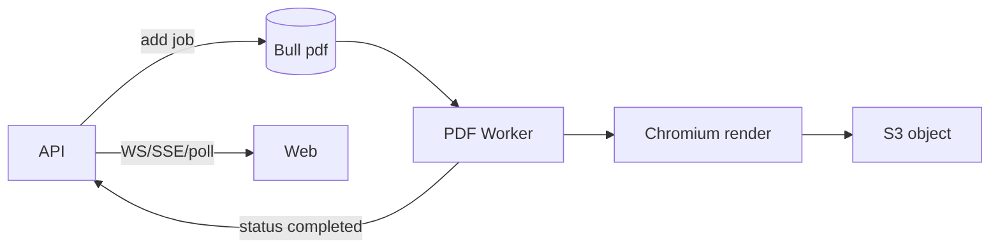
```mermaid
flowchart LR
  API[API] -->|add job| Q[(Bull pdf)]
  Q --> W[PDF Worker]
  W --> Render[Chromium render]
  Render --> S3[S3 object]
  W -->|status completed| API
  API -->|WS/SSE/poll| Web
```

---

# 12. API DESIGN

## 12.1 Base

- Prefix : `/api/v1`
- Auth : `Authorization: Bearer <access_token>`
- Idempotency-Key sur POST export/checkout
- Pagination : `?cursor=` ou `page/pageSize` (max 100)
- Versioning URL ; breaking → `/v2`

## 12.2 Resources

```
/api/v1/auth/*
/api/v1/users/me
/api/v1/cvs
/api/v1/cvs/:id
/api/v1/cvs/:id/export
/api/v1/cvs/:id/ats/analyze
/api/v1/cvs/:id/match
/api/v1/templates
/api/v1/subscriptions
/api/v1/payments/checkout-session
/api/v1/payments/portal-session
/api/v1/payments/webhooks/stripe
/api/v1/ai/*
/api/v1/analytics/events
/api/v1/portfolio
/api/v1/marketplace/*
/api/v1/health
```

## 12.3 Envelope réponse (succès)

```json
{
  "success": true,
  "data": {},
  "meta": {
    "timestamp": "2026-07-26T00:00:00.000Z",
    "version": "1.0"
  }
}
```

## 12.4 Envelope erreur

Aligné aussi RFC7807 en interne ; envelope produit :

```json
{
  "success": false,
  "error": {
    "code": "VALIDATION_ERROR",
    "message": "Invalid email",
    "details": [{ "path": "email", "message": "Invalid format" }]
  },
  "meta": { "timestamp": "...", "version": "1.0", "requestId": "..." }
}
```

Codes courants : `UNAUTHORIZED`, `FORBIDDEN`, `NOT_FOUND`, `VALIDATION_ERROR`, `ENTITLEMENT_REQUIRED` (402), `RATE_LIMITED`, `CONFLICT`, `INTERNAL_ERROR`.

## 12.5 OpenAPI

Swagger généré Nest ; `shared-types` générés depuis OpenAPI (or zod-first → OpenAPI).

---

# 13. AUTHENTICATION & AUTHORIZATION

## 13.1 Auth flows

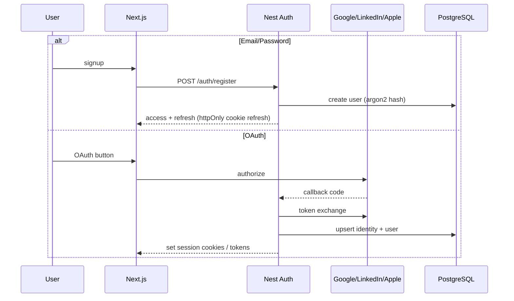
```mermaid
sequenceDiagram
  participant U as User
  participant Web as Next.js
  participant API as Nest Auth
  participant IdP as Google/LinkedIn/Apple
  participant DB as PostgreSQL

  alt Email/Password
    U->>Web: signup
    Web->>API: POST /auth/register
    API->>DB: create user (argon2 hash)
    API-->>Web: access + refresh (httpOnly cookie refresh)
  else OAuth
    U->>Web: OAuth button
    Web->>IdP: authorize
    IdP-->>API: callback code
    API->>IdP: token exchange
    API->>DB: upsert identity + user
    API-->>Web: set session cookies / tokens
  end
```

### Tokens

- Access JWT : 15 min, claims `sub`, `roles`, `plan` (plan aussi revalidé via entitlements service)
- Refresh : 7–30 jours, rotation, family revoke on reuse detection
- 2FA TOTP optional (Should Have)
- Magic link : one-time token Redis TTL 15 min

## 13.2 RBAC

| Role             | Description            |
| ---------------- | ---------------------- |
| `free_user`      | quotas Free            |
| `pro_user`       | Pro entitlements       |
| `business_user`  | member siège           |
| `business_admin` | team billing + invites |
| `moderator`      | marketplace review     |
| `admin`          | ops support (audited)  |

Permissions exemples : `cv:read`, `cv:write`, `cv:export`, `ai:optimize`, `billing:manage`, `team:invite`, `admin:impersonate`.

## 13.3 Entitlements Guard

```typescript
@RequireEntitlement('ai:optimize')
@Post('optimize-bullet')
optimize() { ... }
```

Check order : Auth → Role → Entitlement → RateLimit → Handler.

---

# 14. SECURITY CONSIDERATIONS

## 14.1 OWASP Top 10 mapping

| Risque | Mitigation |
|---|---|---|
| Broken Access Control | Guards + ownership checks + IDOR tests |
| Cryptographic Failures | TLS1.2+, KMS secrets, encryption S3/RDS |
| Injection | Prisma parameterized ; DTO validation |
| Insecure Design | Threat model AI/billing ; ethics guardrails |
| Security Misconfiguration | Hardened images, no default creds, CIS |
| Vulnerable Components | Dependabot, SCA CI, Renovate |
| Identification/Auth Failures | argon2, lockout, refresh rotation, OAuth |
| Software/Data Integrity | signed webhooks Stripe, CI attestations |
| Security Logging Failures | audit authz, shipping logs, alerts |
| SSRF | JD URL fetch allowlist, block link-local |

## 14.2 Headers

CSP, HSTS, X-Frame-Options `DENY`, Referrer-Policy, Permissions-Policy.

## 14.3 Secrets

AWS Secrets Manager / SSM ; jamais dans git ; rotation runbooks.

## 14.4 Rate limiting

- Login : 5 / 15 min / account+IP
- API general : 120/min Free, 600/min Pro
- AI : quota + burst token bucket
- Export : burst protection

## 14.5 Privacy

- EU data residency
- PII minimization in logs
- AI logs retention 90d
- Right to erase / export endpoints

---

# 15. PERFORMANCE OPTIMIZATIONS

## 15.1 Frontend

Code splitting · next/image · lazy drawers · RSC marketing · prefetch dashboard · Lighthouse CI ≥90

## 15.2 Backend

Indexes · include Prisma (anti N+1) · connection pooling (PgBouncer) · query timeout · pagination max 100 · Redis entitlements · HTTP keep-alive

## 15.3 Infra

CloudFront · Brotli/Gzip · RDS read replicas (M12+) · ALB · HPA on CPU/RPS/queue depth · PDF/AI workers isolés

## 15.4 Budgets

| SLI                   | Target            |
| --------------------- | ----------------- |
| API p95 cached        | < 300 ms          |
| API p95 dynamic       | < 800 ms          |
| PDF p95               | < 5 s             |
| ATS p95               | < 8 s             |
| Editor preview update | < 150 ms debounce |

---

# 16. LOGGING & MONITORING

## 16.1 Logging

- Winston JSON structured
- Fields : `requestId`, `userId` (hashable), `route`, `latencyMs`, `errorCode`
- Levels ERROR/WARN/INFO/DEBUG
- Ship to OpenSearch/ELK
- **No CV content / secrets in logs**

## 16.2 Metrics (Prometheus)

HTTP latency/error · queue depth · PDF success · AI cost/tokens · DB pool · Redis hit ratio · Node process

## 16.3 Tracing

OpenTelemetry → Tempo/Jaeger ; propager `traceparent` Web→API→Workers

## 16.4 Dashboards Grafana

Golden signals API · Billing health · AI FinOps · Editor UX (RUM) · SLO burn

## 16.5 Alerting

| Condition                | Severity |
| ------------------------ | -------- |
| Error rate > 1% 5m       | SEV2     |
| p95 > 2s sustained       | SEV2     |
| PDF fail > 1%            | SEV2     |
| CPU > 80% 15m            | SEV3     |
| Disk > 90%               | SEV2     |
| DB connections exhausted | SEV1     |
| Stripe webhook lag > 10m | SEV2     |

---

# 17. TESTING STRATEGY

```
         /\
        /E2E\          Cypress critical journeys
       /------\
      / Integr \       API + DB testcontainers
     /----------\
    /    Unit     \    Domain + services ≥80%
   /----------------\
```

| Type          | Tool                   | Scope                     |
| ------------- | ---------------------- | ------------------------- |
| Unit          | Jest / Vitest          | domain, use cases         |
| Integration   | Jest + Testcontainers  | Nest modules + Prisma     |
| E2E           | Cypress / Playwright   | signup→edit→export        |
| Contract      | OpenAPI validation     | SDK vs API                |
| Load          | k6                     | autosave storm, PDF burst |
| Security      | ZAP baseline, SCA      | CI                        |
| Visual        | Playwright screenshots | templates                 |
| Lighthouse CI | LHCI                   | marketing + shell         |

Coverage gate packages domain/application : **≥ 80%**.

---

# 18. CI/CD PIPELINE

## 18.1 GitHub Actions (PR)

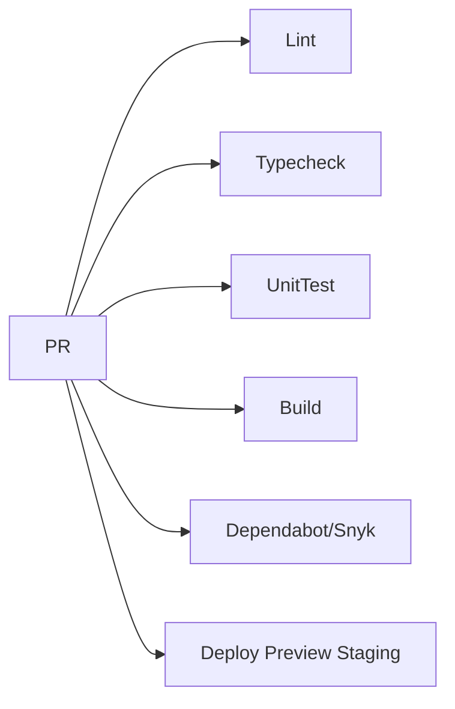
```mermaid
flowchart LR
  PR --> Lint
  PR --> Typecheck
  PR --> UnitTest
  PR --> Build
  PR --> SCA[Dependabot/Snyk]
  PR --> Preview[Deploy Preview Staging]
```

## 18.2 Main / release

1. Build images → ECR
2. Migrate Prisma (job expand)
3. Rolling / Blue-Green deploy API & Web
4. Smoke tests
5. Shift traffic
6. Monitor error budget 30–60 min

## 18.3 Environments

| Env         | Purpose                 |
| ----------- | ----------------------- |
| local       | docker-compose PG/Redis |
| development | shared dev              |
| staging     | prod-like, Stripe test  |
| production  | live                    |

Secrets isolés par env ; prod approvals required.

---

# 19. DEPLOYMENT ARCHITECTURE

## 19.1 AWS topology

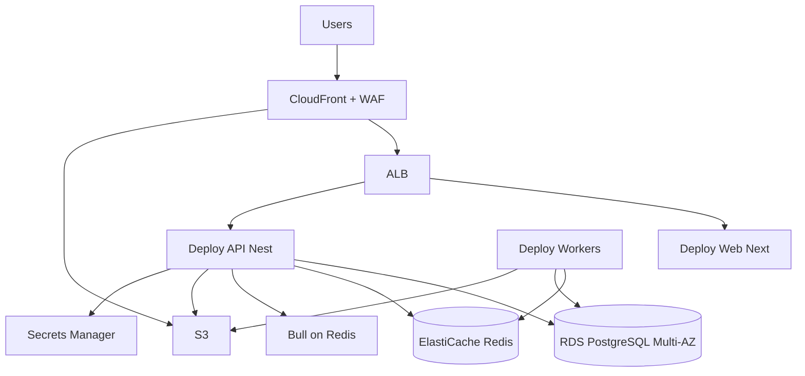
```mermaid
flowchart TB
  Users --> CF[CloudFront + WAF]
  CF --> ALB[ALB]
  ALB --> Web[Deploy Web Next]
  ALB --> API[Deploy API Nest]
  API --> RDS[(RDS PostgreSQL Multi-AZ)]
  API --> Redis[(ElastiCache Redis)]
  API --> SQSish[Bull on Redis]
  Workers[Deploy Workers] --> Redis
  Workers --> RDS
  Workers --> S3
  API --> S3
  CF --> S3
  API --> SM[Secrets Manager]
```

## 19.2 Kubernetes

| Deployment     | Replicas (start) | HPA         |
| -------------- | ---------------- | ----------- |
| `web`          | 3                | CPU/RPS     |
| `api`          | 3                | CPU/RPS     |
| `worker-pdf`   | 2                | queue depth |
| `worker-ai`    | 2                | queue depth |
| `worker-email` | 1–2              | queue       |

Resources : PDF workers memory ↑ (Chromium).  
PodDisruptionBudgets + anti-affinity.

## 19.3 Deployment strategy

- **Blue-Green** ou rolling with readiness probes
- DB migrations expand/contract
- Feature flags pour découpler deploy et release
- Rollback : previous ReplicaSet + migrate down only if safe (prefer forward fixes)

## 19.4 Storage

- S3 buckets : `exports`, `uploads`, `public-assets`
- Lifecycle exports 30 days
- Signed URLs short TTL

---

# 20. UML & DIAGRAMMES

## 20.1 Sequence — Création CV + Autosave + Export PDF

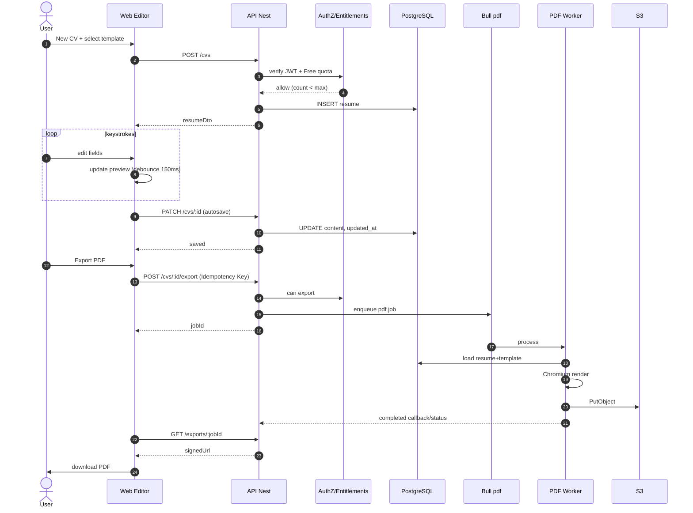
```mermaid
sequenceDiagram
  autonumber
  actor U as User
  participant W as Web Editor
  participant API as API Nest
  participant Auth as AuthZ/Entitlements
  participant DB as PostgreSQL
  participant Q as Bull pdf
  participant WR as PDF Worker
  participant S3 as S3

  U->>W: New CV + select template
  W->>API: POST /cvs
  API->>Auth: verify JWT + Free quota
  Auth-->>API: allow (count < max)
  API->>DB: INSERT resume
  API-->>W: resumeDto

  loop keystrokes
    U->>W: edit fields
    W->>W: update preview (debounce 150ms)
  end

  W->>API: PATCH /cvs/:id (autosave)
  API->>DB: UPDATE content, updated_at
  API-->>W: saved

  U->>W: Export PDF
  W->>API: POST /cvs/:id/export (Idempotency-Key)
  API->>Auth: can export
  API->>Q: enqueue pdf job
  API-->>W: jobId
  Q->>WR: process
  WR->>DB: load resume+template
  WR->>WR: Chromium render
  WR->>S3: PutObject
  WR-->>API: completed callback/status
  W->>API: GET /exports/:jobId
  API-->>W: signedUrl
  W->>U: download PDF
```

## 20.2 Sequence — OAuth Google Login

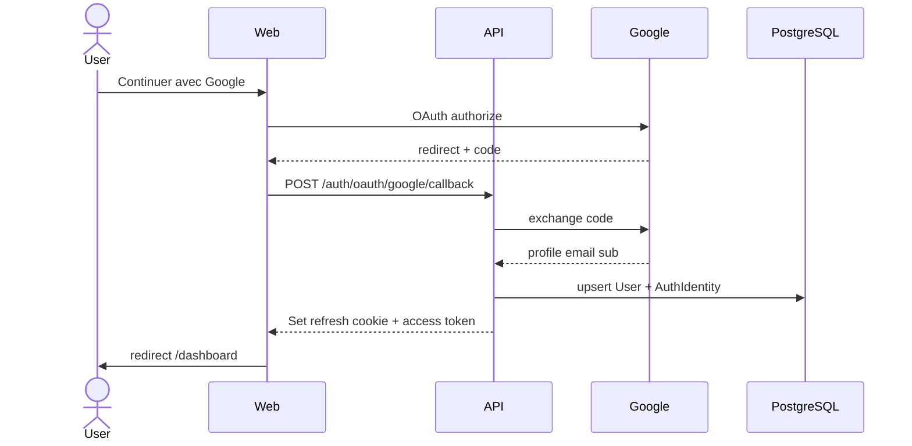
```mermaid
sequenceDiagram
  actor U as User
  participant W as Web
  participant API as API
  participant G as Google
  participant DB as PostgreSQL

  U->>W: Continuer avec Google
  W->>G: OAuth authorize
  G-->>W: redirect + code
  W->>API: POST /auth/oauth/google/callback
  API->>G: exchange code
  G-->>API: profile email sub
  API->>DB: upsert User + AuthIdentity
  API-->>W: Set refresh cookie + access token
  W->>U: redirect /dashboard
```

## 20.3 Sequence — AI Optimize Bullet (Pro)

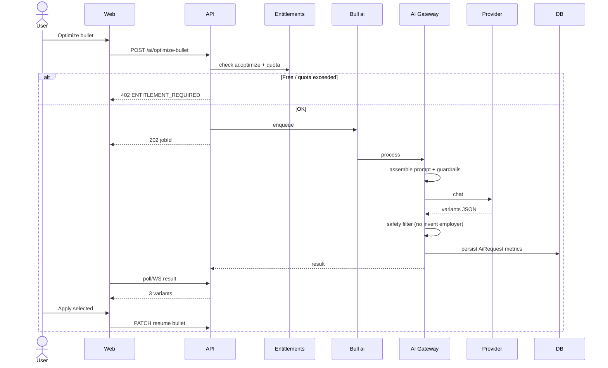
```mermaid
sequenceDiagram
  actor U as User
  participant W as Web
  participant API as API
  participant Ent as Entitlements
  participant Q as Bull ai
  participant GW as AI Gateway
  participant LLM as Provider
  participant DB as DB

  U->>W: Optimize bullet
  W->>API: POST /ai/optimize-bullet
  API->>Ent: check ai:optimize + quota
  alt Free / quota exceeded
    API-->>W: 402 ENTITLEMENT_REQUIRED
  else OK
    API->>Q: enqueue
    API-->>W: 202 jobId
    Q->>GW: process
    GW->>GW: assemble prompt + guardrails
    GW->>LLM: chat
    LLM-->>GW: variants JSON
    GW->>GW: safety filter (no invent employer)
    GW->>DB: persist AiRequest metrics
    GW-->>API: result
    W->>API: poll/WS result
    API-->>W: 3 variants
    U->>W: Apply selected
    W->>API: PATCH resume bullet
  end
```

## 20.4 Sequence — Stripe Checkout → Entitlements

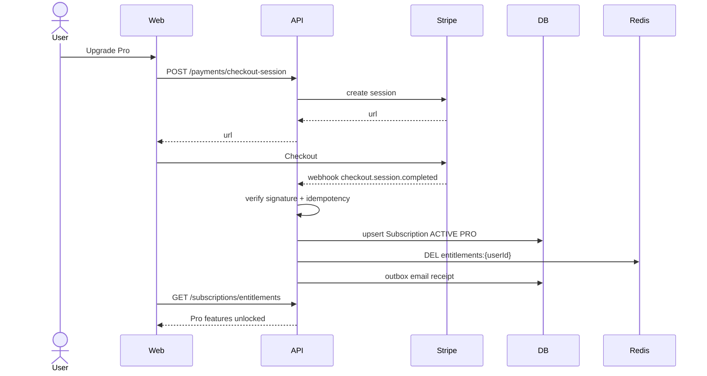
```mermaid
sequenceDiagram
  actor U as User
  participant W as Web
  participant API as API
  participant ST as Stripe
  participant DB as DB
  participant Redis as Redis

  U->>W: Upgrade Pro
  W->>API: POST /payments/checkout-session
  API->>ST: create session
  ST-->>API: url
  API-->>W: url
  W->>ST: Checkout
  ST-->>API: webhook checkout.session.completed
  API->>API: verify signature + idempotency
  API->>DB: upsert Subscription ACTIVE PRO
  API->>Redis: DEL entitlements:{userId}
  API->>DB: outbox email receipt
  W->>API: GET /subscriptions/entitlements
  API-->>W: Pro features unlocked
```

## 20.5 Sequence — ATS Analyze

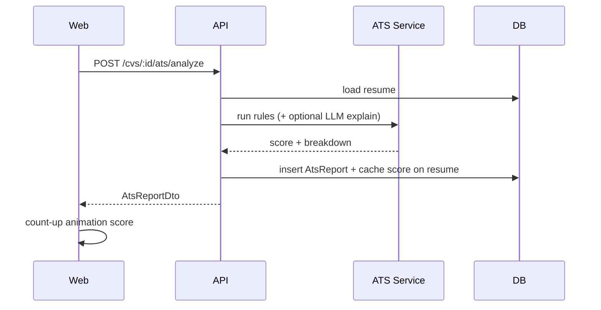
```mermaid
sequenceDiagram
  participant W as Web
  participant API as API
  participant ATS as ATS Service
  participant DB as DB

  W->>API: POST /cvs/:id/ats/analyze
  API->>DB: load resume
  API->>ATS: run rules (+ optional LLM explain)
  ATS-->>API: score + breakdown
  API->>DB: insert AtsReport + cache score on resume
  API-->>W: AtsReportDto
  W->>W: count-up animation score
```

## 20.6 State machine — Subscription

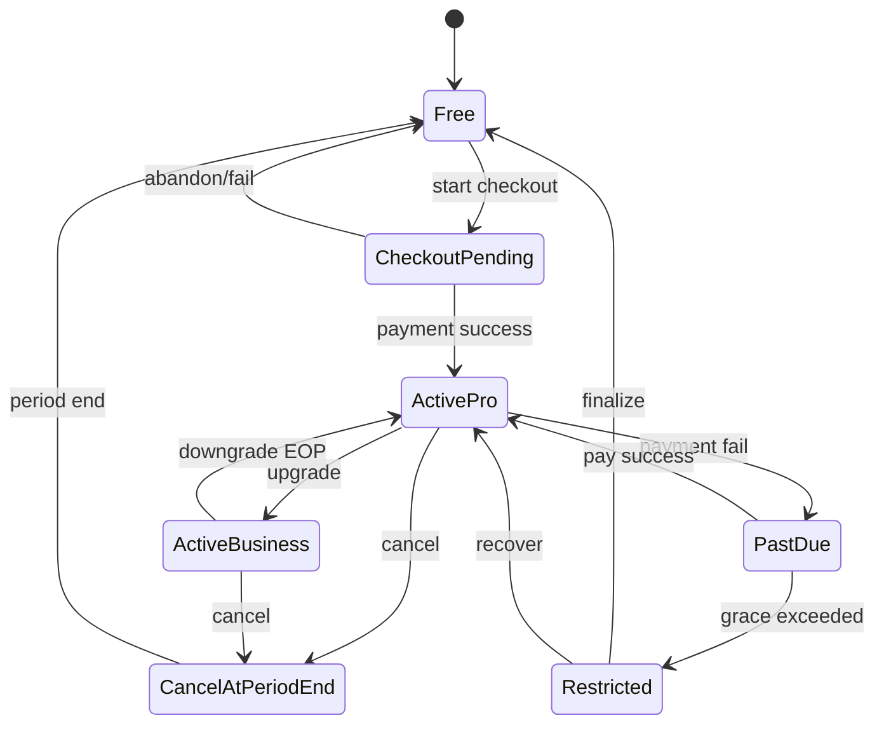
```mermaid
stateDiagram-v2
  [*] --> Free
  Free --> CheckoutPending: start checkout
  CheckoutPending --> ActivePro: payment success
  CheckoutPending --> Free: abandon/fail
  ActivePro --> ActiveBusiness: upgrade
  ActiveBusiness --> ActivePro: downgrade EOP
  ActivePro --> CancelAtPeriodEnd: cancel
  ActiveBusiness --> CancelAtPeriodEnd: cancel
  CancelAtPeriodEnd --> Free: period end
  ActivePro --> PastDue: payment fail
  PastDue --> ActivePro: pay success
  PastDue --> Restricted: grace exceeded
  Restricted --> Free: finalize
  Restricted --> ActivePro: recover
```

## 20.7 Component diagram — AI Gateway

```mermaid
flowchart TB
  subgraph API
    Ctrl[AI Controller]
    UC[OptimizeBulletHandler]
  end
  subgraph PackageAI[packages/ai-service]
    GW[LLM Gateway]
    Prompt[Prompt Registry]
    Guard[Guardrail Pipeline]
    Route[Model Router]
    Cost[Cost Tracker]
  end
  Ctrl --> UC --> GW
  GW --> Prompt
  GW --> Guard
  GW --> Route
  Route --> P1[Provider A]
  Route --> P2[Provider B]
  GW --> Cost
```

## 20.8 Deployment UML (nodes)

```mermaid
flowchart TB
  subgraph Internet
    U[Users]
  end
  subgraph AWS
    WAF[WAF]
    CF[CloudFront]
    ALB[ALB]
    subgraph EKS
      WEB[web pods]
      API[api pods]
      WP[worker-pdf]
      WA[worker-ai]
      WE[worker-email]
    end
    RDS[(RDS Postgres)]
    REDIS[(Redis)]
    S3[(S3)]
  end
  U --> WAF --> CF --> ALB
  ALB --> WEB
  ALB --> API
  API --> RDS
  API --> REDIS
  WP --> REDIS
  WA --> REDIS
  WE --> REDIS
  WP --> S3
  WP --> RDS
```

## 20.9 Class diagram — Auth module (simplifié)

```mermaid
classDiagram
  class AuthController {
    +register()
    +login()
    +refresh()
    +oauthCallback()
  }
  class AuthService {
    +registerUser()
    +validatePassword()
    +issueTokens()
    +rotateRefresh()
  }
  class JwtStrategy
  class GoogleStrategy
  class EntitlementsService {
    +getForUser()
    +invalidate()
  }
  AuthController --> AuthService
  AuthService --> JwtStrategy
  AuthService --> GoogleStrategy
  AuthService --> EntitlementsService
```

---

# 21. ARCHITECTURE DECISION RECORDS

| ADR     | Décision                                       | Statut   |
| ------- | ---------------------------------------------- | -------- |
| ADR-001 | Monorepo Turborepo + pnpm                      | Accepted |
| ADR-002 | Modular monolith NestJS (pas microservices J0) | Accepted |
| ADR-003 | Prisma + PostgreSQL                            | Accepted |
| ADR-004 | REST `/api/v1` before GraphQL                  | Accepted |
| ADR-005 | JSONB resume content + schemaVersion           | Accepted |
| ADR-006 | BullMQ on Redis for jobs                       | Accepted |
| ADR-007 | Chromium worker for PDF fidelity               | Accepted |
| ADR-008 | LLM Gateway package isolé                      | Accepted |
| ADR-009 | JWT access + refresh httpOnly                  | Accepted |
| ADR-010 | EKS on AWS + Terraform                         | Accepted |
| ADR-011 | CQRS light (handlers) without full ES          | Accepted |
| ADR-012 | Expo for mobile (spike validate M9)            | Proposed |

Chaque ADR détaillé vivra sous `docs/adr/XXXX-title.md`.

---

# 22. ROADMAP TECHNIQUE 24 MOIS

| Phase | Mois  | Focus technique                                                        |
| ----- | ----- | ---------------------------------------------------------------------- |
| P1    | 0–3   | Monorepo, auth, CV CRUD, PDF, web editor, CI, staging                  |
| P2    | 3–6   | Billing Stripe, entitlements, ATS v1, templates scale, Redis hardening |
| P3    | 6–9   | AI gateway, quotas FinOps, matcher, letters, interview                 |
| P4    | 9–12  | Marketplace, mobile Expo, OCR, i18n, read replicas                     |
| P5    | 12–18 | Collab (CRDT spike→impl), analytics advanced, API public, SSO explore  |
| P6    | 18–24 | Scale 1M, cost optimize, multi-region read option, SOC2 controls       |

### Dettes contrôlées

- Éviter microservices avant signaux (team size, deploy coupling pain)
- Collab realtime seulement après Business demand
- GraphQL si besoins BFF mobiles complexes

---

# 23. SLOs & ERROR BUDGETS

| SLO                                  | Target | Window      |
| ------------------------------------ | ------ | ----------- |
| API availability                     | 99.9%  | 30d         |
| Auth login success (ex. IdP outages) | 99.5%  | 30d         |
| PDF export success                   | 99.5%  | 30d         |
| Autosave success                     | 99.9%  | 30d         |
| Lighthouse landing perf              | ≥90    | per release |

Error budget : freeze features non-critiques si burn >50% mois.

---

# 24. HANDOFF ÉQUIPE

## 24.1 Pour démarrer Sprint 0

1. Scaffold Turborepo + apps `web`, `api`, `workers`
2. docker-compose : Postgres 16 + Redis 7
3. Prisma migrate init from `docs/prisma/schema.prisma`
4. Auth email JWT vertical slice
5. CI lint/test/build
6. Import `design-tokens.css` dans web
7. OpenAPI skeleton + healthcheck

## 24.2 Ownership suggéré (20 devs)

| Squad          | Scope                               |
| -------------- | ----------------------------------- |
| Platform       | CI/CD, K8s, observability, security |
| Web Editor     | dual-pane, templates render         |
| API Core       | users, cv, entitlements             |
| Growth/Billing | Stripe, paywall, emails             |
| AI             | gateway, ATS, prompts               |
| Mobile         | Expo parity later                   |

## 24.3 Definition of Done architecture

- [ ] Diagrammes à jour si changement bounded context
- [ ] ADR pour décisions transverses
- [ ] Contrats `shared-types` versionnés
- [ ] Migrations expand/contract
- [ ] Metrics + logs sur nouveaux endpoints
- [ ] Threat model note si surface AI/billing

---

# 25. RISQUES TECHNIQUES & MITIGATIONS

| Risque             | Mitigation                                      |
| ------------------ | ----------------------------------------------- |
| Coût LLM           | Router modèles, cache, quotas, budget alerts    |
| Chromium ops       | Pool warm, circuit break, isolate node group    |
| JSONB schema drift | schemaVersion + validators zod partagés         |
| Monorepo CI slow   | remote cache Turborepo, affected builds         |
| Redis SPOF queues  | managed Redis, persistence, split instances M12 |
| IDOR               | automated authz tests every CV route            |

---

# 26. GLOSSAIRE ARCHITECTE

| Terme            | Sens                                    |
| ---------------- | --------------------------------------- |
| Modular monolith | Un deploy API, modules bornés           |
| Outbox           | Table events atomique avec write métier |
| Entitlement      | Droit feature lié au plan               |
| BFF              | Backend-for-frontend (minimisé ici)     |
| HPA              | Horizontal Pod Autoscaler               |
| PITR             | Point-in-time recovery                  |

---

_Architecture CV Studio AI v1.0 — Production-ready blueprint_  
_À lire avec PRD v1.0 et Design System v1.0_
