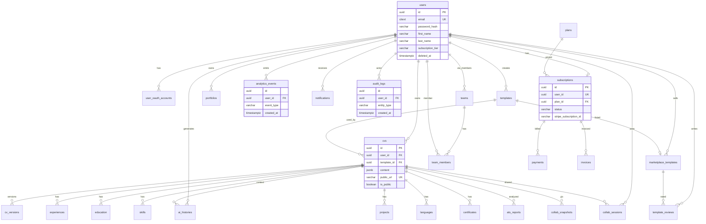
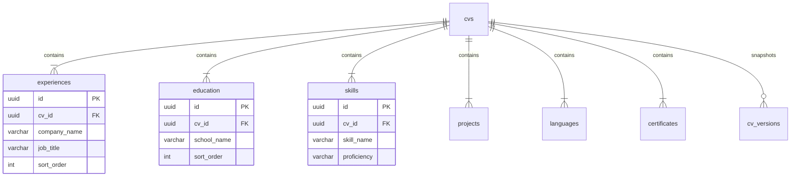
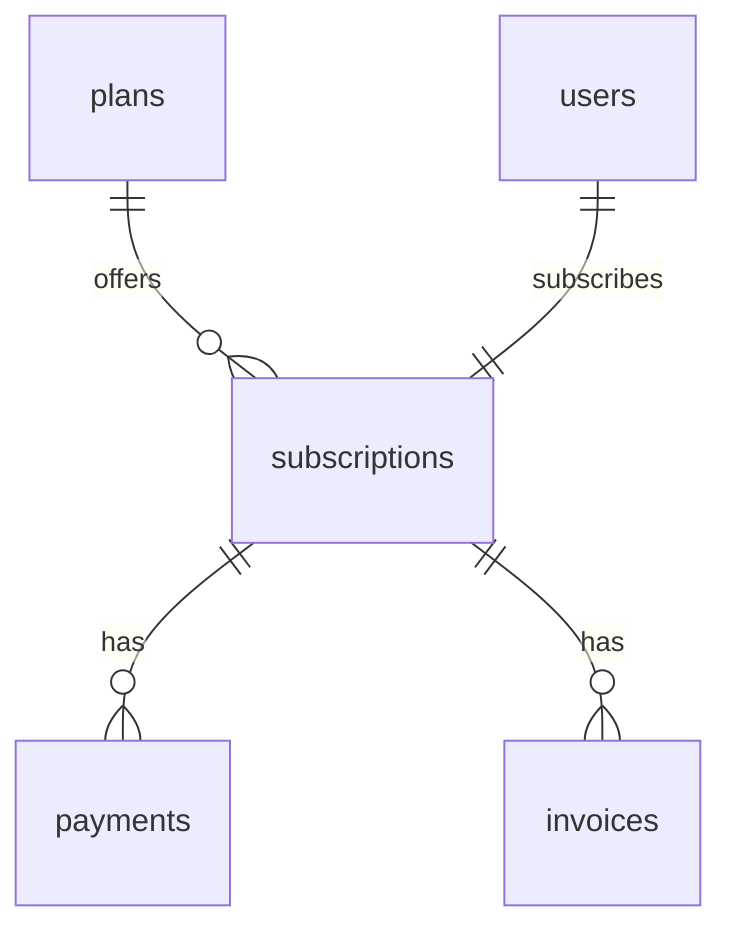
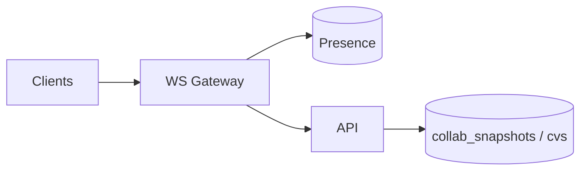

# CV STUDIO AI — DATABASE ARCHITECTURE (PostgreSQL)

## Document de référence Database Architect

| Métadonnée    | Valeur                                                      |
| ------------- | ----------------------------------------------------------- |
| **Produit**   | CV Studio AI                                                |
| **Version**   | 1.0                                                         |
| **Date**      | 26 juillet 2026                                             |
| **Auteur**    | Database Architect                                          |
| **Engine**    | PostgreSQL 16+ (AWS RDS / Aurora PostgreSQL)                |
| **ORM**       | Prisma                                                      |
| **Cibles**    | 1M users · queries p95 < 100ms · HA · GDPR · audit · collab |
| **Artefacts** | `apps/api/prisma/schema.prisma` · `docs/sql/*` · [`docs/prisma/README.md`](./prisma/README.md) |

---

## Table des matières

1. [Design principles](#1-design-principles)
2. [Logical model & dual storage](#2-logical-model--dual-storage-cv)
3. [ERD complet](#3-erd-complet)
4. [Tables détaillées](#4-catalogue-des-tables)
5. [Indexes strategy](#5-indexes-strategy)
6. [Constraints](#6-constraints)
7. [Partitioning](#7-partitioning-strategy)
8. [Sharding readiness](#8-sharding-readiness)
9. [RLS & security](#9-security--rls--encryption)
10. [GDPR](#10-gdpr-compliance)
11. [Collaboration realtime](#11-real-time-collaboration-data)
12. [Prisma schema](#12-prisma-schema)
13. [Migrations](#13-migration-strategy)
14. [Backup & HA](#14-backup--high-availability)
15. [Performance tuning](#15-performance-tuning)
16. [Capacity planning](#16-capacity-planning)
17. [Query patterns](#17-query-patterns--slas)
18. [Operations](#18-operations-checklist)

---

# 1. DESIGN PRINCIPLES

| Pilier             | Application                                                                                         |
| ------------------ | --------------------------------------------------------------------------------------------------- |
| **3NF**            | Entités billing, users, templates, child CV sections normalisées                                    |
| **Scalabilité**    | Partition RANGE sur events/audit ; pool PgBouncer ; read replicas                                   |
| **Performance**    | Indexes partiels `deleted_at IS NULL` ; composite `(user_id, updated_at DESC)` ; JSONB GIN sélectif |
| **Sécurité**       | RLS tenant-user ; secrets chiffrés app-level (KMS) ; audit_logs                                     |
| **Maintenabilité** | snake_case SQL · UUID PK · soft deletes · FK explicites                                             |
| **Évolutivité**    | `schema_version` sur documents ; migrations expand/contract                                         |

### Conventions de nommage

| Objet      | Convention                                           |
| ---------- | ---------------------------------------------------- |
| Tables     | `snake_case` pluriel (`users`, `cvs`, `ats_reports`) |
| Colonnes   | `snake_case`                                         |
| PK         | `id` UUID                                            |
| FK         | `<table_singulier>_id`                               |
| Timestamps | `created_at`, `updated_at`, `deleted_at`             |
| Enums PG   | `enum_<domaine>` ou Prisma enums mappés              |
| Indexes    | `idx_<table>_<cols>` / `uidx_` / `pidx_` (partial)   |

---

# 2. LOGICAL MODEL — DUAL STORAGE CV

Pour concilier **éditeur temps réel** (autosave <5s) et **intégrité 3NF** :

```
┌─────────────────────────────────────────┐
│  cvs.content (JSONB)                    │
│  = Document de travail éditeur         │
│  Chargement 1 round-trip, export PDF    │
└─────────────────┬───────────────────────┘
                  │ sync applicatif
                  │ (debounce / post-save job)
                  ▼
┌─────────────────────────────────────────┐
│  experiences, education, skills, …      │
│  = Projection relationnelle             │
│  Recherche, reporting, collab locks     │
└─────────────────────────────────────────┘
```

**Règle :** `cvs.content` est la **source de vérité runtime**. Les tables enfants sont reconstruites via `SyncCvSectionsCommand` (transaction) pour requêtes analytiques / filtres.  
Les `cv_versions` snapshotent le JSONB à chaque milestone (template change, AI apply, export, intervalle).

---

# 3. ERD COMPLET



### ERD — Domaine CV (zoom)



### ERD — Billing



---

# 4. CATALOGUE DES TABLES

## 4.1 Identity

### `users`

Profil + denormalized `subscription_tier` (cache ; vérité = `subscriptions`).

| Colonne                              | Type                   | Notes                                |
| ------------------------------------ | ---------------------- | ------------------------------------ |
| id                                   | UUID PK                | gen_random_uuid()                    |
| email                                | CITEXT UNIQUE          | index                                |
| password_hash                        | VARCHAR                | argon2id/bcrypt ; null si OAuth-only |
| first_name, last_name                | VARCHAR                |                                      |
| avatar_url, phone, location          | VARCHAR null           |                                      |
| bio                                  | TEXT null              |                                      |
| date_of_birth                        | DATE null              | PII sensible                         |
| subscription_tier                    | ENUM free/pro/business | synced                               |
| subscription_start_date / end_date   | TIMESTAMPTZ null       | cache                                |
| is_email_verified                    | BOOLEAN                | default false                        |
| is_2fa_enabled                       | BOOLEAN                |                                      |
| two_factor_secret_encrypted          | BYTEA null             | AES-GCM via KMS                      |
| last_login_at                        | TIMESTAMPTZ            |                                      |
| created_at / updated_at / deleted_at | TIMESTAMPTZ            | soft delete                          |

### `user_oauth_accounts`

`provider` + `provider_id` UNIQUE. Tokens **chiffrés** (BYTEA), jamais plaintext.

## 4.2 CV core

### `cvs`

Document principal + `content JSONB` + flags public/starred.

### `cv_versions`

Historique immutable (`version_number` monotonic per cv).

### Sections normalisées

`experiences`, `education`, `skills`, `projects`, `languages`, `certificates`  
Colonne ordre : **`sort_order`** (évite mot réservé `order`).

## 4.3 Templates & marketplace

`templates`, `marketplace_templates`, `template_reviews`

## 4.4 Billing

`plans`, `subscriptions` (1 active / user v1), `payments`, `invoices`

## 4.5 AI & ATS

`ats_reports`, `ai_histories` (prompts : rétention GDPR courte / redact)

## 4.6 Analytics, notifications, portfolios, audit

`analytics_events` (**partitionné**), `notifications`, `portfolios`, `audit_logs` (**partitionné**)

## 4.7 Collab & teams (realtime ready)

`teams`, `team_members`, `collab_sessions`, `collab_snapshots` (Yjs state BYTEA), `collab_presence` (éphémère — préférer Redis ; table optionnelle audit)

---

# 5. INDEXES STRATEGY

## 5.1 B-Tree (défaut)

- Toutes les FK
- `users(email)`, `users(subscription_tier)`, `users(created_at)`
- `cvs(user_id, updated_at DESC) WHERE deleted_at IS NULL`
- `(cv_id, sort_order)` sur sections
- `subscriptions(status, current_period_end)`

## 5.2 Unique / Hash-like equality

- `cvs(public_url)` UNIQUE WHERE NOT NULL
- `portfolios(public_url)` UNIQUE
- Hash index PG rarement nécessaire ; B-Tree suffit pour URLs

## 5.3 Partial indexes

```sql
CREATE INDEX pidx_cvs_active_user ON cvs (user_id, updated_at DESC)
  WHERE deleted_at IS NULL;
CREATE INDEX pidx_templates_published ON templates (category, rating DESC)
  WHERE is_published = true;
CREATE INDEX pidx_notifications_unread ON notifications (user_id, created_at DESC)
  WHERE is_read = false;
```

## 5.4 JSONB

```sql
CREATE INDEX idx_cvs_content_gin ON cvs USING GIN (content jsonb_path_ops);
-- Utiliser avec parcimonie (write amplification)
```

## 5.5 Composite analytics

```sql
-- sur partition parent / children
CREATE INDEX ON analytics_events (user_id, created_at DESC);
CREATE INDEX ON analytics_events (event_type, created_at DESC);
```

---

# 6. CONSTRAINTS

| Type                     | Exemples                                                                |
| ------------------------ | ----------------------------------------------------------------------- |
| PK                       | UUID toutes tables                                                      |
| FK                       | CASCADE enfants CV ; SET NULL audit user                                |
| UNIQUE                   | email ; (provider, provider_id) ; invoice_number ; public_url           |
| CHECK                    | `price >= 0` ; `rating BETWEEN 1 AND 5` ; `ats_score BETWEEN 0 AND 100` |
| CHECK dates              | `end_date IS NULL OR end_date >= start_date`                            |
| EXCLUDE / partial unique | un subscription active par user (index unique partiel)                  |

```sql
CREATE UNIQUE INDEX uidx_subscriptions_user_active
  ON subscriptions (user_id)
  WHERE status IN ('active', 'past_due', 'trialing');
```

---

# 7. PARTITIONING STRATEGY

## 7.1 `analytics_events` — RANGE mensuel sur `created_at`

```sql
CREATE TABLE analytics_events (
  id UUID NOT NULL,
  user_id UUID,
  event_type VARCHAR(128) NOT NULL,
  event_data JSONB,
  session_id VARCHAR(128),
  created_at TIMESTAMPTZ NOT NULL DEFAULT now(),
  PRIMARY KEY (id, created_at)
) PARTITION BY RANGE (created_at);
```

Job cron : créer partition `M+1`, détacher/archiver `M-6` (ou cold S3).

## 7.2 `audit_logs` — idem RANGE mensuel

Rétention légale configurable (ex. 24 mois) puis archive compressée.

## 7.3 `ai_histories` (option M12)

Partition si volume tokens logs élevé ; sinon TTL delete 90j (GDPR AI).

### Prisma note

Les tables partitionnées sont gérées en **SQL migrations** ; Prisma modelise la table parent pour le CRUD courant (insert avec `created_at` dans la bonne partition).

---

# 8. SHARDING READINESS

Pas de sharding J0. Préparation :

1. **Tenant key** = `user_id` présent sur toutes tables user-owned
2. Éviter sequences globales métier (UUID)
3. Pas de FK cross-shard futures sans discipline
4. Si >5TB ou hot tenants : Citus / Vitess-like ou shard par hash `user_id` (post-M24)

---

# 9. SECURITY — RLS, ENCRYPTION

## 9.1 Row-Level Security

Session app :

```sql
SET LOCAL app.current_user_id = '<uuid>';
SET LOCAL app.is_admin = 'false';
```

Exemple policy `cvs` :

```sql
ALTER TABLE cvs ENABLE ROW LEVEL SECURITY;

CREATE POLICY cvs_owner_all ON cvs
  FOR ALL
  USING (
    deleted_at IS NULL
    AND (
      user_id = NULLIF(current_setting('app.current_user_id', true), '')::uuid
      OR current_setting('app.is_admin', true) = 'true'
    )
  )
  WITH CHECK (
    user_id = NULLIF(current_setting('app.current_user_id', true), '')::uuid
    OR current_setting('app.is_admin', true) = 'true'
  );
```

Policies similaires : sections via `cv_id IN (SELECT id FROM cvs …)`, `ai_histories`, `notifications`, `portfolios`.

**Service role** migrations / workers : bypass RLS via owner role ou `BYPASSRLS` dédié (jamais l’app user).

## 9.2 Encryption

| Data                 | Méthode                        |
| -------------------- | ------------------------------ |
| password_hash        | argon2id (pas réversible)      |
| two_factor_secret    | AES-256-GCM + AWS KMS envelope |
| oauth access/refresh | idem BYTEA ciphertext          |
| RDS                  | Encryption at rest AWS         |
| Transit              | TLS only                       |

## 9.3 Audit

Trigger optionnel `AFTER INSERT/UPDATE/DELETE` → `audit_logs` pour tables sensibles (subscriptions, users email change).  
Ou audit applicatif (préféré pour contrôle PII dans `old_values`/`new_values`).

---

# 10. GDPR COMPLIANCE

| Obligation       | Implémentation                                |
| ---------------- | --------------------------------------------- |
| Minimisation     | Pas de CV body dans `analytics_events`        |
| Droit d’accès    | Export job ZIP (user + cvs + invoices meta)   |
| Droit à l’oubli  | soft delete immédiat → hard purge ≤30j        |
| Portabilité      | JSON export schemaVersion                     |
| Sous-processeurs | hors DB ; documentés                          |
| AI logs          | retention 90j ; redact prompts on delete user |
| Residence        | RDS `eu-west-*`                               |

Procédure erase :

1. Anonymise `audit_logs.user_id` / IP
2. Delete cvs + children + versions
3. Delete AI histories
4. Cancel Stripe (app) puis delete subscription rows
5. Hard delete user

---

# 11. REAL-TIME COLLABORATION DATA

| Store              | Rôle                                      |
| ------------------ | ----------------------------------------- |
| Redis              | Presence, cursors, rate limits (hot path) |
| `collab_sessions`  | Qui a accès, rôle editor/commenter        |
| `collab_snapshots` | Persistance Yjs/CRDT périodique           |
| `cv_versions`      | Checkpoints humains                       |



---

# 12. PRISMA SCHEMA

Fichier canonique : **[`apps/api/prisma/schema.prisma`](../apps/api/prisma/schema.prisma)** (v2 — schéma DB complet). Voir aussi [`docs/prisma/README.md`](./prisma/README.md).

SQL complémentaire :

- [`docs/sql/001_extensions.sql`](./sql/001_extensions.sql)
- [`docs/sql/002_partitioning.sql`](./sql/002_partitioning.sql)
- [`docs/sql/003_rls.sql`](./sql/003_rls.sql)
- [`docs/sql/004_indexes_extra.sql`](./sql/004_indexes_extra.sql)

---

# 13. MIGRATION STRATEGY

## Initial

1. Extensions (`citext`, `pgcrypto`)
2. Enums + tables non partitionnées (Prisma migrate)
3. SQL partition parents + first partitions
4. RLS policies
5. Seed `plans` (Free/Pro/Business)

## Continues

- Expand/contract
- Numbered Prisma migrations + raw SQL companion
- Rollback : forward-fix préféré ; down scripts pour dev only
- Zero-downtime : dual-write si rename colonnes

---

# 14. BACKUP & HIGH AVAILABILITY

| Contrôle       | Spec                                           |
| -------------- | ---------------------------------------------- |
| Primary        | RDS Multi-AZ                                   |
| Backups        | Daily automated + **30-day** retention         |
| PITR           | activé (5-min granularité typique AWS)         |
| Read replicas  | 1 (M6) → 2+ (M12) pour lectures list/analytics |
| Failover       | Automatic Multi-AZ < 120s typique              |
| Restore drills | Quarterly                                      |
| RPO / RTO      | ≤1h / ≤4h (aligné PRD)                         |

Replicas : traffic read-only Prisma read replica URL pour `ListCVs`, templates catalog, analytics inserts peuvent rester primary ou queue.

---

# 15. PERFORMANCE TUNING

## 15.1 Objectif p95 < 100ms

Queries hot path :

- `GetCvById` (PK)
- `ListCvsByUser` (partial composite index)
- `GetEntitlements` (subscriptions by user_id) — aussi Redis
- Template catalog (partial published)

## 15.2 Pratiques

- Jamais `SELECT *` en prod list endpoints
- Cursor pagination (`updated_at, id`)
- Batch `createMany` sync sections
- Prisma `include` contrôlé (anti N+1)
- `statement_timeout` = 5s app ; 60s workers
- `idle_in_transaction_session_timeout`
- Autovacuum agressif sur `cvs`, partitions events
- `ANALYZE` after bulk loads

## 15.3 PgBouncer

- Transaction pooling
- `default_pool_size` dimensionné : **~100 connexions serveur** partagées
- App instances : max clients élevés, server connections bornées
- **Ne pas** utiliser prepared statements nommées incompatibles sans config (Prisma + PgBouncer : transaction mode + Prisma tricks / session mode pour migrate)

Recommandation : **PgBouncer transaction mode** pour API ; migrations en connexion directe RDS.

---

# 16. CAPACITY PLANNING

| Poste                             | Estimation                                            |
| --------------------------------- | ----------------------------------------------------- |
| 1M users metadata                 | ~10–20 GB                                             |
| CVs (JSONB + sections) 1M × ~50KB | ~50 GB                                                |
| Versions (moy. 5)                 | ~100–150 GB                                           |
| Analytics                         | ~10 GB/mois → ~120 GB/an (retention 6–12 mois online) |
| Audit                             | ~5–15 GB/an online                                    |
| **Year 1 total**                  | **~200–350 GB**                                       |
| YoY growth                        | ~200% (aligné brief)                                  |
| Year 2–3                          | plan Aurora storage autoscaling / partitioning drop   |

### Connections

- 1M registered ≠ 1M concurrent
- Peak concurrent DB via pool : **dimensionner 500–1000 server conns** (primary)
- Reads → replicas
- « 5 connections per user » est un myth concurrent ; on dimensionne sur **QPS** et pool, pas users×5

Target peak : 10k editor sessions → ~3–8k QPS autosave coalesced → pool + Redis entitlements.

---

# 17. QUERY PATTERNS & SLAs

| Query            | SLA p95 | Strategy               |
| ---------------- | ------- | ---------------------- |
| Load CV editor   | < 50ms  | PK + content JSONB     |
| List user CVs    | < 80ms  | partial index          |
| Save CV          | < 100ms | single row update      |
| Sync sections    | < 200ms | delete+insert tx batch |
| ATS insert       | < 100ms | append-only            |
| Analytics ingest | < 50ms  | partition insert       |

---

# 18. OPERATIONS CHECKLIST

- [ ] Extensions installed
- [ ] Plans seeded
- [ ] Partitions +2 months ahead
- [ ] RLS enabled + smoke tests IDOR
- [ ] PgBouncer + direct URL migrate
- [ ] Monitoring : bloat, dead tuples, seq scans hot tables
- [ ] Slow query log > 100ms
- [ ] GDPR erase job scheduled
- [ ] Backup restore drill

---

_Database Architecture CV Studio AI v1.0_  
_Complète Architecture Technique §9 et remplace le schéma Prisma minimal._
