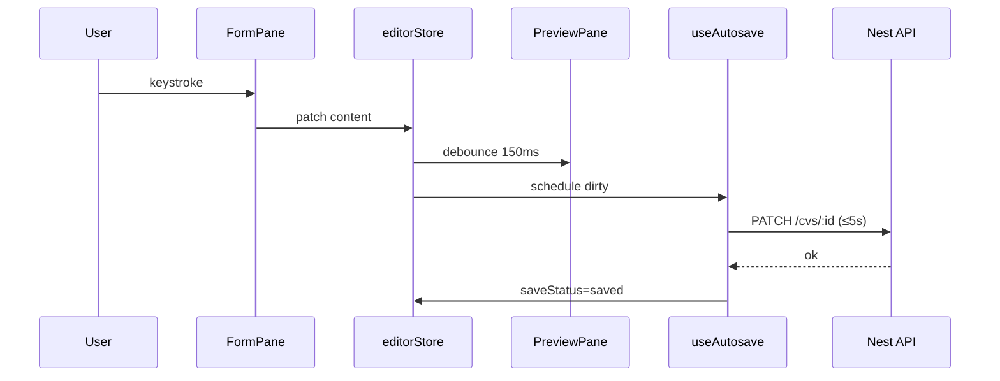

# CV STUDIO AI — FRONTEND ARCHITECTURE (Next.js 14)

## Frontend Architect — Document de référence

| Métadonnée      | Valeur                                                   |
| --------------- | -------------------------------------------------------- |
| **App**         | `apps/web`                                               |
| **Framework**   | Next.js 14 App Router                                    |
| **Version doc** | 1.0                                                      |
| **Date**        | 26 juillet 2026                                          |
| **Cible perf**  | Lighthouse ≥ 90 (Performance, A11y, Best Practices, SEO) |
| **Alignement**  | Design System · API NestJS · Editor UI Spec · PRD        |

---

## 1. Objectifs

1. Expérience éditeur dual-pane fluide (preview ≤150ms debounce, autosave ≤5s)
2. Marketing SEO-first (SSR/SSG) avec Lighthouse ≥90
3. Auth sécurisée (Bearer + refresh), entitlements UI alignés server
4. Maintenable pour ~20 devs (feature folders, contrats typés)
5. Responsive : mobile tabs / desktop dual-pane
6. Dark mode via tokens CSS

## 2. Stack

| Couche        | Techno                                     |
| ------------- | ------------------------------------------ |
| Framework     | Next.js 14 (App Router, RSC)               |
| Language      | TypeScript strict                          |
| Styling       | Tailwind CSS + `design-tokens.css`         |
| UI primitives | shadcn/ui (Radix)                          |
| Forms         | React Hook Form + Zod                      |
| Server state  | TanStack Query v5                          |
| Client state  | Zustand                                    |
| Motion        | Framer Motion (+ `prefers-reduced-motion`) |
| Icons         | Lucide                                     |
| Fonts         | `next/font` Inter + JetBrains Mono         |
| Analytics     | thin wrapper (`track()`)                   |

## 3. Architecture layers

```
┌─────────────────────────────────────────────────┐
│  app/  (RSC pages + layouts + route handlers)   │
├─────────────────────────────────────────────────┤
│  components/  (ui · layout · editor · marketing)│
├─────────────────────────────────────────────────┤
│  hooks/  (domain hooks wrapping Query + stores) │
├─────────────────────────────────────────────────┤
│  stores/  (Zustand — editor UI ephemeral)       │
├─────────────────────────────────────────────────┤
│  lib/api/  (typed client → Nest /api/v1)        │
├─────────────────────────────────────────────────┤
│  lib/validations/  (Zod schemas)                │
└─────────────────────────────────────────────────┘
```

### Règles

| State                      | Où                                                     |
| -------------------------- | ------------------------------------------------------ |
| Auth session / user        | TanStack Query (`useMe`) + cookie/token helper         |
| Liste CVs, templates       | TanStack Query                                         |
| Contenu CV en édition      | Zustand `editorStore` (source UI) → mutations autosave |
| Drawers, tabs mobile, zoom | Zustand UI slice                                       |
| Theme                      | Zustand + `html.dark` / `data-theme`                   |

**Server Components** pour marketing & shells.  
**Client Components** pour editor, forms, interactive pricing.

---

## 4. Arborescence `apps/web`

```
apps/web/
├── src/
│   ├── app/
│   │   ├── layout.tsx                 # Root: fonts, providers, tokens
│   │   ├── globals.css
│   │   ├── (marketing)/
│   │   │   ├── layout.tsx
│   │   │   ├── page.tsx               # Landing /
│   │   │   ├── pricing/page.tsx
│   │   │   ├── templates/page.tsx
│   │   │   ├── templates/[id]/page.tsx
│   │   │   ├── blog/page.tsx
│   │   │   └── blog/[slug]/page.tsx
│   │   ├── (auth)/
│   │   │   ├── layout.tsx
│   │   │   ├── login/page.tsx
│   │   │   ├── register/page.tsx
│   │   │   ├── forgot-password/page.tsx
│   │   │   └── reset-password/page.tsx
│   │   ├── (app)/
│   │   │   ├── layout.tsx             # App shell (auth required)
│   │   │   ├── dashboard/page.tsx
│   │   │   ├── editor/[resumeId]/page.tsx
│   │   │   ├── templates/page.tsx     # picker in-app
│   │   │   ├── marketplace/
│   │   │   │   ├── page.tsx
│   │   │   │   └── [id]/page.tsx
│   │   │   ├── account/
│   │   │   │   ├── page.tsx           # redirect profile
│   │   │   │   ├── profile/page.tsx
│   │   │   │   ├── billing/page.tsx
│   │   │   │   ├── security/page.tsx
│   │   │   │   └── preferences/page.tsx
│   │   │   └── analytics/page.tsx
│   │   ├── p/[slug]/page.tsx          # Public portfolio
│   │   ├── s/[token]/page.tsx         # Shared resume
│   │   ├── api/
│   │   │   └── health/route.ts        # Optional BFF ping
│   │   ├── robots.ts
│   │   ├── sitemap.ts
│   │   └── opengraph-image.tsx
│   ├── components/
│   │   ├── ui/                        # Button, Input, Dialog…
│   │   ├── layout/                    # MarketingNav, AppSidebar, Topbar
│   │   ├── marketing/                 # Hero, PricingCards, Faq
│   │   ├── editor/                    # DualPane, Form, Preview, Rail…
│   │   ├── forms/                     # AuthForm, ProfileForm
│   │   ├── billing/                   # PlanChip, PaywallModal
│   │   └── shared/                    # EmptyState, ErrorState, Logo
│   ├── hooks/
│   ├── stores/
│   ├── lib/
│   │   ├── api/
│   │   ├── validations/
│   │   ├── utils.ts
│   │   └── seo.ts
│   ├── providers/
│   │   ├── app-providers.tsx
│   │   ├── query-provider.tsx
│   │   └── theme-provider.tsx
│   └── middleware.ts
├── public/
├── next.config.mjs
├── tailwind.config.ts
├── postcss.config.mjs
├── package.json
└── tsconfig.json
```

---

## 5. Pages (catalogue)

### Marketing `(marketing)`

| Route                   | Type    | SEO | Description         |
| ----------------------- | ------- | --- | ------------------- |
| `/`                     | SSG/ISR | ★★★ | Landing brand + CTA |
| `/pricing`              | SSG     | ★★★ | Free/Pro/Business   |
| `/templates`            | ISR     | ★★★ | Gallery             |
| `/templates/[id]`       | ISR     | ★★  | Template detail     |
| `/blog`, `/blog/[slug]` | SSG     | ★★★ | Content SEO         |

### Auth `(auth)`

| Route              | Description   |
| ------------------ | ------------- |
| `/login`           | Email + OAuth |
| `/register`        | Signup        |
| `/forgot-password` | Reset request |
| `/reset-password`  | Token form    |

### App `(app)` — middleware protégé

| Route                  | Description             |
| ---------------------- | ----------------------- |
| `/dashboard`           | Stats + recent CVs      |
| `/editor/[resumeId]`   | **Core dual-pane**      |
| `/templates`           | In-app template library |
| `/marketplace`         | Browse/buy              |
| `/marketplace/[id]`    | Listing detail          |
| `/account/profile`     | Profil                  |
| `/account/billing`     | Sub + invoices          |
| `/account/security`    | Password / 2FA          |
| `/account/preferences` | Theme, locale           |
| `/analytics`           | User dashboard metrics  |

### Public

| Route        | Description                 |
| ------------ | --------------------------- |
| `/p/[slug]`  | Portfolio published         |
| `/s/[token]` | Shared CV (noindex default) |

---

## 6. Middleware

Fichier `src/middleware.ts` :

1. Attache `x-request-id` si absent
2. Protège matcher `(app)/*` — redirect `/login?next=`
3. Si authentifié sur `/login|/register` → `/dashboard`
4. Locale cookie optionnel
5. Security headers complémentaires (CSP report-only early)

Auth check : cookie `access_token` **ou** session bridge ; refresh via Route Handler si expiré (pattern BFF léger optionnel).

**Recommandation prod :** refresh httpOnly cookie set by API domain + BFF `/api/auth/session` ; access token mémoire côté client pour SPA editor.

---

## 7. API Client

```
lib/api/
  client.ts          # fetch wrapper + envelope unwrap
  errors.ts          # ApiError (code, status, details)
  auth.ts
  cvs.ts
  templates.ts
  subscriptions.ts
  ai.ts
  marketplace.ts
  analytics.ts
  keys.ts            # queryKey factory
```

### Contrat

```ts
type Envelope<T> = {
  success: boolean;
  data?: T;
  error?: { code: string; message: string; details?: unknown };
  meta?: { timestamp: string; version: string; requestId?: string };
};
```

- Base URL : `process.env.NEXT_PUBLIC_API_URL` → `http://localhost:3001/api/v1`
- `Authorization: Bearer`
- Retry idempotent GET via TanStack
- Sur `401` → attempt refresh → logout

---

## 8. TanStack Query patterns

| Hook                | Query key               | Notes          |
| ------------------- | ----------------------- | -------------- |
| `useMe`             | `['me']`                | staleTime 5m   |
| `useCvs`            | `['cvs', filters]`      |                |
| `useCv(id)`         | `['cvs', id]`           | hydrate editor |
| `useTemplates`      | `['templates', q]`      | public         |
| `useSubscription`   | `['subscription','me']` |                |
| `useAts(cvId)`      | mutation                |                |
| `useOptimizeBullet` | mutation                | entitlements   |

### Mutations éditeur

- `useAutosaveCv` : debounce 5s + flush on blur/unmount
- Optimistic UI optionnel pour title only
- Invalidate `['cvs']` on create/delete

---

## 9. Zustand stores

### `editorStore`

```ts
{
  resumeId: string | null;
  content: CvContent;
  dirty: boolean;
  saveStatus: 'idle' | 'saving' | 'saved' | 'error';
  activeSection: SectionId;
  previewZoom: number;
  drawer: null | 'ats' | 'ai' | 'match';
  mobileTab: 'content' | 'preview' | 'tools';
  setField / reorderSection / applyAiVariant / markSaved;
}
```

### `uiStore`

```ts
{ theme, sidebarCollapsed, paywall: { open, trigger } }
```

### `authStore` (minimal)

Préférer Query pour user ; store seulement `accessToken` en mémoire si besoin.

---

## 10. Hooks personnalisés

| Hook                      | Rôle                    |
| ------------------------- | ----------------------- |
| `useMe`                   | Profil                  |
| `useCvs` / `useCv`        | Data CV                 |
| `useAutosave`             | Sync editor → API       |
| `useDebouncedPreview`     | 150ms content → preview |
| `useEntitlement(feature)` | Gate UI + paywall       |
| `usePaywall`              | Open modal upgrade      |
| `useAtsAnalyzer`          | Run ATS + score UI      |
| `useMediaQuery`           | Breakpoints             |
| `useReducedMotion`        | Motion preference       |
| `useExportPdf`            | Poll job export         |
| `useTheme`                | Light/dark/system       |

---

## 11. Components inventory

### `components/ui` (shadcn)

Button, Input, Textarea, Label, Select, Checkbox, Switch, Dialog, Sheet, DropdownMenu, Tabs, Tooltip, Badge, Avatar, Skeleton, Toast/Sonner, Progress, Separator, Card, Accordion, Breadcrumb, Popover, Slider

### `components/layout`

`MarketingHeader`, `MarketingFooter`, `AppShell`, `AppTopbar`, `AppSidebar`, `UserMenu`, `PlanChip`, `CommandPalette` (later)

### `components/marketing`

`Hero`, `FeatureRow`, `HowItWorks`, `TemplatesShowcase`, `Testimonials`, `PricingToggle`, `PricingCards`, `FaqAccordion`, `FinalCta`

### `components/editor` ★

`EditorShell`, `EditorTopbar`, `SectionRail`, `FormPane`, `PreviewPane`, `CvPage`, `Splitter`, `AutosaveIndicator`, `AtsScoreChip`, `AtsDrawer`, `AiOptimizePopover`, `SectionDnD`, `MobileEditorTabs`, `PageBreakHints`, `TemplateSwitcherModal`

### `components/billing`

`PaywallModal`, `CheckoutButton`, `InvoiceTable`

### `components/shared`

`Logo`, `EmptyState`, `ErrorState`, `LoadingPage`, `ProBadge`

---

## 12. Validation Zod + RHF

```
lib/validations/
  auth.ts          registerSchema, loginSchema
  profile.ts
  cv-identity.ts
  cv-experience.ts
  checkout.ts
```

Forms : `zodResolver(schema)` · erreurs `aria-describedby` · Design System labels.

---

## 13. Editor data flow



Pas de bouton Prévisualiser.

---

## 14. Responsive

| Breakpoint | Editor                                            | App shell        |
| ---------- | ------------------------------------------------- | ---------------- |
| ≤640       | Tabs Contenu/Aperçu/Outils · bottom-friendly CTAs | Stack            |
| 641–1024   | Split 50/50 si ≥900 else tabs                     | Compact nav      |
| ≥1025      | Dual-pane + rail                                  | Sidebar optional |
| ≥1441      | Preview max-width page + margins                  | Dashboard 3 cols |

Touch targets ≥48px. DnD + boutons Monter/Descendre.

---

## 15. SEO

| Technique                       | Usage                                             |
| ------------------------------- | ------------------------------------------------- |
| `metadata` / `generateMetadata` | Toutes pages marketing                            |
| `sitemap.ts`                    | templates + blog                                  |
| `robots.ts`                     | allow marketing ; disallow `/dashboard` `/editor` |
| OG image                        | `opengraph-image`                                 |
| JSON-LD                         | Organization + FAQ landing                        |
| Canonical                       | absolute via `NEXT_PUBLIC_SITE_URL`               |
| hreflang                        | FR/EN when i18n                                   |
| `/s/*` `/p/*` private           | `noindex` by default                              |

---

## 16. Performance — Lighthouse ≥90

| Levier    | Action                                                   |
| --------- | -------------------------------------------------------- |
| LCP       | Hero SSR, font subset, priority image                    |
| CLS       | reserved aspect-ratio preview/thumbs                     |
| TBT       | dynamic import AI drawer, heavy editor only on `/editor` |
| JS budget | editor client island ; marketing mostly RSC              |
| Images    | `next/image`                                             |
| Bundle    | analyze `@next/bundle-analyzer`                          |
| Caching   | ISR templates 60–300s                                    |
| Prefetch  | dashboard links                                          |

### Budgets

- Marketing first load JS ≤ ~150KB gzip aim
- Editor route separate chunk
- Lighthouse CI on `/` and `/login` in PR

### Core Web Vitals targets

| Metric | Target  |
| ------ | ------- |
| LCP    | ≤ 2.5s  |
| INP    | ≤ 200ms |
| CLS    | ≤ 0.1   |

---

## 17. A11y

Aligné Design System + checklist :

- Skip link
- Focus ring tokens
- Editor landmarks
- Live region autosave
- Reduced motion

---

## 18. Env

```
NEXT_PUBLIC_API_URL=http://localhost:3001/api/v1
NEXT_PUBLIC_SITE_URL=http://localhost:3000
NEXT_PUBLIC_STRIPE_PUBLISHABLE_KEY=pk_test_xxx
```

---

## 19. Testing

| Type             | Tool                              |
| ---------------- | --------------------------------- |
| Unit hooks/utils | Vitest                            |
| Component        | Testing Library                   |
| E2E              | Playwright (signup→editor→export) |
| Visual           | Playwright screenshots templates  |
| A11y             | axe in CI                         |
| Lighthouse       | LHCI                              |

---

## 20. Deployment (Vercel-ready)

- `apps/web` as Vercel project root or Turborepo filter
- Edge Middleware
- Preview deployments per PR
- Env per environment
- Headers security in `next.config.mjs`

---

## 21. Definition of Done UI feature

- [ ] RSC vs client intentional
- [ ] Query keys stables
- [ ] Zod validation
- [ ] Loading / empty / error
- [ ] Responsive + a11y
- [ ] Tokens only (no hardcode color)
- [ ] Analytics event on primary CTA
- [ ] Entitlement gate if paid feature

---

_Frontend Architecture CV Studio AI v1.0 — Code scaffold in apps/web_
