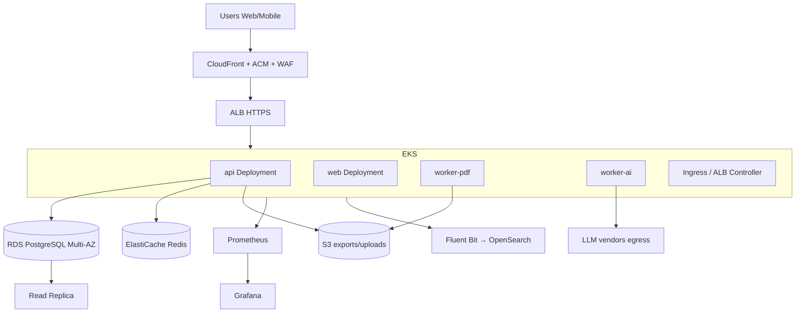
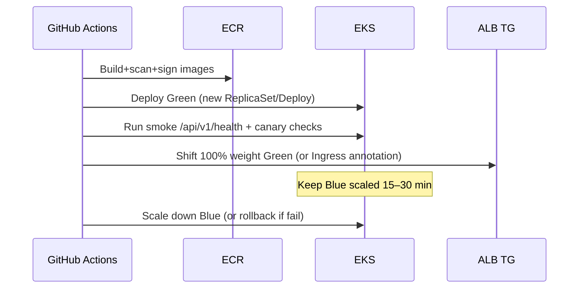

# CV STUDIO AI — INFRASTRUCTURE & CI/CD

## DevOps Principal Engineer — Document de référence

| Métadonnée          | Valeur                                                              |
| ------------------- | ------------------------------------------------------------------- |
| **Cloud**           | AWS (primary) · multi-AZ                                            |
| **Compute**         | Amazon EKS 1.31+                                                    |
| **IaC**             | Terraform ≥ 1.7 · remote state S3 + DynamoDB lock                   |
| **CI/CD**           | GitHub Actions · OIDC → AWS · Cosign · Argo CD / kubectl blue-green |
| **Observability**   | Prometheus · Grafana · OpenTelemetry · ELK/OpenSearch               |
| **Région primaire** | `eu-west-1` (GDPR-friendly) · DR `eu-central-1`                     |
| **Alignement**      | Architecture · Security · Database · API · Web · Mobile             |
| **Version**         | 1.0 · 26 juillet 2026                                               |

---

## 0. Objectifs

| Pilier            | Cible                                              |
| ----------------- | -------------------------------------------------- |
| Disponibilité API | **99.9%** mensuel                                  |
| RPO (DB)          | **≤ 5 min** (PITR)                                 |
| RTO (région)      | **≤ 1 h** (DR runbook) · **≤ 15 min** (AZ failure) |
| Deploy prod       | Blue-Green · zero-downtime · rollback &lt; 5 min   |
| Security          | OIDC CI, private subnets, WAF, TLS 1.3 edge        |
| Cost              | FinOps tags + budgets ; scale-to-need workers      |

---

## 1. Architecture infra (vue d’ensemble)



**Scaffold :** `infrastructure/` (Terraform, k8s, docker) · `.github/workflows/`

---

## 2. Environnements

| Env         | Account    | Cluster                | DB                   | Purpose       |
| ----------- | ---------- | ---------------------- | -------------------- | ------------- |
| **dev**     | sandbox    | eks-dev (small)        | RDS single-AZ        | Engineers     |
| **staging** | nonprod    | eks-staging            | Multi-AZ smaller     | QA / pen test |
| **prod**    | prod       | eks-prod               | Multi-AZ + replica   | GA            |
| **dr**      | prod or dr | warm standby / restore | Cross-region replica | Disaster      |

Tags obligatoires : `Project=cvstudio`, `Env`, `Owner=platform`, `CostCenter`.

---

## 3. Docker & containerization

### 3.1 Images

| Image              | Base                                                     | Contenu            |
| ------------------ | -------------------------------------------------------- | ------------------ |
| `cvstudio/api`     | `node:20-alpine` multi-stage                             | NestJS dist        |
| `cvstudio/web`     | `node:20-alpine` → `nginx:alpine` **ou** Node standalone | Next.js            |
| `cvstudio/worker`  | same as api + Chromium deps (PDF)                        | BullMQ consumers   |
| `cvstudio/migrate` | api slim                                                 | Prisma migrate job |

### 3.2 Principes

- **Multi-stage** builds ; pas de secrets dans layers
- Non-root user (`uid 10001`)
- Distroless/alpine minimal ; `dumb-init`
- SBOM + Trivy scan en CI ; **Cosign** sign
- Registry : **ECR** per account/region
- Tag : `sha-<gitsha>` + `env-v<semver>`

Fichiers : `apps/api/Dockerfile` · `apps/web/Dockerfile` · `apps/api/Dockerfile.worker` · `infrastructure/docker/docker-compose.yml`

### 3.3 Local compose

Postgres 16 + Redis 7 + Mailpit (référence existante étendue) + api/web optionnels.

---

## 4. Kubernetes (EKS)

### 4.1 Cluster design

| Item       | Choice                                                                                          |
| ---------- | ----------------------------------------------------------------------------------------------- |
| Version    | EKS 1.31+                                                                                       |
| Networking | VPC CNI · prefix delegation                                                                     |
| Nodes      | Managed node groups : `general` (API/web), `workers` (PDF/AI, larger)                           |
| Capacity   | On-Demand baseline + Spot for workers (drain-safe)                                              |
| Addons     | ALB Controller, Metrics Server, Cluster Autoscaler **or Karpenter**, EBS CSI, Secrets Store CSI |
| Isolation  | Namespaces `cvstudio`, `monitoring`, `ingress`                                                  |
| Security   | Pod Security **restricted** · IRSA · NetworkPolicies default-deny + allowlists                  |

### 4.2 Workloads

| Deployment   | Replicas (prod) | HPA           | Resources (req/lim guide) |
| ------------ | --------------- | ------------- | ------------------------- |
| `api`        | 3+              | CPU 60% / RPS | 250m–1000m · 512Mi–1Gi    |
| `web`        | 2+              | CPU 70%       | 100m–500m · 256Mi–512Mi   |
| `worker-pdf` | 2+              | queue depth   | 500m–2000m · 1–2Gi        |
| `worker-ai`  | 2+              | queue depth   | 250m–1000m · 512Mi–1Gi    |
| `migrate`    | Job (pre-sync)  | —             | once                      |

### 4.3 Services & ingress

- ClusterIP services
- **AWS Load Balancer Controller** → ALB
- Ingress annotations : HTTPS only, stickiness off (JWT/stateless)
- Health : `/api/v1/health` (liveness) · `/api/v1/health/ready` (readiness + DB/Redis)

### 4.4 Config & secrets

- ConfigMaps for non-secret
- Secrets via **AWS Secrets Manager + CSI driver** (IRSA)
- External Secrets Operator optional

Manifests Kustomize : `infrastructure/k8s/base` + overlays.

---

## 5. Load balancing

```
Internet → CloudFront (TLS, cache static) → ALB (TLS to origin optional)
         → target groups → EKS pods (api / web)
```

| Layer      | Rôle                                                           |
| ---------- | -------------------------------------------------------------- |
| CloudFront | Edge TLS, WAF association, cache `_next/static`, templates CDN |
| ALB        | L7 routing `/api/*` → api · `/*` → web ; health checks         |
| NLB        | Uniquement si besoin TCP interne (rare)                        |

**Session affinity :** non requise (JWT).  
**Connection draining :** ALB deregistration delay 30–60s + preStop hook.

---

## 6. Auto-scaling

### 6.1 Pod (HPA)

- API/Web : CPU + custom metric RPS (Prometheus Adapter)
- Workers : BullMQ `waiting` jobs via exporter

### 6.2 Node

- **Karpenter** (préféré) ou Cluster Autoscaler
- Consolidation ; workers Spot with capacity-type diversity

### 6.3 Data plane

- RDS : storage autoscaling ; instance class vertical via maintenance window
- Redis : scale replica count (prod)
- **Pas** d’autoscale write primary sans validation

---

## 7. Blue-Green deployment

### 7.1 Stratégie prod



### 7.2 Implémentation

- **Option A (MVP) :** two Deployments `api-blue` / `api-green` + Service selector swap / ALB weighted target groups
- **Option B :** Argo Rollouts BlueGreen
- Migrations DB : **expand/contract** ; migrate Job **before** green traffic ; never break old blue

### 7.3 Rollback

- Re-point Service/TG to Blue &lt; 5 min
- Feature flags kill AI/export independently

---

## 8. CI/CD — GitHub Actions

### 8.1 Pipelines

| Workflow              | Trigger                          | Actions                                  |
| --------------------- | -------------------------------- | ---------------------------------------- |
| `ci.yml`              | PR                               | lint, typecheck, unit, build, Trivy FS   |
| `cd-staging.yml`      | push `main`                      | build → ECR → deploy staging → e2e smoke |
| `cd-prod.yml`         | tag `v*` / manual approval       | blue-green prod                          |
| `terraform.yml`       | PR `infrastructure/terraform/**` | fmt, validate, plan (comment)            |
| `terraform-apply.yml` | apply on merge + env approval    | apply                                    |

### 8.2 Auth

- **GitHub OIDC → IAM roles** (pas de clés AWS longues)
- Environment protection : `staging` auto · `prod` required reviewers

### 8.3 Gates

- Tests verts
- Image Critical CVE = fail (sauf exception CISO)
- Cosign signature verified on deploy
- Terraform plan reviewed

Workflows scaffold : `.github/workflows/*.yml`

---

## 9. Terraform (IaC)

### 9.1 Layout

```
infrastructure/terraform/
├── modules/
│   ├── vpc/
│   ├── eks/
│   ├── rds/
│   ├── redis/
│   ├── s3_cdn/
│   ├── waf/
│   └── observability/
└── envs/
    ├── dev/
    ├── staging/
    └── prod/
```

### 9.2 State

- Backend S3 `cvstudio-tfstate-<account>` + DynamoDB lock
- State séparée **par env**
- Encryption SSE-KMS

### 9.3 Modules responsabilité

| Module        | Resources                                                          |
| ------------- | ------------------------------------------------------------------ |
| vpc           | VPC, subnets public/private, NAT, endpoints S3/ECR                 |
| eks           | Cluster, node groups/Karpenter, IRSA, addons                       |
| rds           | PostgreSQL 16 Multi-AZ, subnet group, SG, parameter group, replica |
| redis         | ElastiCache Redis, encryption, SG                                  |
| s3_cdn        | Buckets, CloudFront OAC, ACM                                       |
| waf           | WebACL CloudFront/ALB                                              |
| observability | Optional AMP/AMG or OpenSearch domain refs                         |

### 9.4 Règles

- `terraform fmt` + `tflint` + `checkov` en CI
- Pas de secrets en plain tfvars (Secrets Manager data sources)
- Versions pinned modules/providers

---

## 10. Database replication

| Feature      | Prod setting                                   |
| ------------ | ---------------------------------------------- |
| Engine       | PostgreSQL **16** on RDS                       |
| HA           | **Multi-AZ** synchronous standby               |
| Read replica | ≥1 same-region (API read-heavy / analytics)    |
| Cross-region | Async replica → `eu-central-1` (DR)            |
| Connection   | PgBouncer / RDS Proxy                          |
| Params       | `rds.force_ssl=1` ; sensible `max_connections` |
| Migrations   | Prisma via K8s Job ; expand/contract           |

App : route writes → primary ; optional reads → replica (lag-aware).

---

## 11. Backup strategy

| Asset              | Method                                         | Retention    | Test                    |
| ------------------ | ---------------------------------------------- | ------------ | ----------------------- |
| RDS                | Automated backups + **PITR**                   | 35 days prod | Restore drill quarterly |
| RDS snapshots      | Manual pre-major migrate                       | 90 days      | —                       |
| S3 exports/uploads | Versioning + CRR to DR region                  | 35–90 days   | Object restore test     |
| Redis              | AOF/RDB managed ; treat as **ephemeral cache** | —            | Rebuild OK              |
| Terraform state    | S3 versioning                                  | 90 days      | —                       |
| Secrets            | Secrets Manager versioning                     | —            | —                       |
| EKS etcd           | AWS managed                                    | —            | —                       |

**Immutability :** backup vault / SCP deny delete sans break-glass.

Aligné Security : encrypted KMS ; GDPR erase best-effort on backups (TTL).

---

## 12. Disaster recovery

### 12.1 Scénarios

| Scenario                 | RTO      | RPO           | Runbook                                                    |
| ------------------------ | -------- | ------------- | ---------------------------------------------------------- |
| Single AZ down           | ≤ 15 min | ≈0 (Multi-AZ) | Auto failover RDS/ALB                                      |
| EKS node group failure   | ≤ 15 min | 0             | Karpenter reprovision                                      |
| Region failure           | ≤ 1 h    | ≤ 5–15 min    | Promote cross-region replica ; deploy EKS DR ; DNS cutover |
| Ransomware / bad migrate | ≤ 2 h    | PITR point    | Restore PITR → new instance → cutover                      |

### 12.2 DR mechanics

1. Route53 **failover** or weighted DNS `api.cvstudio.ai`
2. ACM certs in DR region
3. ECR cross-region replication
4. Annual **game day** DR

Doc runbook : `docs/infrastructure/DR-RUNBOOK.md`

---

## 13. SSL/TLS certificates

| Where                       | Provider            | Notes              |
| --------------------------- | ------------------- | ------------------ |
| CloudFront / custom domains | **ACM us-east-1**   | Required for CF    |
| ALB regional                | **ACM eu-west-1**   | api-origin if dual |
| Internal                    | Optional private CA | mesh later         |
| Mobile pinning              | Optional M18        | See Security       |

- TLS **1.2+** (prefer 1.3)
- HSTS on apex
- Auto-renewal ACM
- Redirect HTTP→HTTPS at CF/ALB
- RDS `force_ssl`

Domains : `cvstudio.ai`, `www`, `app`, `api`, `cdn`, `status`.

---

## 14. Monitoring — Prometheus & Grafana

### 14.1 Stack

- **kube-prometheus-stack** (Helm) in `monitoring` ns
- **OpenTelemetry Collector** → metrics/traces
- Optional Amazon Managed Prometheus / Grafana for HA SaaS

### 14.2 Golden signals

- Latency p50/p95/p99 per route
- Traffic RPS
- Errors 5xx rate
- Saturation CPU/mem/queue depth

### 14.3 App metrics

- `http_request_duration_seconds`
- `bullmq_jobs_waiting` / `active`
- `ai_tokens_total` / `ai_cost_usd`
- `auth_login_failures`
- `db_pool_checked_out`

### 14.4 Dashboards Grafana

- API overview · Workers · RDS · Redis · Business (signups, exports)
- SLO burn-rate (99.9%)

Alertmanager → PagerDuty/Slack (align Security alert catalog).

Manifests : `infrastructure/k8s/monitoring/`

---

## 15. Logging — ELK / OpenSearch

```
Pods → Fluent Bit DaemonSet → OpenSearch (or Elastic Cloud)
                          ↘ S3 cold archive
```

| Index pattern | Retention hot | Content                    |
| ------------- | ------------- | -------------------------- |
| `app-api-*`   | 14–30j        | JSON structured logs       |
| `audit-*`     | 90j hot → S3  | Security audit             |
| `ingress-*`   | 14j           | Access logs optional CF→S3 |

**Règles :** pas de secrets/PII CV (Security §10).  
Corrélation : `trace_id` / `request_id`.  
Kibana/OpenSearch Dashboards : auth fail, 5xx, deploy markers.

---

## 16. Network topology

```
VPC 10.20.0.0/16
├── public 10.20.0.0/20   — ALB, NAT
├── private app 10.20.16.0/20 — EKS nodes
└── private data 10.20.32.0/20 — RDS, Redis
```

- VPC endpoints : S3, ECR, Logs, STS, Secrets Manager
- SG : ALB → nodes 443/pod ports ; nodes → RDS 5432 ; nodes → Redis 6379
- Egress workers PDF : deny IMDS hop / private IP (SSRF) via policy

---

## 17. Cost & FinOps (bref)

- Right-size requests ; HPA avoid overprovision
- Spot workers
- CF cache hit ratio
- Budgets AWS + anomaly detection
- AI cost circuit (product)

---

## 18. Roadmap infra

| Phase   | Livrable                                        |
| ------- | ----------------------------------------------- |
| M0–M1   | Terraform VPC/EKS/RDS/Redis · Docker · CI       |
| M2–M3   | Staging CD · Prometheus/Grafana · Fluent Bit    |
| M4–M6   | Prod blue-green · WAF/CF · backups drills       |
| M7–M9   | Read replica · Karpenter · OpenSearch hardening |
| M10–M12 | DR region warm · game day · SLOs board          |
| M12+    | Mesh mTLS · AMP/AMG · multi-cluster optional    |

---

## 19. Definition of Done (infra change)

- [ ] Terraform plan reviewed
- [ ] Applied via pipeline (no laptop prod)
- [ ] Dashboards/alerts updated if needed
- [ ] Runbook updated
- [ ] Security impact checked (SG, public exposure)

---

## 20. Documents liés

| Doc                                           | Rôle                |
| --------------------------------------------- | ------------------- |
| [DR-RUNBOOK.md](infrastructure/DR-RUNBOOK.md) | Disaster recovery   |
| [SLO-SLI.md](infrastructure/SLO-SLI.md)       | Objectifs fiabilité |
| [ADR-017](../adr/017-eks-terraform-cicd.md)   | Décision EKS+TF+GHA |
| `infrastructure/*`                            | Code scaffold       |
| Security plan                                 | WAF, secrets, IR    |

---

_Infrastructure CV Studio AI v1.0 — DevOps Principal_
