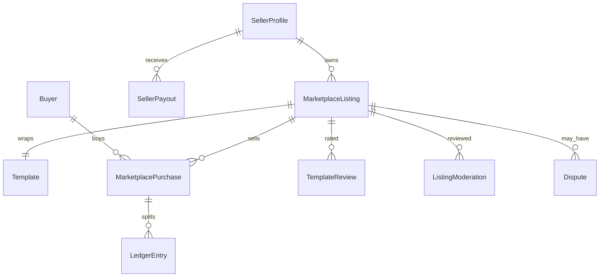
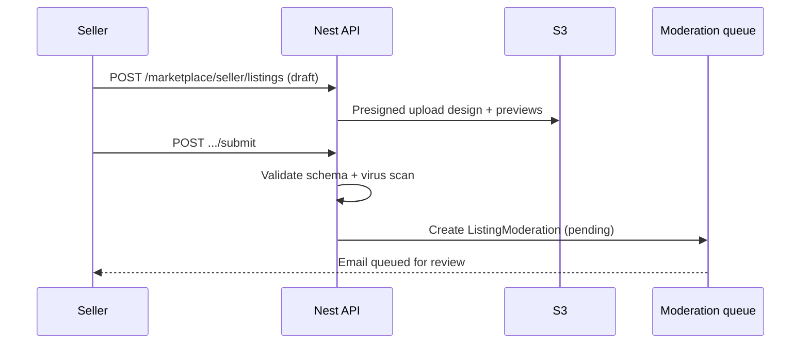

# CV STUDIO AI — MARKETPLACE DE DESIGNS

## Marketplace Architect — Document de référence

| Métadonnée                | Valeur                                                      |
| ------------------------- | ----------------------------------------------------------- |
| **Modèle**                | Two-sided marketplace (créateurs ↔ candidats)               |
| **Commission plateforme** | **30%** take rate (seller reçoit **70%**)                   |
| **Paiements**             | Stripe Connect (Express) · payouts hebdo                    |
| **Devise v1**             | USD · EUR (multi-currency M12+)                             |
| **Licence acheteur**      | Licence d’usage personnelle / Pro seat — non redistribuable |
| **Alignement**            | PRD · Billing · Analytics · Security · Templates            |
| **Version**               | 1.0 · 26 juillet 2026                                       |

---

## 0. Vision produit

La marketplace transforme CV Studio AI en **écosystème de designs ATS-ready** : sellers publient templates premium ; buyers (Free+ avec entitlement `marketplace:buy` Pro/Business, ou one-shot purchase) achètent une licence d’usage dans l’éditeur.

### Objectifs M12

| KPI                             | Cible                         |
| ------------------------------- | ----------------------------- |
| Listings publiés                | ≥ 200                         |
| Sellers actifs (1+ vente / 90j) | ≥ 50                          |
| GMV mensuel                     | Trajectoire vers $50k+        |
| Take rate réalisé               | 30% (hors taxes/frais Stripe) |
| CSAT listing                    | ≥ 4.3 / 5                     |
| Temps médian review qualité     | ≤ 72h                         |

### Non-goals v1

- Services freelance custom CV (Fiverr-like gigs) — phase 2
- NFT / revente secondaire
- Templates contenant contenu CV d’un tiers

---

## 1. Domain model



| Entité                  | Rôle                                  |
| ----------------------- | ------------------------------------- |
| **SellerProfile**       | KYC lite, Connect account, storefront |
| **MarketplaceListing**  | Offre commerciale sur un `Template`   |
| **Template**            | Design JSON + previews (déjà en DB)   |
| **MarketplacePurchase** | Licence acheteur (idempotent)         |
| **LedgerEntry**         | Split 70/30 + fees                    |
| **SellerPayout**        | Virement Connect                      |
| **ListingModeration**   | File d’approbation qualité            |
| **TemplateReview**      | Notes 1–5 + commentaire               |
| **Dispute**             | Litige buyer/seller/platform          |
| **CopyrightClaim**      | DMCA-style notice                     |

---

## 2. Seller profiles

### 2.1 Onboarding

```
Apply seller → Accept Seller Terms + IP warranty
  → Stripe Connect Express onboarding
  → Profile (display name, bio, avatar, country, portfolio links)
  → Status: pending_kyc → active | rejected
```

| Champ               | Règle                         |
| ------------------- | ----------------------------- |
| `display_name`      | 3–40 chars, unique slug       |
| `slug`              | `cvstudio.ai/creators/:slug`  |
| `bio`               | ≤ 500 chars                   |
| `country`           | ISO ; payout eligibility      |
| `stripe_account_id` | Connect Express               |
| `payouts_enabled`   | bool from Connect             |
| `seller_tier`       | `new` · `trusted` · `partner` |
| `tos_accepted_at`   | required                      |

### 2.2 Seller tiers

| Tier        | Criteria                                 | Perks                                 |
| ----------- | ---------------------------------------- | ------------------------------------- |
| **new**     | &lt; 5 sales                             | Standard review queue                 |
| **trusted** | ≥ 20 sales · rating ≥ 4.5 · 0 IP strikes | Fast-track review · featured eligible |
| **partner** | Invite-only                              | Co-marketing · lower scrutiny · badge |

### 2.3 Storefront

- Public page : bio, listings, aggregate rating, sales count (banded)
- Analytics privés : §10

---

## 3. Template uploading

### 3.1 Asset package

| Asset             | Spec                                                     |
| ----------------- | -------------------------------------------------------- |
| `design.json`     | Schema versionné (tokens, layout, slots) — validateur CI |
| Preview PNG/WebP  | 3 breakpoints · max 1.5 MB each                          |
| Thumbnail         | 600×800                                                  |
| Sample PDF        | Rendered with lorem CV (no PII)                          |
| Cover video (opt) | ≤ 15s · muted                                            |

### 3.2 Upload flow



### 3.3 Categories & tags

Align Design System templates : `ats` · `creative` · `executive` · `academic` · `tech` · `career_change`  
Tags libres modérés ; max 8.

### 3.4 Versioning

- Nouvelle version = new `template_version` ; buyers get updates **opt-in** or auto for bugfix
- Breaking layout changes = major version ; notify buyers

---

## 4. Pricing

### 4.1 Price rules

| Rule          | Value                                                           |
| ------------- | --------------------------------------------------------------- |
| Min price     | **$4.99**                                                       |
| Max price     | **$49.99** (v1)                                                 |
| Increments    | $0.50                                                           |
| Free listings | Not on marketplace (use official free templates)                |
| Promos        | Seller coupon % off · platform flash sales (optional co-funded) |

### 4.2 Suggested pricing bands

| Band      | Price       | Profile                   |
| --------- | ----------- | ------------------------- |
| Starter   | $4.99–$9.99 | Simple ATS                |
| Standard  | $10–$19.99  | Polished dual-column      |
| Premium   | $20–$34.99  | Brand systems, multi-page |
| Signature | $35–$49.99  | Partner / niche executive |

### 4.3 Bundles (M12+)

Pack 3 templates · seller-defined bundle discount ≤ 25%.

### 4.4 Who can buy

- Entitlement `marketplace:buy` : **Pro & Business** (PRD)
- Alternative : **à-la-carte** purchase for Free users (PaymentIntent one-shot) — recommended to grow GMV ; flag `purchase_mode: subscription_gate | alacarte`

**Decision v1 :** Pro/Business gated **or** alacarte checkout (both supported ; alacarte unlocks single licence).

---

## 5. Commission structure (30%)

### 5.1 Split

```
Buyer pays Gross G (VAT/GST handled per Stripe Tax)
Stripe fee F ≈ 2.9% + $0.30 (indicative)
Net N = G - F
Platform take P = 30% × N
Seller earn S = 70% × N
```

**Produit communiqué :** « Sellers keep **70%** of net after payment processing. »

### 5.2 Ledger (immutable)

Chaque `MarketplacePurchase` crée :

1. `ledger.charge` (gross)
2. `ledger.stripe_fee`
3. `ledger.platform_commission` (30% net)
4. `ledger.seller_earning` (70% net)

Idempotency : `purchase_id` + `entry_type` unique.

### 5.3 Refunds

- Full refund ≤ 14 days if template defect (policy)
- Reverse ledger entries ; clawback from next payout if already paid
- Partial refund rare (admin only)

### 5.4 Chargebacks

- Freeze seller balance ; dispute flow ; seller may lose trusted tier

---

## 6. Payment to sellers (payouts)

### 6.1 Rails

**Stripe Connect Express** — platform is Merchant of Record for marketplace (or connected destination charges — Legal choose).

Recommended : **Destination charges** with `application_fee_amount` = platform cut ≈ 30% net equivalent.

### 6.2 Schedule

| Item           | Policy                                                       |
| -------------- | ------------------------------------------------------------ |
| Payout cadence | **Weekly** (Wednesday)                                       |
| Minimum payout | **$25** (else roll)                                          |
| Reserve        | 10% of earnings held **14 days** (refunds) for `new` sellers |
| Trusted        | Reserve 5% / 7 days                                          |
| Currency       | Account default                                              |

### 6.3 Seller balance

```
available = settled_earnings - paid - reserves - clawbacks
pending = earnings in reserve window
```

### 6.4 Tax

- 1099 / local equivalents via Stripe Tax / seller responsibility
- Collect tax IDs where required

---

## 7. Quality approval process

### 7.1 Automated gates (must pass)

- [ ] `design.json` schema valid
- [ ] Previews present & dimensions OK
- [ ] No offensive text in sample
- [ ] Virus / malware scan clean
- [ ] Perceptual hash vs existing catalog (dupe threshold)
- [ ] Contrast / font license declaration present

### 7.2 Human review checklist

| Criterion        | Fail if                                                |
| ---------------- | ------------------------------------------------------ |
| ATS friendliness | Multi-column text in unreadable PDF order              |
| Visual quality   | Pixelation, misaligned, low contrast                   |
| Originality      | Obvious clone of platform or peer listing              |
| Completeness     | Missing sections slots (experience, education, skills) |
| Metadata         | Misleading category / fake “#1 ATS” claims             |
| IP               | Suspected trademark / stolen portfolio                 |

### 7.3 States

```
draft → submitted → in_review → changes_requested → approved → published
                              ↘ rejected
published → unpublished (seller) | suspended (trust & safety)
```

SLA : **72h** median `submitted` → first decision.

### 7.4 Reviewer tools

Admin console : side-by-side preview, PDF sample, similarity score, seller history, approve / request changes / reject with canned reasons.

---

## 8. Reviews & ratings

### 8.1 Eligibility

- Buyer must have **purchase** (verified)
- One review per listing per buyer
- Editable 72h ; then locked

### 8.2 Schema

- `rating` 1–5 integer
- `comment` optional 10–1000 chars
- `helpful_count`
- Dimensions optional M12 : `ats_quality`, `design`, `ease_of_use`

### 8.3 Aggregation

```
listing.rating = bayesian_average(ratings, C=10, m=global_mean)
```

Display stars + count ; sort “Top rated” uses bayesian.

### 8.4 Moderation

- Profanity / PII filter
- Seller can **flag** ; cannot delete
- Platform removes ToS violations
- Review gating : no review if dispute open

### 8.5 Analytics events

`marketplace_review_submitted`, `marketplace_review_helpful` (extend taxonomy).

---

## 9. Dispute resolution

### 9.1 Types

| Type        | Examples                        |
| ----------- | ------------------------------- |
| **quality** | Broken layout, not as preview   |
| **ip**      | Copyright complaint             |
| **billing** | Duplicate charge                |
| **access**  | Purchase not unlocking template |

### 9.2 Flow

```
Buyer opens dispute (≤ 14d post-purchase)
  → Seller notified (48h to respond)
  → Mediation (platform agent)
  → Decision: refund_full | refund_partial | deny | replace_version
  → Ledger + Connect refund if needed
```

### 9.3 SLAs

| Step               | Time             |
| ------------------ | ---------------- |
| Seller response    | 48h              |
| Platform decision  | 5 business days  |
| Urgent IP takedown | 24h hide listing |

### 9.4 Escalation

- Repeat offenders → suspend seller
- Fraud rings → ban + hold payouts

---

## 10. Analytics for sellers

### 10.1 Dashboard metrics

| Metric              | Definition               |
| ------------------- | ------------------------ |
| Impressions         | Listing card views       |
| Detail views        | PDP views                |
| Conversion          | Purchases / detail views |
| GMV / Net earnings  | Gross vs seller share    |
| Refund rate         | Refunds / purchases      |
| Rating              | Bayesian avg             |
| Search rank signals | CTR, apply-to-CV rate    |

### 10.2 Charts

- Revenue 30/90d
- Funnel impression → purchase
- Geo of buyers (country)
- Traffic sources (search, featured, creator page, external UTM)

### 10.3 Exports

CSV transactions · monthly statement PDF

API : `GET /marketplace/seller/analytics`

---

## 11. Marketing for designs

### 11.1 Discovery surfaces

| Surface          | Mechanism                             |
| ---------------- | ------------------------------------- |
| Marketplace home | Featured, trending, new               |
| Search           | Name, tags, category, ATS score badge |
| Editor           | “Similar templates” · up-sell premium |
| Email            | New in category for engaged users     |
| Creators program | Spotlight newsletter                  |
| SEO              | `/marketplace/[slug]` public SSR      |

### 11.2 Ranking (v1 heuristic)

```
score = 0.35*CTR + 0.25*CVR + 0.20*rating_bayes + 0.10*recency + 0.10*seller_tier
```

Manual boost for featured (paid later / editorial).

### 11.3 Seller self-serve marketing

- Promo codes (seller-funded discount)
- Share cards / UTM links
- “New version” notify past buyers

### 11.4 Platform campaigns

- Seasonal (back-to-school, Jan job season)
- Category challenges with prizes

---

## 12. Copyright protection

### 12.1 Seller warranties

Seller Terms : original work or licensed rights ; indemnify platform ; grant platform licence to host/display/sell.

### 12.2 Technical protections

| Control                | Detail                                                                                                          |
| ---------------------- | --------------------------------------------------------------------------------------------------------------- |
| ToS + clickwrap        | On submit                                                                                                       |
| Perceptual hash        | Near-dupe detection                                                                                             |
| Watermark previews     | Light CV Studio mark on gallery only                                                                            |
| No raw design download | Buyers get in-app licence, not transferable JSON export of full commercial package (optional export restricted) |
| Audit trail            | Who published what / when                                                                                       |
| Rate limit             | Upload velocity                                                                                                 |

### 12.3 DMCA / notice-and-takedown

1. Copyright claimant submits notice (`CopyrightClaim`)
2. Listing **suspended** pending review
3. Counter-notice process (US) / local equivalent
4. Repeat infringer policy → account termination

### 12.4 Trademark / brand abuse

No impersonation of employers (Google, McKinsey…) in template names misleadingly.

### 12.5 Buyer licence (summary)

- Non-exclusive, non-transferable
- Use in CV Studio for personal / job applications
- No resale, no redistribution of template files
- Business seats : licence per org policy

Legal owns final EULA text.

---

## 13. Trust & safety

- Seller KYC via Stripe
- Max unpublished drafts
- Auto-suspend on chargeback ratio &gt; threshold
- Admin roles : `moderator`, `finance`, `trust`
- Audit all publish/suspend/refund

---

## 14. API surface (target)

| Method    | Path                                         | Actor            |
| --------- | -------------------------------------------- | ---------------- |
| POST      | `/marketplace/seller/apply`                  | User             |
| GET/PATCH | `/marketplace/seller/me`                     | Seller           |
| POST      | `/marketplace/seller/listings`               | Seller           |
| POST      | `/marketplace/seller/listings/:id/assets`    | Seller (presign) |
| POST      | `/marketplace/seller/listings/:id/submit`    | Seller           |
| PATCH     | `/marketplace/seller/listings/:id`           | Seller           |
| POST      | `/marketplace/seller/listings/:id/unpublish` | Seller           |
| GET       | `/marketplace/seller/analytics`              | Seller           |
| GET       | `/marketplace/seller/payouts`                | Seller           |
| GET       | `/marketplace/templates`                     | Public           |
| GET       | `/marketplace/templates/:id`                 | Public           |
| POST      | `/marketplace/templates/:id/purchase`        | Buyer            |
| POST      | `/marketplace/templates/:id/reviews`         | Buyer            |
| POST      | `/marketplace/purchases/:id/disputes`        | Buyer            |
| GET       | `/admin/marketplace/queue`                   | Moderator        |
| POST      | `/admin/marketplace/listings/:id/decision`   | Moderator        |

---

## 15. Frontend surfaces

| Route                  | Purpose           |
| ---------------------- | ----------------- |
| `/marketplace`         | Browse            |
| `/marketplace/[slug]`  | PDP               |
| `/creators/[slug]`     | Seller storefront |
| `/seller`              | Seller home       |
| `/seller/listings/new` | Upload wizard     |
| `/seller/analytics`    | Dashboards        |
| `/seller/payouts`      | Balance & history |
| `/admin/marketplace`   | Review queue      |

---

## 16. Analytics events (marketplace)

Extend product taxonomy :
`seller_apply_started` · `seller_apply_completed` · `listing_submitted` · `listing_approved` · `listing_rejected` · `marketplace_impression` · `marketplace_review_submitted` · `dispute_opened` · `dispute_resolved` · `seller_payout_paid`

Funnels : browse → PDP → purchase · submit → approved → first sale.

---

## 17. Roadmap

| Phase   | Scope                                                           |
| ------- | --------------------------------------------------------------- |
| M6–M8   | Seller apply, upload, moderation MVP, buy Pro-gated, 30% ledger |
| M9–M10  | Connect payouts, reviews, seller analytics                      |
| M11–M12 | Disputes, copyright claims, ranking, SEO PDP                    |
| M13+    | Bundles, services gigs, multi-currency, featured ads            |

---

## 18. Related docs

| Doc                                                                    | Role          |
| ---------------------------------------------------------------------- | ------------- |
| [COMMISSION-AND-PAYOUTS.md](marketplace/COMMISSION-AND-PAYOUTS.md)     | Math & ledger |
| [QUALITY-REVIEW-CHECKLIST.md](marketplace/QUALITY-REVIEW-CHECKLIST.md) | Moderators    |
| [SELLER-GUIDE.md](marketplace/SELLER-GUIDE.md)                         | Creator UX    |
| [DISPUTES-AND-IP.md](marketplace/DISPUTES-AND-IP.md)                   | Policies      |
| [ADR-019](adr/019-marketplace-connect-30.md)                           | Connect + 30% |

---

_Marketplace Architecture CV Studio AI v1.0_
