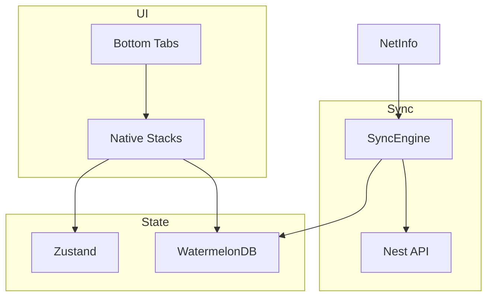
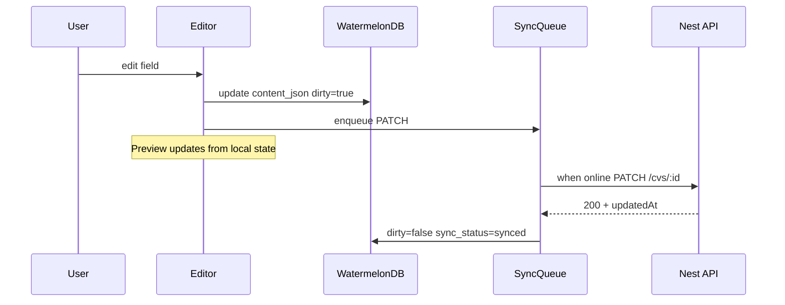
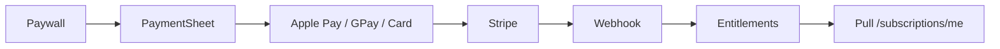

# CV STUDIO AI — MOBILE ARCHITECTURE (React Native / Expo)

## Senior React Native — Document de référence

| Métadonnée        | Valeur                                                       |
| ----------------- | ------------------------------------------------------------ |
| **App**           | `apps/mobile`                                                |
| **Stack**         | Expo (dev client) · React Native · TypeScript                |
| **Navigation**    | React Navigation 7 (Native Stack + Bottom Tabs)              |
| **State**         | Zustand (UI/session) + WatermelonDB (données métier offline) |
| **Sync**          | Pull/push vers Nest `/api/v1`                                |
| **Notifications** | Expo Notifications + backend device tokens                   |
| **Payments**      | Stripe Payment Sheet · Apple Pay · Google Pay                |
| **Deep links**    | `cvstudio://` + Universal / App Links                        |
| **Alignement**    | PRD Phase 4 · API · Design System · Web editor parity core   |
| **Version**       | 1.0 · 26 juillet 2026                                        |

---

## 1. Objectifs produit mobile

1. **Édition CV utile en mobilité** (pas parity pixel-perfect desktop day-1)
2. **Preview temps réel** (onglets Contenu / Aperçu — Design System mobile)
3. **Offline-first** : lire/éditer sans réseau ; sync à la reconnexion
4. **Templates browse + apply**
5. **Notifications** : export prêt, ATS, billing, reminders candidature (opt-in)
6. **Paiements natifs** Apple Pay / Google Pay via Stripe
7. **Deep links** : ouvrir un CV, checkout success, magic share

### Non-goals M12

- Collab realtime CRDT
- Marketplace seller tools complets
- OCR lourd on-device (upload + server OCR)

---

## 2. Architecture overview

```
┌──────────────────────────────────────────────┐
│                 UI Screens                    │
│         React Navigation + Components         │
├──────────────────────────────────────────────┤
│     Zustand (auth token, ui, editor ephemeral)│
├──────────────────────────────────────────────┤
│   Repositories / Sync Engine (domain layer)   │
├───────────────┬──────────────────────────────┤
│ WatermelonDB  │  API Client (typed fetch)     │
│ (SQLite)      │  → NestJS /api/v1             │
├───────────────┴──────────────────────────────┤
│ Expo: SecureStore, Notifications, Linking,   │
│ NetInfo, Stripe SDK, FileSystem              │
└──────────────────────────────────────────────┘
```



---

## 3. Monorepo layout

```
apps/mobile/
├── app.json / app.config.ts
├── package.json
├── tsconfig.json
├── babel.config.js
├── index.js
├── src/
│   ├── App.tsx
│   ├── navigation/
│   │   ├── RootNavigator.tsx
│   │   ├── AuthStack.tsx
│   │   ├── MainTabs.tsx
│   │   ├── EditorStack.tsx
│   │   ├── linking.ts
│   │   └── types.ts
│   ├── screens/
│   │   ├── auth/
│   │   ├── home/
│   │   ├── editor/
│   │   ├── templates/
│   │   ├── account/
│   │   └── paywall/
│   ├── components/
│   │   ├── ui/
│   │   ├── editor/
│   │   └── cv-preview/
│   ├── stores/
│   ├── db/
│   │   ├── index.ts
│   │   ├── schema.ts
│   │   ├── models/
│   │   └── sync/
│   ├── api/
│   ├── hooks/
│   ├── services/
│   │   ├── notifications.ts
│   │   ├── payments.ts
│   │   └── analytics.ts
│   ├── theme/
│   └── utils/
└── assets/
```

**Partage monorepo :** réutiliser `packages/shared-types` (API DTOs / CvContent) dès disponible ; tokens couleurs depuis Design System JSON.

---

## 4. Navigation

### 4.1 Arbres

```
RootNavigator
├── AuthStack (si !token)
│   ├── Welcome
│   ├── Login
│   ├── Register
│   └── ForgotPassword
└── AppStack (si token)
    ├── MainTabs
    │   ├── HomeTab → HomeStack (Dashboard, CvList)
    │   ├── TemplatesTab
    │   ├── AITab (tools entry — Pro gated)
    │   └── AccountTab
    ├── EditorStack (modal / full screen)
    │   ├── EditorHome (tabs Content | Preview | Tools)
    │   ├── SectionEdit
    │   ├── AtsResult
    │   └── ExportStatus
    ├── PaywallModal
    └── CheckoutResult
```

### 4.2 React Navigation config

- `@react-navigation/native`
- `@react-navigation/native-stack`
- `@react-navigation/bottom-tabs`
- Themes light/dark alignés tokens
- `screenOptions`: `headerLargeTitle` iOS Home ; Editor `headerShown` custom

### 4.3 Deep linking (`linking.ts`)

| URL                                | Screen                           |
| ---------------------------------- | -------------------------------- |
| `cvstudio://login`                 | Login                            |
| `cvstudio://dashboard`             | Home                             |
| `cvstudio://cv/:id`                | Editor                           |
| `cvstudio://templates/:id`         | Template detail                  |
| `cvstudio://billing/success`       | CheckoutResult                   |
| `cvstudio://billing/cancel`        | Paywall                          |
| `https://app.cvstudio.ai/cv/:id`   | Universal Link → Editor          |
| `https://app.cvstudio.ai/s/:token` | Shared preview (web fallback OK) |

`app.json` : `scheme: "cvstudio"` + associatedDomains / intentFilters.

---

## 5. Screens catalogue

| Screen           | Features                                      |
| ---------------- | --------------------------------------------- |
| Welcome          | Value prop + CTA                              |
| Login / Register | Email + OAuth (Google/Apple)                  |
| Home / CvList    | Liste offline, FAB create, sync badge         |
| Editor Content   | Forms sections, DnD light / reorder buttons   |
| Editor Preview   | PDF-like WebView or RN render                 |
| Editor Tools     | ATS, AI optimize, export                      |
| Templates        | Browse, filter, apply (queue sync)            |
| Account          | Profile, billing, notifications prefs, logout |
| Paywall          | Pro benefits + Apple/Google Pay               |
| ExportStatus     | Job poll + share sheet                        |
| OfflineBanner    | Persistent when NetInfo offline               |

---

## 6. State management

### 6.1 Zustand

| Store           | Contenu                                                |
| --------------- | ------------------------------------------------------ |
| `authStore`     | accessToken (SecureStore hydrate), user stub, logout   |
| `uiStore`       | theme, tab, paywall, toast queue                       |
| `editorUiStore` | activeSection, previewZoom, dirty flag, saveStatus     |
| `syncStore`     | status: idle/syncing/error, lastSyncedAt, pendingCount |

**Règle :** pas de liste CV complète dans Zustand — observer WatermelonDB.

### 6.2 WatermelonDB — source of truth locale

#### Schema (v1)

| Table        | Champs clés                                                                                 |
| ------------ | ------------------------------------------------------------------------------------------- |
| `cvs`        | id, server_id, title, template_id, content_json, updated_at, deleted_at, dirty, sync_status |
| `templates`  | id, server_id, name, category, preview_url, is_premium, design_json, cached_at              |
| `sync_queue` | id, entity, entity_id, op, payload, attempts, next_at                                       |
| `meta`       | key, value (cursor pull, user_id)                                                           |

#### Models

`CvModel`, `TemplateModel`, `SyncQueueModel` — `@field` / `@json` content.

#### Why WatermelonDB

- SQLite performant
- Lazy observables → listes fluides
- Sync protocol adapté offline queue

---

## 7. Offline & Sync engine

### 7.1 Principes

1. **Read** toujours depuis DB locale
2. **Write** locale immédiat (`dirty=true`) + enqueue `sync_queue`
3. **Push** quand online (FIFO, idempotency-key = queue id)
4. **Pull** incremental `updated_at > cursor` sur `/cvs`
5. **Conflict** : Last-Write-Wins sur `updated_at` server vs local + banner si server newer during edit (prompt merge simple M12 ; LWW acceptable MVP mobile)

### 7.2 Flow



### 7.3 NetInfo

- `offline` → banner + disable export/AI requiring network
- `online` → `SyncEngine.flush()` + `pull()`

### 7.4 AI / Export offline

- Queue intent « run ATS when online » OR block with CTA
- PDF export requires network (server Chromium)

---

## 8. Editor & real-time preview

### 8.1 UX (align Design System)

```
┌─────────────────────┐
│ Topbar: title·save  │
│ [Contenu|Aperçu|…]  │
├─────────────────────┤
│                     │
│  Form OR Preview    │
│                     │
└─────────────────────┘
│ Sync · Plan · Export│
```

- Touch targets ≥ 48
- Autosave local immediate ; push ≤5s coalesced when online
- Preview : **React Native render** of template subset (Atlas/ATS) OR `react-native-webview` HTML from shared renderer package later

### 8.2 Shared renderer strategy

| Phase | Approach                                                         |
| ----- | ---------------------------------------------------------------- |
| M9–10 | Native simplified preview (typography stack)                     |
| M11+  | Shared HTML template package rendered in WebView (closer to PDF) |

---

## 9. Templates browsing

- Pull catalog → cache `templates` table (TTL 24h)
- Images : `expo-image` + disk cache
- Apply template : update local cv.template_id + queue sync
- Premium gate → Paywall

---

## 10. Notifications (Expo)

### 10.1 Setup

- `expo-notifications`
- Register device push token → `POST /api/v1/devices` (à ajouter backend)
- Permissions UX soft-ask after first export success

### 10.2 Notification types

| Type              | Trigger backend     |
| ----------------- | ------------------- |
| `export.ready`    | PDF job completed   |
| `ats.complete`    | ATS job done        |
| `billing.renewal` | Stripe upcoming     |
| `sync.conflict`   | rare                |
| `career.reminder` | opt-in inactive 14d |

### 10.3 Handling

- Foreground : in-app toast
- Background tap → deep link navigate
- Channels Android : `exports`, `billing`, `product`

---

## 11. Payments — Apple Pay / Google Pay

### 11.1 Stack

- `@stripe/stripe-react-native` Payment Sheet
- Backend : existing `POST /subscriptions/checkout` **ou** mieux `POST /payments/payment-sheet` (PaymentIntent / SetupIntent + Customer Ephemeral Key)

### 11.2 Flow



### 11.3 Store compliance

- Si vente de features digitales : respecter **Reader App / External Link** rules iOS selon juridiction ; alternative : Stripe + disclose.
- Document Legal review avant Store submit.
- Prefer **subscriptions** via Stripe + Apple/Google Pay as wallets on Payment Sheet (not IAP) when allowed ; sinon IAP mapping — **décision Legal ADR avant GA stores**.

**ADR mobile-pay (pending Legal) :** Payment Sheet wallets first for web-parity SaaS where permitted ; fallback IAP if App Store requires.

---

## 12. Auth mobile

- Login/Register → API → store `accessToken` in **expo-secure-store**
- Refresh token secure store ; rotate on 401
- Apple Sign In (`expo-apple-authentication`) + Google (`expo-auth-session`)
- Biometrics optional unlock app (`expo-local-authentication`) — token already on device

---

## 13. API client mobile

Same envelope as web:

```ts
apiClient<T>(path, { method, body, idempotencyKey });
```

- Base `EXPO_PUBLIC_API_URL`
- Attach Bearer from SecureStore
- Timeout shorter on cellular (15s) ; retry GET

Endpoints used : auth, users/me, cvs CRUD, templates, subscriptions, ai (online), payments sheet, devices, exports poll.

---

## 14. Theming & Design System

```
theme/tokens.ts  // port from design-tokens.json
theme/navigationTheme.ts
```

- Primary `#2563EB`, Secondary `#7C3AED`, etc.
- Dark mode : `useColorScheme` + override settings
- Typography : Inter via `expo-google-fonts` (or system SF/Roboto if license constraint)

---

## 15. Performance

| Area      | Practice                                     |
| --------- | -------------------------------------------- |
| Lists     | FlashList / Watermelon observables           |
| Images    | expo-image                                   |
| JS thread | debounce preview 150ms                       |
| Startup   | defer sync 1s after first paint              |
| Bundle    | Expo Router optional later ; avoid moment.js |
| Crash     | Sentry React Native                          |

Targets : JS FPS 60 on mid devices ; cold start < 2.5s on recent phones.

---

## 16. Security

- No tokens in AsyncStorage plain
- Certificate pinning optional M18
- Jailbreak detect soft warning (optional)
- Screen capture flag on Editor for executive users? (Android FLAG_SECURE optional setting)
- RLS server remains source of AuthZ

---

## 17. Testing

| Layer     | Tool                                    |
| --------- | --------------------------------------- |
| Unit      | Jest                                    |
| Component | RNTL                                    |
| E2E       | Maestro / Detox                         |
| Sync      | integration tests queue offline→online  |
| Store     | Screenshot + TestFlight / Play Internal |

---

## 18. CI / Release

- EAS Build (`eas.json` : development, preview, production)
- EAS Submit
- OTA Updates (`expo-updates`) for JS fixes — native modules require store build
- Versioning : `app.config.ts` runtimeVersion policy

---

## 19. Feature parity matrix (Web vs Mobile M12)

| Feature         | Web     | Mobile M12          |
| --------------- | ------- | ------------------- |
| Dual-pane       | ✓       | Tabs Contenu/Aperçu |
| Autosave        | ✓       | ✓ local + sync      |
| Templates 5+    | ✓       | ✓ cached            |
| PDF export      | ✓       | ✓ online            |
| ATS             | ✓       | ✓ online            |
| AI optimize     | ✓       | ✓ online + Pro      |
| Offline edit    | partial | ✓ first-class       |
| Marketplace buy | ✓       | ✓ light             |
| Collab realtime | later   | ✗                   |
| DOCX            | ✓ Pro   | later               |

---

## 20. Roadmap mobile

| Milestone | Livrable                                            |
| --------- | --------------------------------------------------- |
| M9        | Expo app shell, auth, CvList offline read           |
| M10       | Editor + preview + sync push/pull                   |
| M11       | Templates, notifications, paywall Stripe            |
| M12       | Soft launch TestFlight/Internal · crash-free ≥99.5% |
| M13+      | Shared HTML preview, IAP decision, polish           |

---

## 21. Backend endpoints to add (mobile)

| Endpoint                       | Why                 |
| ------------------------------ | ------------------- |
| `POST /devices`                | push token register |
| `DELETE /devices/:id`          | logout              |
| `POST /payments/payment-sheet` | Stripe RN           |
| `GET /cvs?updatedSince=`       | incremental pull    |

---

## 22. Definition of Done (mobile feature)

- [ ] Works offline when applicable
- [ ] Sync queue durable
- [ ] Deep link covered if entry point
- [ ] a11y labels / Dynamic Type
- [ ] Analytics event
- [ ] Pro gate tested
- [ ] EAS build profile OK

---

_Mobile Architecture CV Studio AI v1.0 — scaffold in apps/mobile_
