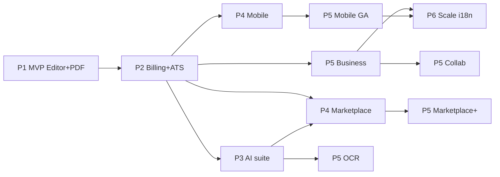

# CV STUDIO AI — ROADMAP 24 MOIS

## CTO — Document de pilotage exécutif

| Métadonnée         | Valeur                                                                        |
| ------------------ | ----------------------------------------------------------------------------- |
| **Owner**          | CTO                                                                           |
| **Horizon**        | M0 → M24 (24 mois)                                                            |
| **Cadence sprint** | **2 semaines**                                                                |
| **Méthode**        | Shape-up light + Scrum delivery · Go/No-Go gates phase                        |
| **Alignement**     | PRD · Architecture · Security · Infra · AI · Mobile · Marketplace · Analytics |
| **Version**        | 1.0 · 26 juillet 2026                                                         |
| **Statut actuel**  | **Phase 0 complète (specs)** → démarrage Phase 1 Sprint 0                     |

---

## 0. Executive summary

**Mission technique :** livrer un SaaS CV ATS-first avec éditeur dual-pane, monétisation Pro, IA différenciante, marketplace créateurs, app mobile offline, puis scale multi-région / i18n — sans sacrifier fiabilité (99.9%) ni conformité GDPR.

### Phases

| Phase | Mois  | Thème                    | Outcome business                            |
| ----- | ----- | ------------------------ | ------------------------------------------- |
| **1** | 0–3   | **MVP**                  | GA éditeur + export PDF + auth              |
| **2** | 3–6   | **Core**                 | Billing Pro, ATS, rétention, prod hardening |
| **3** | 6–9   | **IA & Premium**         | Suite IA, quotas, NRR                       |
| **4** | 9–12  | **Marketplace & Mobile** | GMV creators + soft launch mobile           |
| **5** | 12–18 | **Advanced**             | Collab, OCR, Business, SOC2 path            |
| **6** | 18–24 | **Scale & i18n**         | Multi-langue, DR, 1M users path             |

### Principes CTO (Notion/Linear style)

1. **Editor quality > feature count** — dual-pane live preview non négociable
2. **Ship vertical slices** — chaque sprint livre un chemin utilisateur testable
3. **Platform before scale** — CI/CD, observabilité, sécurité avant growth hacks
4. **Kill switches** — AI, export, marketplace feature-flaggés
5. **Gate honestly** — No-Go = pivot scope, pas « ship anyway »

### Capacité (hypothèse staffing)

| Phase | Eng | Design | Product | Platform/DevOps | Data | QA  | Total ~ |
| ----- | --- | ------ | ------- | --------------- | ---- | --- | ------- |
| P1    | 4   | 1      | 1       | 1               | 0.5  | 1   | ~8.5    |
| P2    | 6   | 1.5    | 1       | 1.5             | 1    | 1   | ~12     |
| P3    | 8   | 2      | 2       | 2               | 1    | 1.5 | ~16.5   |
| P4    | 10  | 2      | 2       | 2               | 1.5  | 2   | ~19.5   |
| P5    | 14  | 3      | 3       | 3               | 2    | 2   | ~27     |
| P6    | 18  | 3      | 3       | 4               | 2    | 3   | ~33     |

_(FTEs indicatifs — ajuster au funding.)_

### Risques portfolio (transverses)

| Risque                   | Mitigation                                      |
| ------------------------ | ----------------------------------------------- |
| Coût LLM explosion       | Quotas, caching, model routing, circuit breaker |
| App Store / IAP conflict | ADR Legal wallets vs IAP avant soft launch      |
| Marketplace IP           | Review QA + DMCA process avant GMV scale        |
| Scope creep collab       | Collab **après** PMF mobile (P5)                |
| Hiring lag               | Contractor buffer Platform/AI P2–P3             |

---

# PHASE 1 — MVP (Mois 0–3)

**Objectif :** utilisateurs créent un CV, preview live, export PDF, compte sécurisé.  
**Exit criteria phase :** Activation export ≥ 25% signups semaine · p95 editor OK · crash-free web ≥ 99% · Go GA soft.

## Sprint 0 — Foundation (S0 · Semaines 1–2)

|                 |                                                                                                                             |
| --------------- | --------------------------------------------------------------------------------------------------------------------------- |
| **Features**    | Monorepo Turborepo live ; Nest + Next boots ; Postgres/Redis compose ; CI lint/test ; design tokens branchés ; envelope API |
| **Dépendances** | Specs Phase 0 (déjà) · AWS comptes · domaines                                                                               |
| **Risques**     | Dettes scaffold vs rewrite — **mitigation :** freeze API envelope                                                           |
| **Ressources**  | 2 fullstack, 1 platform, 0.5 design                                                                                         |
| **Timeline**    | 2 semaines                                                                                                                  |
| **Livrables**   | `apps/api` + `apps/web` runnable · CI green · staging VPC skeleton                                                          |
| **Go/No-Go**    | **Go** si CI + healthchecks verts · **No-Go** si auth/DB non bootables                                                      |

## Sprint 1 — Identity (S1 · S3–4)

|                 |                                                                                                           |
| --------------- | --------------------------------------------------------------------------------------------------------- |
| **Features**    | Register/login email · JWT access+refresh rotation · Secure cookies web · `/users/me` · email verify stub |
| **Dépendances** | S0 · Secrets Manager                                                                                      |
| **Risques**     | Account enumeration — rate limit + messages neutres                                                       |
| **Ressources**  | 2 backend, 1 frontend, 0.5 security                                                                       |
| **Timeline**    | 2 semaines                                                                                                |
| **Livrables**   | Auth flows E2E staging · audit `auth.login.*`                                                             |
| **Go/No-Go**    | **Go** si refresh reuse detection · **No-Go** si tokens en localStorage                                   |

## Sprint 2 — CV data model (S2 · S5–6)

|                 |                                                                                               |
| --------------- | --------------------------------------------------------------------------------------------- |
| **Features**    | CRUD CV · JSONB content + sections projection · RLS policies · soft delete · versioning light |
| **Dépendances** | S1 · Prisma schema                                                                            |
| **Risques**     | JSONB drift — schemaVersion + validators Zod                                                  |
| **Ressources**  | 2 backend, 1 frontend                                                                         |
| **Timeline**    | 2 semaines                                                                                    |
| **Livrables**   | API CV stable · IDOR tests                                                                    |
| **Go/No-Go**    | **Go** si RLS + IDOR tests passent                                                            |

## Sprint 3 — Editor dual-pane v1 (S3 · S7–8)

|                 |                                                                                    |
| --------------- | ---------------------------------------------------------------------------------- |
| **Features**    | Form sections · live preview debounce 150ms · autosave ≤5s · 2 templates officiels |
| **Dépendances** | S2 · Design System editor spec                                                     |
| **Risques**     | Perf preview — virtualiser / memo layout                                           |
| **Ressources**  | 2 frontend, 1 design, 1 backend                                                    |
| **Timeline**    | 2 semaines                                                                         |
| **Livrables**   | Editor usable desktop · analytics `cv_*` core                                      |
| **Go/No-Go**    | **Go** si dogfood interne 10 CV créés sans data loss                               |

## Sprint 4 — Templates + PDF (S4 · S9–10)

|                 |                                                                          |
| --------------- | ------------------------------------------------------------------------ |
| **Features**    | 5 templates officiels · worker PDF Chromium · export job + download · S3 |
| **Dépendances** | S3 · worker infra                                                        |
| **Risques**     | SSRF PDF — egress lock · sandbox                                         |
| **Ressources**  | 1 platform, 2 backend, 1 frontend                                        |
| **Timeline**    | 2 semaines                                                               |
| **Livrables**   | Export PDF success ≥ 95% staging                                         |
| **Go/No-Go**    | **Go** si ATS-readable PDF sample pass manuel                            |

## Sprint 5 — Marketing + soft GA (S5 · S11–12)

|                      |                                                                                                        |
| -------------------- | ------------------------------------------------------------------------------------------------------ |
| **Features**         | Landing · pricing page (soft) · SEO basics · Amplitude taxonomy · consent · status page · WAF baseline |
| **Dépendances**      | S1–S4 · Analytics doc                                                                                  |
| **Risques**          | GDPR cookies — Legal review                                                                            |
| **Ressources**       | 1 frontend, 1 data, 1 platform, Legal                                                                  |
| **Timeline**         | 2 semaines                                                                                             |
| **Livrables**        | Soft GA invite-only ou public limited · runbook IR v1                                                  |
| **Go/No-Go Phase 1** | **Go P2** si : export funnel instrumenté · MTTD alerts basiques · 0 Critical open · NPS dogfood ≥ 30   |

---

# PHASE 2 — CORE FEATURES (Mois 3–6)

**Objectif :** monétisation Stripe, ATS, hardening prod, rétention.  
**Exit :** Paid users live · Free→Paid CVR trackable · uptime 99.5%+.

## Sprint 6 — Billing foundation (S6 · S13–14)

|                 |                                                                                     |
| --------------- | ----------------------------------------------------------------------------------- |
| **Features**    | Plans Free/Pro · Stripe Customer · checkout session · webhooks · entitlements guard |
| **Dépendances** | P1 GA · Stripe account                                                              |
| **Risques**     | Webhook forgery — signature verify                                                  |
| **Ressources**  | 2 backend, 1 frontend, Finance                                                      |
| **Timeline**    | 2 semaines                                                                          |
| **Livrables**   | Paywall · `checkout_*` events                                                       |
| **Go/No-Go**    | **Go** si webhook idempotent + entitlement server-side                              |

## Sprint 7 — Paywall UX + Customer portal (S7 · S15–16)

|                 |                                                                                    |
| --------------- | ---------------------------------------------------------------------------------- |
| **Features**    | Triggers paywall (CV limit, DOCX) · portal billing · invoices list · cancel survey |
| **Dépendances** | S6                                                                                 |
| **Risques**     | Churn UX agressif — copy test                                                      |
| **Ressources**  | 1 frontend, 1 backend, 1 product                                                   |
| **Timeline**    | 2 semaines                                                                         |
| **Livrables**   | Cancel reason capture · revenue dashboard v0                                       |
| **Go/No-Go**    | **Go** si premier $ réel en staging→prod test                                      |

## Sprint 8 — ATS scoring v1 (S8 · S17–18)

|                 |                                                                |
| --------------- | -------------------------------------------------------------- |
| **Features**    | `ai/check-ats` · report UI · Free teaser score · Pro full      |
| **Dépendances** | AI gateway stub · prompts                                      |
| **Risques**     | Hallucination — guardrails + human confirm                     |
| **Ressources**  | 1 AI eng, 1 backend, 1 frontend                                |
| **Timeline**    | 2 semaines                                                     |
| **Livrables**   | ATS feature flag · eval set 50 CV                              |
| **Go/No-Go**    | **Go** si precision acceptable sur eval (≥ alignement produit) |

## Sprint 9 — Infra prod hardening (S9 · S19–20)

|                 |                                                                                       |
| --------------- | ------------------------------------------------------------------------------------- |
| **Features**    | EKS prod · blue-green · RDS Multi-AZ · backups PITR · Prometheus/Grafana · Fluent Bit |
| **Dépendances** | Terraform modules                                                                     |
| **Risques**     | Migration cutover — expand/contract                                                   |
| **Ressources**  | 2 platform, 1 backend                                                                 |
| **Timeline**    | 2 semaines                                                                            |
| **Livrables**   | Prod SLO board · DR restore drill dry-run                                             |
| **Go/No-Go**    | **Go** si backup restore test OK                                                      |

## Sprint 10 — OAuth + MFA (S10 · S21–22)

|                 |                                                             |
| --------------- | ----------------------------------------------------------- |
| **Features**    | Google/Apple OAuth PKCE · TOTP MFA · step-up delete account |
| **Dépendances** | Security plan · IdP apps                                    |
| **Risques**     | Account linking takeover                                    |
| **Ressources**  | 2 backend, 1 frontend, CISO consult                         |
| **Timeline**    | 2 semaines                                                  |
| **Livrables**   | MFA enable flow · audit events                              |
| **Go/No-Go**    | **Go** si pen-test auth checklist interne 80%               |

## Sprint 11 — Growth loops core (S11 · S23–24)

|                      |                                                                                        |
| -------------------- | -------------------------------------------------------------------------------------- |
| **Features**         | Share link CV · portfolio light · onboarding funnel · NPS v1 · experiment framework    |
| **Dépendances**      | Analytics · Amplitude Experiment                                                       |
| **Risques**          | Public share enumeration — token entropy                                               |
| **Ressources**       | 2 frontend, 1 data, 1 backend                                                          |
| **Timeline**         | 2 semaines                                                                             |
| **Livrables**        | Activation 24h dashboard · first A/B                                                   |
| **Go/No-Go Phase 2** | **Go P3** si : MRR > 0 · activation ≥ 30% · 0 High billing vulns · LTV:CAC model wired |

---

# PHASE 3 — IA & PREMIUM (Mois 6–9)

**Objectif :** suite IA différenciante, quotas FinOps, premium stickiness.  
**Exit :** ≥ 4 AI features GA · AI gross margin contrôlée · Pro retention D30↑.

## Sprint 12 — AI gateway production (S12 · S25–26)

|                 |                                                                                         |
| --------------- | --------------------------------------------------------------------------------------- |
| **Features**    | `packages/ai-service` · model routing · quotas Redis · cost circuit · prompt versioning |
| **Dépendances** | Vendor keys · Security redact                                                           |
| **Risques**     | Vendor outage — multi-model fallback                                                    |
| **Ressources**  | 2 AI/backend, 1 platform                                                                |
| **Timeline**    | 2 semaines                                                                              |
| **Livrables**   | Gateway SLA · FinOps dashboard                                                          |
| **Go/No-Go**    | **Go** si cost per user p95 sous budget                                                 |

## Sprint 13 — Optimize + bullets + summary (S13 · S27–28)

|                 |                                                                    |
| --------------- | ------------------------------------------------------------------ |
| **Features**    | 3 features IA core · apply suggestion UX · `ai_suggestion_applied` |
| **Dépendances** | S12 · editor                                                       |
| **Risques**     | Invented employers — system guardrails                             |
| **Ressources**  | 2 AI, 2 frontend                                                   |
| **Timeline**    | 2 semaines                                                         |
| **Livrables**   | Eval harness · quotas Pro                                          |
| **Go/No-Go**    | **Go** si apply rate ≥ 20% des runs                                |

## Sprint 14 — Cover letter + keywords + job match (S14 · S29–30)

|                 |                                                    |
| --------------- | -------------------------------------------------- |
| **Features**    | 3 features additionnelles · JD paste · match score |
| **Dépendances** | S13                                                |
| **Risques**     | Latency — async jobs                               |
| **Ressources**  | 2 AI, 1 frontend, 1 backend                        |
| **Timeline**    | 2 semaines                                         |
| **Livrables**   | Jobs UI · notifications export/AI ready            |
| **Go/No-Go**    | **Go** si p95 job &lt; 60s                         |

## Sprint 15 — DOCX + premium templates (S15 · S31–32)

|                 |                                                                            |
| --------------- | -------------------------------------------------------------------------- |
| **Features**    | Export DOCX Pro · 5+ premium official templates · template apply analytics |
| **Dépendances** | Billing entitlements                                                       |
| **Risques**     | DOCX fidelity — accept gaps vs PDF                                         |
| **Ressources**  | 1 backend, 1 design, 1 frontend                                            |
| **Timeline**    | 2 semaines                                                                 |
| **Livrables**   | Entitlement `export:docx`                                                  |
| **Go/No-Go**    | **Go** si paywall trigger `export_docx` instrumenté                        |

## Sprint 16 — Tone / translate / interview prep (S16 · S33–34)

|                 |                                                                 |
| --------------- | --------------------------------------------------------------- |
| **Features**    | 3 features IA restantes (hors OCR) · i18n strings EN/FR product |
| **Dépendances** | S12                                                             |
| **Risques**     | Quality EN/FR — bilingual eval                                  |
| **Ressources**  | 2 AI, 1 frontend                                                |
| **Timeline**    | 2 semaines                                                      |
| **Livrables**   | Feature complete AI set (ex-OCR)                                |
| **Go/No-Go**    | **Go** si AI attach rate Pro ≥ target PM                        |

## Sprint 17 — Pen test + GDPR harden (S17 · S35–36)

|                      |                                                                                      |
| -------------------- | ------------------------------------------------------------------------------------ |
| **Features**         | External pen test remediations · DPIA sign-off · data export/erase jobs · AI log TTL |
| **Dépendances**      | Security · Legal                                                                     |
| **Risques**          | Findings delay P4 — buffer 2 semaines                                                |
| **Ressources**       | All eng + CISO + DPO                                                                 |
| **Timeline**         | 2 semaines                                                                           |
| **Livrables**        | Pen test report closed Critical/High · DPIA approved                                 |
| **Go/No-Go Phase 3** | **Go P4** si : AI gross margin OK · Critical=0 · Pro D30 retention ≥ baseline+5pts   |

---

# PHASE 4 — MARKETPLACE & MOBILE (Mois 9–12)

**Objectif :** GMV creators + soft launch mobile offline.  
**Exit :** Marketplace live · TestFlight/Internal · soft launch crash-free ≥ 99.5%.

## Sprint 18 — Seller onboarding + Connect (S18 · S37–38)

|                 |                                                                      |
| --------------- | -------------------------------------------------------------------- |
| **Features**    | Seller apply · Stripe Connect Express · Seller Terms · `/seller` hub |
| **Dépendances** | Legal ToS · Marketplace ADR                                          |
| **Risques**     | KYC friction — UX guidance                                           |
| **Ressources**  | 2 backend, 1 frontend, Legal, Finance                                |
| **Timeline**    | 2 semaines                                                           |
| **Livrables**   | First seller `active` in staging                                     |
| **Go/No-Go**    | **Go** si Connect payouts_enabled path works                         |

## Sprint 19 — Upload + moderation queue (S19 · S39–40)

|                 |                                                                      |
| --------------- | -------------------------------------------------------------------- |
| **Features**    | Listing upload · schema validate · admin review UI · 72h SLA process |
| **Dépendances** | S18 · S3                                                             |
| **Risques**     | Junk content — auto gates                                            |
| **Ressources**  | 2 fullstack, 1 design, moderator ops                                 |
| **Timeline**    | 2 semaines                                                           |
| **Livrables**   | ≥ 10 seed listings approved                                          |
| **Go/No-Go**    | **Go** si checklist QA enforced in product                           |

## Sprint 20 — Buy + ledger 30% + reviews (S20 · S41–42)

|                 |                                                                 |
| --------------- | --------------------------------------------------------------- |
| **Features**    | Purchase licence · ledger 70/30 · reviews verified · ranking v1 |
| **Dépendances** | S19 · entitlements                                              |
| **Risques**     | Fee math disputes — ledger immutable                            |
| **Ressources**  | 2 backend, 1 frontend, Finance                                  |
| **Timeline**    | 2 semaines                                                      |
| **Livrables**   | First real GMV · seller analytics v1                            |
| **Go/No-Go**    | **Go** si commission ledger reconcilie Stripe                   |

## Sprint 21 — Mobile shell + auth offline (S21 · S43–44)

|                 |                                                                                |
| --------------- | ------------------------------------------------------------------------------ |
| **Features**    | Expo dev client · auth SecureStore · WatermelonDB schema · CvList offline read |
| **Dépendances** | Mobile architecture · API incremental pull                                     |
| **Risques**     | Native modules — EAS early                                                     |
| **Ressources**  | 2 mobile, 1 backend                                                            |
| **Timeline**    | 2 semaines                                                                     |
| **Livrables**   | Internal builds iOS/Android                                                    |
| **Go/No-Go**    | **Go** si offline open CV works airplane mode                                  |

## Sprint 22 — Mobile editor + sync (S22 · S45–46)

|                 |                                                                                   |
| --------------- | --------------------------------------------------------------------------------- |
| **Features**    | Contenu/Aperçu tabs · sync engine push/pull · deep links · notifications register |
| **Dépendances** | S21 · `/devices`                                                                  |
| **Risques**     | Conflict LWW — UX banner                                                          |
| **Ressources**  | 2 mobile, 1 backend                                                               |
| **Timeline**    | 2 semaines                                                                        |
| **Livrables**   | Sync cycle E2E · push export.ready                                                |
| **Go/No-Go**    | **Go** si pending queue flush &lt; 60s online                                     |

## Sprint 23 — Mobile paywall + soft launch (S23 · S47–48)

|                      |                                                                                                         |
| -------------------- | ------------------------------------------------------------------------------------------------------- |
| **Features**         | Stripe Payment Sheet wallets · Legal IAP decision · TestFlight / Play Internal · disputes/IP MVP web    |
| **Dépendances**      | S20 · S22 · Legal ADR-015                                                                               |
| **Risques**          | Store rejection — compliance package                                                                    |
| **Ressources**       | 2 mobile, 1 backend, Legal, 1 QA                                                                        |
| **Timeline**         | 2 semaines                                                                                              |
| **Livrables**        | Soft launch cohort · marketplace disputes UI                                                            |
| **Go/No-Go Phase 4** | **Go P5** si : GMV > 0 · mobile crash-free ≥ 99.5% · store policy signed · K-factor share tracking live |

---

# PHASE 5 — ADVANCED FEATURES (Mois 12–18)

**Objectif :** Business, collab, OCR, confiance enterprise.  
**Exit :** Business seats · collab beta · OCR GA · SOC2 Type I path started.

_Sprints bi-mensuels groupés par thème (6 mois ≈ 12 sprints S24–S35)._

## Sprint 24–25 — Business teams (S24–25 · M13)

|                 |                                                                        |
| --------------- | ---------------------------------------------------------------------- |
| **Features**    | Orgs · seats · roles · shared templates library · SSO prep (SAML stub) |
| **Dépendances** | Billing Business plan                                                  |
| **Risques**     | ACL complexity — start simple owner/admin/member                       |
| **Ressources**  | 3 backend, 2 frontend, 1 product                                       |
| **Timeline**    | 4 semaines                                                             |
| **Livrables**   | First Business pilot customer                                          |
| **Go/No-Go**    | **Go** si seat enforce + audit admin actions                           |

## Sprint 26–27 — Collaboration realtime (S26–27 · M14)

|                 |                                                                   |
| --------------- | ----------------------------------------------------------------- |
| **Features**    | Presence · comments · CRDT or OT lite · share roles viewer/editor |
| **Dépendances** | Redis · collab service                                            |
| **Risques**     | Sync bugs — feature flag beta                                     |
| **Ressources**  | 3 eng (incl. realtime), 1 design                                  |
| **Timeline**    | 4 semaines                                                        |
| **Livrables**   | Collab beta 50 orgs max                                           |
| **Go/No-Go**    | **Go** si conflict rate &lt; seuil · no data loss incidents       |

## Sprint 28–29 — OCR import (S28–29 · M15)

|                 |                                                                |
| --------------- | -------------------------------------------------------------- |
| **Features**    | PDF/DOCX upload · OCR pipeline · map to JSONB · AI feature #12 |
| **Dépendances** | AI gateway · virus scan                                        |
| **Risques**     | PII in OCR logs — redact · short TTL                           |
| **Ressources**  | 2 AI, 1 backend, 1 frontend                                    |
| **Timeline**    | 4 semaines                                                     |
| **Livrables**   | Import success ≥ 80% on eval set                               |
| **Go/No-Go**    | **Go** si security review OCR pass                             |

## Sprint 30–31 — Marketplace maturity (S30–31 · M16)

|                 |                                                                          |
| --------------- | ------------------------------------------------------------------------ |
| **Features**    | Payouts weekly prod · ranking v2 · copyright claims · featured · bundles |
| **Dépendances** | P4 marketplace                                                           |
| **Risques**     | Fraud sellers — reserves + strikes                                       |
| **Ressources**  | 2 backend, 1 frontend, Trust ops                                         |
| **Timeline**    | 4 semaines                                                               |
| **Livrables**   | Trusted seller tier live                                                 |
| **Go/No-Go**    | **Go** si payout reconciliation monthly close OK                         |

## Sprint 32–33 — Mobile GA + HTML preview parity (S32–33 · M17)

|                 |                                                                                             |
| --------------- | ------------------------------------------------------------------------------------------- |
| **Features**    | Public store GA · shared HTML preview WebView · cert pinning roadmap start · push campaigns |
| **Dépendances** | Soft launch learnings                                                                       |
| **Risques**     | Ratings &lt; 4.0 — support SLA                                                              |
| **Ressources**  | 3 mobile, 1 QA, Support                                                                     |
| **Timeline**    | 4 semaines                                                                                  |
| **Livrables**   | Store GA · rating watch                                                                     |
| **Go/No-Go**    | **Go** si rating ≥ 4.2 après 500 reviews OU plan remédiation                                |

## Sprint 34–35 — Trust enterprise (S34–35 · M18)

|                      |                                                                                          |
| -------------------- | ---------------------------------------------------------------------------------------- |
| **Features**         | SOC2 controls gap analysis · DPA pack · pen test #2 · passkeys beta · status + SLO 99.9% |
| **Dépendances**      | Security roadmap                                                                         |
| **Risques**          | Audit timeline — external firm                                                           |
| **Ressources**       | Platform, CISO, Legal, all leads                                                         |
| **Timeline**         | 4 semaines                                                                               |
| **Livrables**        | SOC2 Type I kickoff · Critical=0                                                         |
| **Go/No-Go Phase 5** | **Go P6** si : Business ARR contribution · collab stable · OCR GA · no P1 security open  |

---

# PHASE 6 — SCALE & INTERNATIONALIZATION (Mois 18–24)

**Objectif :** multi-langue, multi-région readiness, 1M users path, excellence ops.  
**Exit :** ES/DE (+EN/FR) · DR game day success · capacity 1M · ISO27001 readiness.

## Sprint 36–37 — i18n platform (S36–37 · M19)

|                 |                                                                                            |
| --------------- | ------------------------------------------------------------------------------------------ |
| **Features**    | i18n framework completion · ES + DE locales · locale-aware templates · AI translate polish |
| **Dépendances** | Linguists · CMS strings                                                                    |
| **Risques**     | Layout break RTL later — architecture i18n clean                                           |
| **Ressources**  | 2 frontend, 1 backend, localization vendor                                                 |
| **Timeline**    | 4 semaines                                                                                 |
| **Livrables**   | ES/DE GA marketing + app                                                                   |
| **Go/No-Go**    | **Go** si linguistic QA pass · no critical truncation                                      |

## Sprint 38–39 — Multi-region & DR (S38–39 · M20)

|                 |                                                                   |
| --------------- | ----------------------------------------------------------------- |
| **Features**    | Cross-region read replica · DR warm · Route53 failover · game day |
| **Dépendances** | Infra DR runbook                                                  |
| **Risques**     | RPO lag — monitor replica                                         |
| **Ressources**  | 3 platform, 1 backend                                             |
| **Timeline**    | 4 semaines                                                        |
| **Livrables**   | Game day report RTO/RPO met                                       |
| **Go/No-Go**    | **Go** si RTO ≤ 1h demonstrated                                   |

## Sprint 40–41 — Performance at scale (S40–41 · M21)

|                 |                                                                                                |
| --------------- | ---------------------------------------------------------------------------------------------- |
| **Features**    | Read replicas app routing · CDN hit ratio · Karpenter · queue autoscale · PG partitioning tune |
| **Dépendances** | Load tests                                                                                     |
| **Risques**     | Noisy neighbor AI — isolate pools                                                              |
| **Ressources**  | 2 platform, 2 backend                                                                          |
| **Timeline**    | 4 semaines                                                                                     |
| **Livrables**   | Load test 10× traffic · p95 OK                                                                 |
| **Go/No-Go**    | **Go** si error budget healthy under 5×                                                        |

## Sprint 42–43 — Growth machine (S42–43 · M22)

|                 |                                                                                  |
| --------------- | -------------------------------------------------------------------------------- |
| **Features**    | Referral v2 · university/campus SKU · partner API public beta · predictive churn |
| **Dépendances** | Analytics warehouse · Business                                                   |
| **Risques**     | API abuse — keys + rate limits                                                   |
| **Ressources**  | 2 backend, 1 data, 1 growth eng                                                  |
| **Timeline**    | 4 semaines                                                                       |
| **Livrables**   | Public API beta · churn model v1                                                 |
| **Go/No-Go**    | **Go** si API ToS + metering live                                                |

## Sprint 44–45 — Quality & coaching add-ons (S44–45 · M23)

|                 |                                                                                       |
| --------------- | ------------------------------------------------------------------------------------- |
| **Features**    | Human review Express (marketplace services lite) · coaching booking stub · CSAT loops |
| **Dépendances** | Marketplace maturity · Legal services                                                 |
| **Risques**     | Two-sided ops load — limit supply                                                     |
| **Ressources**  | 2 fullstack, ops, product                                                             |
| **Timeline**    | 4 semaines                                                                            |
| **Livrables**   | Soft launch services category                                                         |
| **Go/No-Go**    | **Go** si unit economics positive on pilot                                            |

## Sprint 46–47 — M24 readiness (S46–47 · M24)

|                            |                                                                                                              |
| -------------------------- | ------------------------------------------------------------------------------------------------------------ |
| **Features**               | ISO27001 controls map · annual pen test · cost optimization · roadmap Y3 draft · tech debt burn-down         |
| **Dépendances**            | All pillars                                                                                                  |
| **Risques**                | Burnout — freeze features last 2 weeks                                                                       |
| **Ressources**             | Leadership + platform + security                                                                             |
| **Timeline**               | 4 semaines                                                                                                   |
| **Livrables**              | M24 business/tech review pack · Y3 bets                                                                      |
| **Go/No-Go Phase 6 / M24** | **Go Y3** si : KPIs PRD M24 on-track ou plan écart · uptime 99.9% · i18n ≥4 locales · DR tested · Critical=0 |

---

## Dependency graph (critique)

---

## Ressources — hiring plan (indicatif)

| When | Roles                                        |
| ---- | -------------------------------------------- |
| M0   | Founding eng ×3 · design · platform          |
| M3   | Billing eng · data analyst                   |
| M6   | AI eng ×2 · QA                               |
| M9   | Mobile ×2 · marketplace/trust                |
| M12  | Realtime eng · solutions/Biz                 |
| M18  | SRE ×2 · localization manager · security eng |

---

## Budget tech (ordres de grandeur mensuels)

| Phase | Infra+LLM+tools |
| ----- | --------------- |
| P1    | $2–5k           |
| P2    | $5–15k          |
| P3    | $15–40k (LLM)   |
| P4    | $25–50k         |
| P5    | $40–80k         |
| P6    | $60–120k        |

FinOps AI circuit obligatoire dès P3.

---

## Governance

| Ceremony                 | Cadence                                    |
| ------------------------ | ------------------------------------------ |
| Sprint planning / review | Bi-weekly                                  |
| Phase Go/No-Go           | End of each phase (exec + CTO + CPO)       |
| Architecture review      | Monthly                                    |
| Security review          | Quarterly + pre-GA gates                   |
| Roadmap reforecast       | Quarterly (OK to slip sprints, not silent) |

**Slip rule :** max 1 sprint slip without re-scoping phase outcomes ; 2+ slips → cut features, not quality gates.

---

## KPI checkpoints

| Gate   | Product                 | Tech                          | Biz           |
| ------ | ----------------------- | ----------------------------- | ------------- |
| Fin P1 | Activation export ≥25%  | CI+staging                    | Soft GA       |
| Fin P2 | Activation ≥30% · MRR>0 | 99.5% · backups               | Paid live     |
| Fin P3 | AI apply ≥20%           | AI margin OK · pen Critical=0 | Pro D30↑      |
| Fin P4 | GMV>0 · mobile soft     | Crash-free 99.5%              | Creators ≥20  |
| Fin P5 | Business pilot          | Collab stable · OCR           | SOC2 kickoff  |
| Fin P6 | i18n 4 locales          | DR RTO met · 10× load         | Path 1M users |

---

## Documents liés

| Doc                                              | Usage           |
| ------------------------------------------------ | --------------- |
| [PRD](PRD-CV-STUDIO-AI.md)                       | Why / metrics   |
| [Architecture](ARCHITECTURE-CV-STUDIO-AI.md)     | How system      |
| [Security](SECURITY-CV-STUDIO-AI.md)             | Gates sécurité  |
| [Infrastructure](INFRASTRUCTURE-CV-STUDIO-AI.md) | EKS/CI          |
| [AI Features](AI-FEATURES-CV-STUDIO-AI.md)       | Scope IA        |
| [Mobile](MOBILE-CV-STUDIO-AI.md)                 | P4–P5 mobile    |
| [Marketplace](MARKETPLACE-CV-STUDIO-AI.md)       | P4–P5 GMV       |
| [Analytics](ANALYTICS-CV-STUDIO-AI.md)           | Instrumentation |
| [ADR-020](adr/020-roadmap-24m-governance.md)     | Gouvernance     |

---

## Approbations

| Rôle | Nom | Date | Signature |
| ---- | --- | ---- | --------- |
| CTO  |     |      |           |
| CPO  |     |      |           |
| CISO |     |      |           |
| CEO  |     |      |           |

---

_Roadmap 24 mois CV Studio AI v1.0 — CTO · Living document, reforecast trimestriel_
